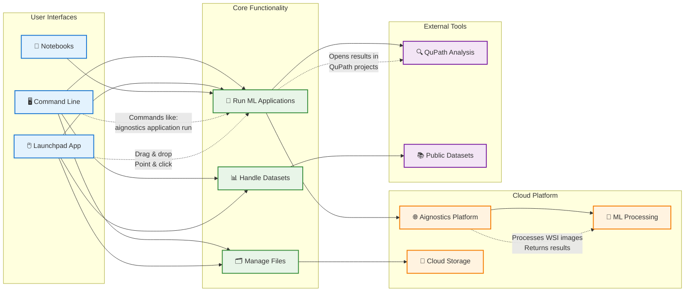
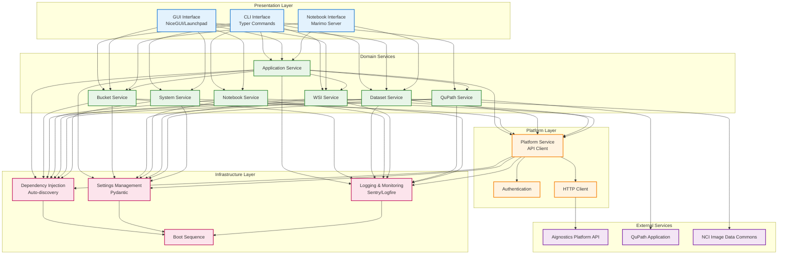
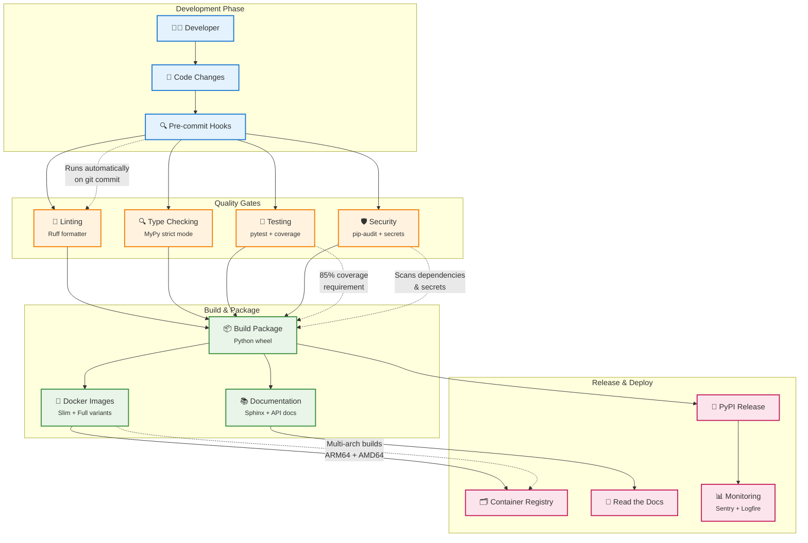
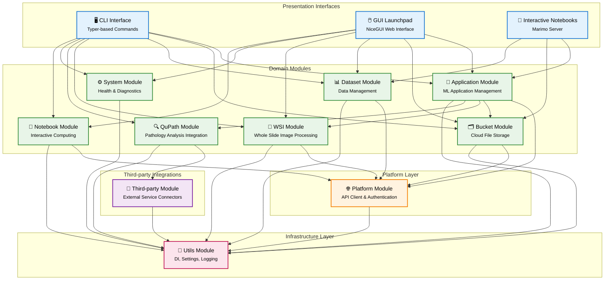
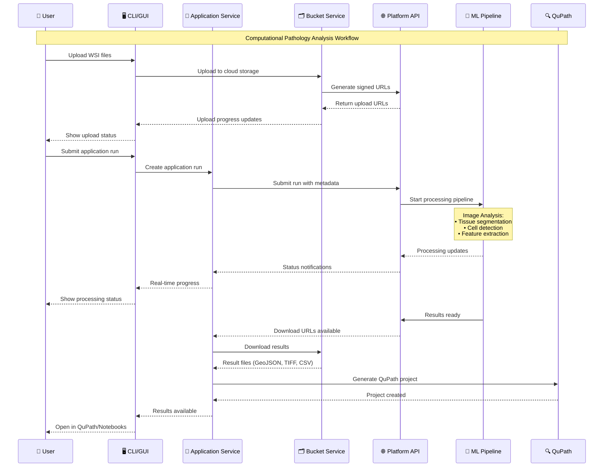
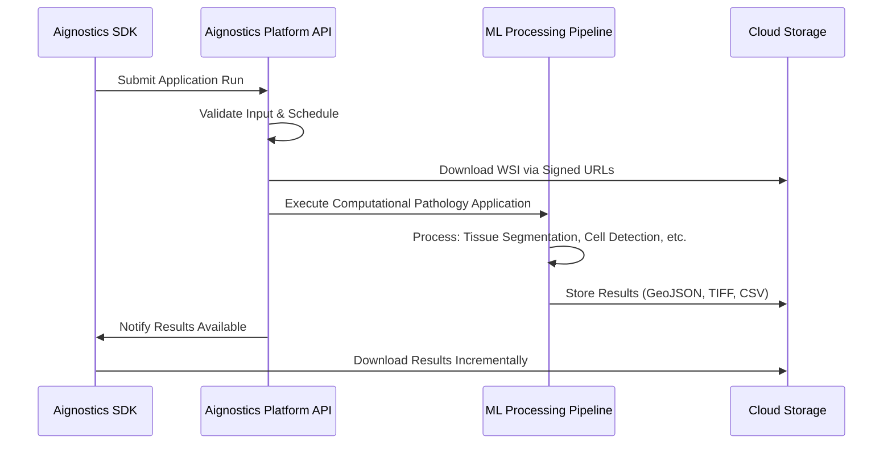

# Software Architecture Document

**Aignostics Python SDK**

**Version:** 0.2.105  
**Date:** August 12, 2025  
**Status:** Draft

---

## 1. Overview

### 1.1 Context

The Aignostics Python SDK is a comprehensive client library that provides programmatic access to the Aignostics AI Platform services. It serves as a bridge between local development environments and cloud-based AI services, enabling developers to interact with applications, manage data buckets, process datasets, and utilize various AI-powered tools through both command-line and graphical interfaces.

The SDK is designed to support data scientists, researchers, and developers working with digital pathology, whole slide imaging (WSI), and pathological applications in the life pathology domain.

### 1.2 General Architecture and Patterns Applied

#### Simplified Overview for Onboarding

The SDK follows a **Modulith Architecture** pattern, organizing functionality into cohesive modules while maintaining a monolithic deployment structure. This approach provides the benefits of modular design (clear boundaries, focused responsibilities) while avoiding the complexity of distributed systems.

**Key Architectural Patterns:**

- **Modulith Pattern**: Self-contained modules with clear boundaries and minimal inter-module dependencies
- **Dependency Injection**: Dynamic discovery and registration of services, CLI commands, and GUI pages
- **Service Layer Pattern**: Core business logic encapsulated in service classes with consistent interfaces
- **Dual Presentation Layers**:
  - (a) **CLI Layer**: Command-line interface using Typer framework
  - (b) **GUI Layer**: Web-based graphical interface using NiceGUI framework
- **Settings-based Configuration**: Environment-aware configuration management using Pydantic Settings
- **Plugin Architecture**: Optional modules that can be enabled/disabled based on available dependencies

**Architecture Overview:**

This high-level diagram shows the four main architectural layers and their relationships:

- **🔵 Presentation Layer**: User interfaces (CLI, GUI, Notebooks)
- **🟢 Domain Services**: Business logic modules for specific functionality
- **🟠 Platform Layer**: API client and authentication services
- **🔴 Infrastructure Layer**: Cross-cutting concerns and utilities
- **🟣 External Services**: Third-party integrations

### 1.3 Language and Frameworks

**Core Technologies:**

- **[Python 3.11+](https://www.python.org/)**: Primary programming language with full type hints and modern features
- **[Typer](https://typer.tiangolo.com/)**: CLI framework for building intuitive command-line interfaces with automatic help generation
- **[NiceGUI](https://nicegui.io/)**: Modern web-based GUI framework for creating responsive user interfaces
- **[FastAPI](https://fastapi.tiangolo.com/)**: High-performance web framework for API endpoints (inherited from template)
- **[Pydantic](https://docs.pydantic.dev/)**: Data validation and settings management with type safety
- **[Requests](https://docs.python-requests.org/)**: HTTP client library for API communication

**Key Dependencies:**

- **[aignx-codegen](https://github.com/aignostics/aignx-codegen)**: Auto-generated API client for Aignostics Platform
- **[Marimo](https://marimo.io/)**: Interactive notebook environment for data exploration
- **[Google CRC32C](https://github.com/googleapis/python-crc32c)**: Data integrity verification for file transfers
- **[Humanize](https://github.com/python-humanize/humanize)**: Human-readable formatting for file sizes, dates, and progress

**Optional Extensions:**

- **[QuPath](https://qupath.github.io/) Integration**: Advanced pathology image analysis capabilities
- **WSI Processing**: Whole slide image format support and processing
- **[Jupyter Notebook](https://jupyter.org/)**: Alternative notebook environment support

### 1.4 Build Chain and CI/CD

The project implements a comprehensive DevOps pipeline with multiple quality gates and automated processes:

**Key Pipeline Features:**

- **Code Generation**: Automated API client generation from OpenAPI specifications
- **Pre-commit Hooks**: Automated quality checks including `detect-secrets` and `pygrep`
- **Multi-environment Testing**: Matrix testing across Python versions and operating systems
- **Security Scanning**: `pip-audit` dependency vulnerability scanning and secret detection
- **Documentation Generation**: Automated API docs and user guides using Sphinx
- **Multi-platform Builds**: Docker images for both ARM64 and AMD64 architectures
- **Compliance Integration**: Automated reporting to compliance platforms

**Code Quality & Analysis:**

- **Linting with Ruff**: Fast Python linter and formatter following Black code style
- **Static Type Checking with MyPy**: Strict type checking in all code paths
- **Pre-commit Hooks**: Automated quality checks including `detect-secrets` and `pygrep`
- **Code Quality Analysis**: SonarQube and GitHub CodeQL integration

**Testing & Coverage:**

- **Unit and E2E Testing with pytest**: Comprehensive test suite with parallel execution
- **Matrix Testing with Nox**: Multi-environment testing across Python versions
- **Test Coverage Reporting**: Codecov integration with coverage artifacts
- **Regression Testing**: Automated detection of breaking changes

**Security & Compliance:**

- **Dependency Monitoring**: Renovate and GitHub Dependabot for automated updates
- **Vulnerability Scanning**: `pip-audit` and Trivy security analysis
- **License Compliance**: `pip-licenses` with allowlist validation and attribution generation
- **SBOM Generation**: Software Bill of Materials in CycloneDX and SPDX formats

**Documentation & Release:**

- **Documentation with Sphinx**: Automated generation of HTML/PDF documentation
- **API Documentation**: Interactive OpenAPI specification with Swagger UI
- **Version Management**: `bump-my-version` for semantic versioning
- **Changelog Generation**: `git-cliff` for automated release notes
- **Multi-format Publishing**: PyPI packages, Docker images, and Read The Docs

**Monitoring & Observability:**

- **Error Monitoring**: Sentry integration for production error tracking
- **Logging & Metrics**: Logfire integration for structured logging
- **Uptime Monitoring**: Prepared integration with monitoring services

**Deployment & Distribution:**

- **Multi-stage Docker Builds**: Fat (all extras) and slim (core only) variants
- **Multi-architecture Support**: ARM64 and AMD64 container images
- **Container Security**: Non-root execution within immutable containers
- **Registry Publishing**: Docker.io and GitHub Container Registry with attestations

**Development Environment:**

- **Dev Containers**: One-click development environments with GitHub Codespaces
- **VSCode Integration**: Optimized settings and extensions for development all found under ./vscode directory
- **GitHub Copilot**: Custom instructions and prompts for AI-assisted development
- **Local CI/CD**: Act integration for running GitHub Actions locally

### 1.5 Layers and Modules

#### High-Level Module Organization

#### Detailed Data Flow: Application Processing Workflow

The SDK is organized into distinct layers, each with specific responsibilities:

#### Infrastructure Layer (`utils/`)

**Core Utilities and Cross-cutting Concerns:**

- **Boot Sequence**: Application initialization and dependency injection setup
- **Dependency Injection**: Dynamic discovery and registration of services and UI components
- **Settings Management**: Environment-aware configuration using Pydantic Settings
- **Logging & Monitoring**: Structured logging with Logfire and Sentry integration
- **Authentication**: Token-based authentication with caching mechanisms
- **Health Monitoring**: Service health checks and status reporting

#### Platform Layer (`platform/`)

**Foundation Services:**

- **API Client**: Auto-generated client for Aignostics Platform REST API
- **Authentication Service**: OAuth/JWT token management and renewal
- **Core Resources**: Applications, versions, runs, and user management
- **Exception Handling**: Standardized error handling and API response processing
- **Configuration**: Platform-specific settings and endpoint management

#### Domain Modules

Each domain module follows a consistent internal structure:

**Application Module (`application/`)**

- **Service** (`_service.py`): Core business logic for application management and execution
- **CLI** (`_cli.py`): Command-line interface for application operations
- **GUI** (`_gui/`): Web-based interface for application management
- **Settings** (`_settings.py`): Module-specific configuration
- **Utilities** (`_utils.py`): Helper functions and data transformations

**Bucket Module (`bucket/`)**

- **Service**: Cloud storage operations, file upload/download with progress tracking
- **CLI**: Command-line file management operations
- **GUI**: Drag-and-drop file manager interface
- **Settings**: Storage configuration and authentication

**Dataset Module (`dataset/`)**

- **Service**: Dataset creation, validation, and metadata management
- **CLI**: Batch dataset operations and validation
- **GUI**: Interactive dataset builder and explorer
- **Settings**: Dataset processing configuration

**WSI Module (`wsi/`)**

- **Service**: Whole slide image processing and format conversion
- **Utilities**: Image format detection and metadata extraction
- **Integration**: Support for various medical imaging formats (DICOM, TIFF, SVS)

**QuPath Module (`qupath/`)**

- **Service**: Integration with QuPath for advanced pathology analysis
- **Annotation Processing**: Import/export of pathology annotations
- **Project Management**: QuPath project creation and synchronization

**Notebook Module (`notebook/`)**

- **Service**: Marimo notebook server management
- **Templates**: Pre-configured notebook templates for common workflows
- **Integration**: Seamless data flow between notebooks and platform services

**System Module (`system/`)**

- **Service**: System diagnostics and environment information
- **Health Checks**: Comprehensive system health monitoring
- **Configuration**: System-level settings and capability detection

**Third-Party Integration (`third_party/`)**

- **Embedded Dependencies**: Vendored third-party libraries for reliability
- **IDC Index**: Integration with Image Data Commons for medical imaging datasets
- **Bottle.py**: Lightweight WSGI micro web-framework for specific use cases

#### Presentation Layer

**CLI Interface (`cli.py`)**

- Auto-discovery and registration of module CLI commands
- Consistent help text and error handling across all commands
- Progress indicators and interactive prompts
- Support for both interactive and scripted usage

**GUI Interface (`gui/`)**

- Responsive web-based interface using NiceGUI
- Consistent theming and layout across all modules
- Real-time progress tracking and status updates
- File drag-and-drop capabilities and interactive forms

## 2. Design Principles

### 2.1 Modular Architecture

Each module is designed as a self-contained unit with:

- **Clear Boundaries**: Well-defined interfaces and minimal coupling
- **Consistent Structure**: Standardized organization across all modules
- **Independent Testing**: Module-specific test suites with isolated dependencies
- **Optional Dependencies**: Graceful degradation when optional features are unavailable

### 2.2 Dependency Injection

The SDK uses a sophisticated dependency injection system:

- **Automatic Discovery**: Services and UI components are automatically registered
- **Dynamic Loading**: Modules are loaded on-demand based on available dependencies
- **Lifecycle Management**: Proper initialization and cleanup of resources
- **Configuration Injection**: Settings are automatically injected into services

### 2.3 Configuration Management

Hierarchical configuration system:

- **Environment Variables**: Platform and module-specific environment variables
- **Settings Files**: `.env` files for local development configuration
- **Default Values**: Sensible defaults for all configuration options
- **Validation**: Type-safe configuration with Pydantic validation

### 2.4 Error Handling and Resilience

Comprehensive error handling strategy:

- **Typed Exceptions**: Domain-specific exception hierarchies
- **Graceful Degradation**: Fallback behavior when services are unavailable
- **Retry Logic**: Automatic retry with exponential backoff for transient failures
- **User-Friendly Messages**: Clear error messages with actionable guidance

### 2.5 Security and Privacy

Security-first design principles:

- **Token-based Authentication**: Secure API authentication with automatic refresh
- **Sensitive Data Protection**: Automatic masking of secrets in logs and outputs
- **Input Validation**: Comprehensive validation of all user inputs and API responses
- **Secure Defaults**: All security settings default to the most secure option

## 3. Integration Patterns

### 3.1 Aignostics Platform API Integration

The SDK serves as a comprehensive client for the **Aignostics Platform API**, a RESTful web service that provides access to advanced computational pathology applications and machine learning workflows:

**Core API Services:**

- **Application Management**: Access to computational pathology applications like Atlas H&E-TME, tissue segmentation, cell detection and classification
- **Run Orchestration**: Submit, monitor, and manage application runs with up to 500 whole slide images per batch
- **Result Management**: Incremental download of results as processing completes, with automatic 30-day retention
- **Resource Management**: User quotas, organization management, and usage monitoring

**Machine Learning Applications:**

The platform provides access to a growing ecosystem of computational pathology applications:

- **Atlas H&E-TME**: Tumor microenvironment analysis for H&E stained slides
- **Test Application**: Free validation application for integration testing
- **Tissue Quality Control**: Automated assessment of slide quality and artifacts
- **Cell Detection & Classification**: Advanced machine learning models for cellular analysis
- **Biomarker Scoring**: Quantitative analysis of immunohistochemical markers

**Technical Integration:**

- **Auto-generated Client**: Type-safe API client generated from OpenAPI specifications using aignx-codegen
- **Authentication Handling**: OAuth/JWT token management with automatic refresh and secure credential storage
- **Request/Response Transformation**: Conversion between Platform API models and SDK domain objects
- **Error Mapping**: Platform API errors mapped to SDK-specific exceptions with actionable error messages
- **Batch Processing**: Support for high-throughput processing with incremental result delivery

**Data Flow Architecture:**

**Supported Image Formats & Standards:**

- **Input Formats**: Pyramidal DICOM, TIFF, SVS, and other digital pathology formats
- **Output Formats**: QuPath GeoJSON (annotations), TIFF (heatmaps), CSV (measurements and statistics)
- **Metadata Standards**: DICOM metadata extraction and validation
- **Quality Assurance**: CRC32C checksums and automated format validation

### 3.2 File System Integration

Comprehensive file system operations optimized for large medical imaging files:

- **Progress Tracking**: Real-time progress indicators for large file operations with human-readable size formatting
- **Integrity Verification**: CRC32C checksums for data integrity validation during transfers
- **Resume Capability**: Ability to resume interrupted file transfers for large WSI files
- **Batch Operations**: Efficient handling of multiple whole slide images with parallel processing
- **Cross-platform Compatibility**: Consistent behavior across operating systems

### 3.3 External Tool Integration

Seamless integration with external tools:

- **QuPath**: Direct integration for pathology image analysis
- **Jupyter/Marimo**: Notebook environments for interactive data exploration
- **File Managers**: Native file manager integration for easy file access
- **Web Browsers**: Embedded browser components for rich user interfaces

## 4. Application Ecosystem

### 4.1 Computational Pathology Applications

The SDK provides access to Aignostics' portfolio of advanced computational pathology applications, each designed for specific analysis purposes in digital pathology workflows:

**Atlas H&E-TME (Hematoxylin & Eosin - Tumor Microenvironment)**

- Advanced machine learning-based tissue and cell analysis for H&E stained slides
- Quantitative tumor microenvironment characterization
- Automated tissue segmentation and cell classification
- Spatial analysis of cellular interactions and distributions

**Application Versioning & Management**

- Each application supports multiple versions with semantic versioning
- Version-specific input requirements and output schemas
- Backward compatibility for stable integrations
- Application-specific documentation and constraints (staining methods, tissue types, diseases)

**Processing Pipeline**

- Automated quality control and format validation
- Parallel processing of multiple whole slide images (up to 500 per batch)
- Real-time status monitoring with detailed error reporting
- Incremental result delivery as individual slides complete processing

### 4.2 Data Processing Workflows

**Input Processing**

- Multi-format support: Pyramidal DICOM, TIFF, SVS, and other digital pathology formats
- Automated metadata extraction from DICOM headers
- Base magnification (MPP) detection and validation
- Image dimension analysis and pyramid level inspection

**Machine Learning Execution**

- Cloud-based processing with enterprise-grade security
- Scalable compute resources for high-throughput analysis
- GPU-accelerated inference for complex pathology models
- Quality control checkpoints throughout the processing pipeline

**Output Generation**

- Standardized result formats for downstream analysis:
  - **QuPath GeoJSON**: Polygon annotations for tissue regions and cellular structures
  - **TIFF Images**: Heatmaps and segmentation masks with spatial information
  - **CSV Data**: Quantitative measurements, statistics, and biomarker scores
- Metadata preservation and provenance tracking
- Result validation and quality assurance checks

### 4.3 Integration Capabilities

**Enterprise Integration**

- RESTful API for language-agnostic integration
- Support for Laboratory Information Management Systems (LIMS)
- Integration with Image Management Systems (IMS)
- SAML/OIDC authentication for enterprise identity providers

**Research Workflows**

- Jupyter and Marimo notebook integration for interactive analysis
- QuPath project generation for advanced visualization
- Export capabilities for external analysis tools
- Batch processing for large-scale studies

**Quality Assurance & Compliance**

- Automated validation of input requirements
- Processing audit trails and provenance tracking
- Secure data handling with configurable retention policies
- Two-factor authentication and role-based access control

## 5. Quality Assurance

### 5.1 Testing Strategy

Multi-layered testing approach:

- **Unit Tests**: Individual component testing with >85% coverage requirement using **[pytest](https://docs.pytest.org/)** with **[pytest-cov](https://pytest-cov.readthedocs.io/)** for coverage reporting
- **End-to-End Tests**: Complete workflow testing from CLI and GUI using **[pytest](https://docs.pytest.org/)** with **[NiceGUI testing plugin](https://nicegui.io/documentation/section_testing)**
- **Regression Tests**: Automated detection of breaking changes using **[pytest-regressions](https://pytest-regressions.readthedocs.io/)**
- **Parallel Execution**: Multi-process test execution using **[pytest-xdist](https://pytest-xdist.readthedocs.io/)**
- **Async Testing**: Asynchronous code testing using **[pytest-asyncio](https://pytest-asyncio.readthedocs.io/)**
- **Long-running Tests**: Scheduled integration tests marked with `@pytest.mark.long_running` and `@pytest.mark.scheduled`

### 4.2 Code Quality

Automated code quality enforcement:

- **Style Consistency**: Automated formatting with Ruff/Black
- **Type Safety**: 100% type annotation coverage with MyPy strict mode
- **Complexity Monitoring**: Cyclomatic complexity limits and code metrics
- **Security Scanning**: Automated detection of security vulnerabilities

### 4.3 Documentation Standards

Comprehensive documentation requirements:

- **API Documentation**: Auto-generated from type hints and docstrings
- **User Guides**: Step-by-step tutorials for common workflows
- **Architecture Documentation**: This document and module-specific designs
- **Release Notes**: Automated changelog generation from commit messages

## 6. Deployment and Operations

### 6.1 Distribution Channels

Multiple distribution methods:

- **PyPI Package**: Standard Python package installation via pip/uv
- **Docker Images**: Containerized deployment with multiple variants
- **Source Installation**: Direct installation from GitHub repository
- **Development Setup**: One-click development environment setup

### 6.2 Configuration Management

Environment-aware configuration:

- **Development**: Local `.env` files with development defaults
- **Testing**: Isolated test configuration with mock services
- **Production**: Environment variables with validation and defaults
- **Container**: Container-specific configuration and health checks

### 6.3 Monitoring and Observability

Production monitoring capabilities:

- **Health Endpoints**: Service health checks for monitoring systems
- **Structured Logging**: JSON-formatted logs with correlation IDs
- **Error Tracking**: Automatic error reporting to monitoring services

---

This architecture document reflects the current state of the Aignostics Python SDK as of August 2025. The design emphasizes modularity, maintainability, and extensibility while providing a consistent developer experience across different interaction modes (CLI, GUI, API).
