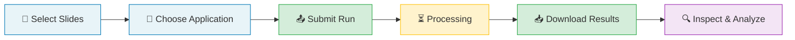

## Introduction

The **Aignostics Python SDK** provides multiple ways to interact with the **Aignostics Platform** for running advanced computational pathology applications like [Atlas H&E-TME](https://www.aignostics.com/products/he-tme-profiling-product), which analyzes tumor microenvironments in H&E-stained tissue samples.

### We take quality and security seriously

We know you take **quality** and **security** as seriously as we do. That's why
the Aignostics Python SDK is built following best practices and with full
transparency. This includes (1) making the complete
[source code of the SDK
available on GitHub](https://github.com/aignostics/python-sdk/), maintaining a
(2)
[A-grade code quality](https://sonarcloud.io/summary/new_code?id=aignostics_python-sdk)
with [high test coverage](https://app.codecov.io/gh/aignostics/python-sdk) in
all releases, (3) achieving
[A-grade security](https://sonarcloud.io/summary/new_code?id=aignostics_python-sdk)
with
[active scanning of dependencies](https://github.com/aignostics/python-sdk/issues/4),
and (4) providing
[extensive documentation](https://aignostics.readthedocs.io/en/latest/). Read
more about how we achieve
[operational excellence](https://aignostics.readthedocs.io/en/latest/operational_excellence.html) and
[security](https://aignostics.readthedocs.io/en/latest/security.html).

## Installation

The **Aignostics Python SDK** can be installed via the [uv package manager](https://docs.astral.sh/uv/). The installation process sets up the SDK along with the necessary dependencies, including the **uv** package manager itself if not already present.

Before proceeding, ensure you have an **Aignostics Platform account**. You can get access either through your organization admin (if your organization has an Aignostics account) or directly from Aignostics. Check your email for an invitation before proceeding.

### Requirements

- **Python 3.11, 3.12, 3.13, or 3.14**
- **macOS 11.0+, Linux, or Windows**
- **Homebrew** (only if you previously installed `uv` via Homebrew)

### Installation Steps

The installation will:

1. Install or update **uv** (Python package installer)
2. Install the **Aignostics Python SDK** (includes Launchpad, CLI, and Python Library)

Copy and paste the appropriate command below into your terminal (macOS/Linux) or PowerShell (Windows):

**Linux/macOS:**

```bash
if ! command -v uv &> /dev/null; then
    echo "uv not found, installing..."
    curl -LsSf https://astral.sh/uv/install.sh | sh
    source $HOME/.local/bin/env
else
    UV_VERSION=$(uv --version | cut -d' ' -f2)
    if [ "$(printf '%s\n' "0.6.17" "$UV_VERSION" | sort -V | head -n1)" != "0.6.17" ]; then
        echo "Updating uv to the latest version..."
        UV_PATH=$(which uv)
        if [[ "$UV_PATH" == *"brew"* ]]; then
            echo "Updating uv using Homebrew..."
            brew upgrade uv
        else
            echo "Updating uv using the installer..."
            uv self update
        fi
    else
        echo "uv is up to date"
    fi
fi
```

**Windows (PowerShell):**

```powershell
winget install --id=Microsoft.VCRedist.2015+.x64 -e
powershell -ExecutionPolicy ByPass -c "irm https://astral.sh/uv/install.ps1 | iex"
```

Verify your installation by running:

```bash
uvx aignostics --help
```

You should see the Aignostics CLI help output.

You can then proceed by choosing your preferred user interface below.

## Choose your interface

Choose your preferred interface for working with the Aignostics Platform. Each interface is designed for different user roles and use cases:

### How analysis works

Whether you use the Launchpad, CLI, or Python Library, the analysis workflow follows the same pattern:



You start by selecting the whole slide images you want to analyze, then choose an application (like Atlas H&E-TME) and submit your run. The Aignostics Platform processes your slides in the cloud, and you download the results when ready. Each interface offers the same capabilities—choose the one that fits your workflow.

### 🖥️ Launchpad (Desktop Application)

| | |
|---|---|
| **What it is** | Graphical application for analyzing slides and viewing results in QuPath or Python notebooks |
| **Best for** | Pathologists and researchers who want to analyze slides without writing code |
| **Use when** | Running analyses on individual cases or small cohorts (1-20 slides) and exploring results interactively |
| **Get started** | <a href="#launchpad-run-your-first-computational-pathology-analysis-in-10-minutes-from-your-desktop">Install and run your first analysis</a> |

### ⌨️ CLI (Command-Line Interface)

| | |
|---|---|
| **What it is** | Terminal tool for scripting and automation |
| **Best for** | Bioinformaticians and technical researchers who work with terminal-based workflows |
| **Use when** | Processing large cohorts (10s-100s of slides), automating repetitive analyses, or integrating with computational pipelines |
| **Get started** | <a href="#cli-manage-datasets-and-application-runs-from-your-terminal">Manage datasets and application runs from your terminal</a> |

### 📚 Python Library

| | |
|---|---|
| **What it is** | Python library for programmatic access in scripts, notebooks, and applications |
| **Best for** | Data scientists and developers who want to integrate the platform into Python-based workflows |
| **Use when** | Building custom analysis pipeline in Python for repeated usage and processing large datasets (10s-1000s of slides) |
| **Get started** | <a href="#example-notebooks-interact-with-the-aignostics-platform-from-your-python-notebook-environment">Run example notebooks</a> or <a href="#python-library-call-the-aignostics-platform-api-from-your-python-scripts">call the Aignostics Platform API from your Python scripts</a> |

> 💡 Launchpad and CLI handle authentication automatically. Python Library requires manual setup (see [authentication section](#example-notebooks-interact-with-the-aignostics-platform-from-your-python-notebook-environment)).

## Launchpad: Run your first computational pathology analysis in 10 minutes from your desktop

The **Aignostics Launchpad** is a graphical desktop application that allows you to run applications on whole slide images (WSIs) from your computer, and inspect results with QuPath and Python Notebooks with one click. It is designed to be user-friendly and intuitive, for use by Research Pathologists and Data Scientists.

**New to Launchpad?** See <a href="#installation">Installation</a> section above to get started.

### Running Your First Analysis

This tutorial uses [Atlas H&E-TME](https://www.aignostics.com/products/he-tme-profiling-product) with a public lung cancer dataset from the NCI Image Data Commons.

**Step 1: Start Aignostics Launchpad**

1. Open a terminal or command prompt
2. Run the command: `uvx aignostics launchpad`
This starts the Launchpad application.

**Step 2: Download a Sample Dataset**

1. Click the menu icon (☰) in the top right corner
2. Click "Download Datasets". The system displays the dataset download interface.
3. Click "EXAMPLE DATASET". The system populates the dataset ID field with a TCGA lung adenocarcinoma sample.
4. Click "DATA". The system shows a folder selection dialog.
5. Click "OK"
6. Click "DOWNLOAD". The system downloads the DICOM dataset. A progress indicator shows download status.
7. Click the menu icon and select "Run Applications"

**Step 3: Select Atlas H&E-TME**

1. Click "Atlas H&E-TME" in the left sidebar. The system displays the application workflow with six steps.
2. Click the version dropdown to view available versions. The system shows all available versions with release notes accessible via the "RELEASE NOTES" button.
3. Keep the default version (latest)
4. Click "NEXT"

**Step 4: Select Slides and Provide Metadata**

1. Click "DATA". The system opens a folder selection dialog showing the Launchpad datasets directory.
2. Navigate to the downloaded dataset folder (e.g., `/datasets/idc/tcga_luad/`)
3. Click "OK". The system displays the selected folder path and scans the folder, showing a table with all compatible slides. Each row shows thumbnail preview, technical metadata (file size, MPP resolution, dimensions), and status indicators.
4. The system automatically extracts technical file metadata. You must provide the required medical metadata by double-clicking the red cells in the "Tissue" column. The system displays a dropdown menu with tissue types.
5. Select the tissue type (e.g., "LUNG") and disease (e.g., "LUNG_CANCER") by double-clicking in the red cells and selecting the value from the dropdown. The system marks these cells green indicating valid metadata.
6. Review the "Staining" column. The system shows "H&E" if this information was extracted from the DICOM file.
7. Click "NEXT"

**Step 5: Add Notes and Tags (Optional)**

1. The system displays the notes and tags screen.
2. Enter an optional note in the text field (e.g., "TCGA lung sample analysis")
3. Add optional tags by typing and pressing Enter (e.g., "TCGA", "lung")
4. Click "NEXT"

**Step 6: Set Schedule (Optional)**

1. The system displays scheduling options with soft due date and hard deadline pickers.
2. Click "NEXT" to leave the default settings.

The soft due date indicates when the platform will attempt to complete processing. The hard deadline is when the platform may cancel the run if resources are unavailable.

**Step 7: Submit Your Run**

1. The system displays the submission screen showing number of slides to be analyzed, full file paths, and upload and submit button.
2. Review the slide information
3. Click "UPLOAD AND SUBMIT". The system uploads your slides to the Aignostics Platform and submits the analysis run. A progress indicator shows upload status.

The left sidebar now shows your submitted run with application name and version, submission timestamp, running status icon (🏃), and any tags you added.

**Step 8: Monitor Your Run**

Atlas H&E-TME processing time depends on slide size and system load. Depending on the file size and the number of files, processing can take minutes to many hours.

Click on your run in the sidebar to view run details and metadata, slide thumbnails, and processing status for each slide. The status icon updates as processing progresses.

### Understanding Your Results

When processing completes, Atlas H&E-TME provides comprehensive tumor microenvironment analysis results for each processed slide:

**What You'll Receive:**

- **Tissue analysis**: Identification of tissue regions (tumor, stroma, necrosis, etc.) with quality assessment in GeoJSON format
- **Cell analysis**: Individual cells detected and classified by type (tumor cells, immune cells, stromal cells, etc.) in GeoJSON format
- **Visual segmentation maps**: Color-coded images showing spatial distribution of tissue and cell types
- **Quantitative measurements**: Cell counts, densities, spatial relationships, and statistical summaries provided in CSV format

**Downloading Results:**

When processing completes, the status icon changes to show completion. To download results:

1. Click the "Download Results" button
2. The system downloads a ZIP file containing all outputs to your computer

**Inspecting Results in QuPath:**

QuPath integration provides the most powerful way to visualize and interact with your results:

1. Click "Open in QuPath" (requires QuPath extension - see Advanced Setup below)
2. The system automatically creates a QuPath project with your slides and annotations loaded
3. In QuPath, you can:
   - View tissue and cell annotations overlaid on your slides
   - Explore cell classifications and measurements
   - Analyze spatial relationships between different cell types
   - Export annotations or perform additional analysis

**Congratulations!** You have successfully downloaded a public dataset, submitted an Atlas H&E-TME analysis run, and learned how to access and inspect your results.

### Advanced Setup: Extensions

> 💡 The Launchpad features a growing ecosystem of extensions that seamlessly integrate with standard digital pathology tools. To use the Launchpad with all available extensions, run `uvx --from "aignostics[qupath,marimo]" aignostics launchpad`. Currently available extensions are:
>
> 1. **QuPath extension**: View your application results in [QuPath](https://qupath.github.io/) with a single click. The Launchpad creates QuPath projects on-the-fly.
> 2. **Marimo extension**: Analyze your application results using [Marimo](https://marimo.io/) notebooks embedded in the Launchpad. You don't have to leave the Launchpad to do real data science.

## CLI: Manage datasets and application runs from your terminal

The Python SDK includes the **Aignostics CLI**, a Command-Line Interface (CLI) that allows you to
interact with the Aignostics Platform directly from your terminal or shell script.

**New to CLI?** See <a href="#installation">Installation</a> section above to get started.

**Common workflows:**

- Download public datasets from NCI Image Data Commons
- Submit batch processing runs for multiple slides
- Monitor run status and download results incrementally
- Automate repetitive tasks with shell scripts

See as follows for a simple example where we download a sample dataset for the [Atlas
H&E-TME application](https://www.aignostics.com/products/he-tme-profiling-product), submit an application run, and download the results.

### Example: Running Atlas H&E-TME with CLI

1. Open a terminal or command prompt
2. Use the following commands to run the Atlas H&E-TME application on a sample dataset:

```shell
# Download a sample dataset from the NCI Image Data Commons (IDC) portal to your current working directory
# As the dataset id refers to the TCGA LUAD collection, this creates a directory tcga_luad with the DICOM files
uvx aignostics dataset idc download 1.3.6.1.4.1.5962.99.1.1069745200.1645485340.1637452317744.2.0 data/
# Prepare the metadata for the application run by creating a metadata.csv, extracting 
# the required metadata from the DICOM files. We furthermore add the required
# information about the tissue type and disease.
uvx aignostics application run prepare he-tme data/tcga_luad/run.csv data/
# Edit the metadata.csv to insert the required information about the staining method, tissue type and disease
# Adapt to your favourite editor
nano tcga_luad/metadata.csv 
# Upload the metadata.csv and referenced whole slide images to the Aignostics Platform
uvx aignostics application run upload he-tme data/tcga_luad/run.csv
# Submit the application run and print the run id
uvx aignostics application run submit he-tme data/tcga_luad/run.csv
# Check the status of the application run you submitted
uvx aignostics application run list
# Incrementally download results when they become available
# Fill in the id from the output in the previous step
uvx aignostics application run result download APPLICATION_RUN_ID 
```

For convenience the `application run execute` command combines preparation, upload, submission and download.
The below is equivalent to the above, while adding additionally required metadata using a mapping:

```shell
uvx aignostics dataset idc download 1.3.6.1.4.1.5962.99.1.1069745200.1645485340.1637452317744.2.0 data/
uvx aignostics application run execute he-tme data/tcga_luad/run.csv data/ --mapping ".*\.dcm:staining_method=H&E,tissue=LUNG,disease=LUNG_CANCER"
```

The CLI provides extensive help:

```shell
uvx aignostics --help                           # list all spaces such as application, dataset, bucket and system, 
uvx aignostics application --help               # list subcommands in the application space
uvx aignostics application run --help           # list subcommands in the application run sub-space
uvx aignostics application run list --help      # show help for specific command
uvx aignostics application run execute --help   # show help for another command
```

Check out our
[CLI reference documentation](https://aignostics.readthedocs.io/en/latest/cli_reference.html)
to learn about all commands and options available.

## Python Library: Call the Aignostics Platform API from your Python scripts

The Python SDK includes the *Aignostics Python Library* for integration with your Python codebase.

**New to Python Library?** See <a href="#installation">Installation</a> section above to get started.

<!-- - **Authentication setup** - ADD INSTRUCTIONS. -->

### Installation

Add the Aignostics Python SDK to your Python project:

**Install with [uv](https://docs.astral.sh/uv/):**

```shell
uv add aignostics
```

**Install with [pip](https://pip.pypa.io/en/stable/):**

```shell
# Add Python SDK as dependency to your project
pip install aignostics
```

#### Usage

The following snippet shows how to use the Client to submit an application
run:

```python
from aignostics import platform

# initialize the client
client = platform.Client()
# submit an application run
application_run = client.runs.submit(
   application_id="test-app",
   items=[
      platform.InputItem(
         external_id="slide-1",
         input_artifacts=[
            platform.InputArtifact(
               name="whole_slide_image",
               download_url="<a signed url to download the data>",
               metadata={
                  "checksum_base64_crc32c": "AAAAAA==",
                  "resolution_mpp": 0.25,
                  "width_px": 1000,
                  "height_px": 1000,
               },
            )
         ],
      ),
   ],
)
# wait for the results and download incrementally as they become available
application_run.download_to_folder("path/to/download/folder")
```

Please look at the notebooks in the `example` folder for a more detailed example
and read the
[client reference documentation](https://aignostics.readthedocs.io/en/latest/lib_reference.html)
to learn about all classes and methods.

### Example Notebooks: Interact with the Aignostics Platform from your Python Notebook environment

> [!IMPORTANT]
> Before you get started, you need to set up your authentication credentials if
> you did not yet do so! Please visit
> [your personal dashboard on the Aignostics Platform website](https://platform.aignostics.com/getting-started/quick-start)
> and follow the steps outlined in the `Use in Python Notebooks` section.

The Python SDK includes ready-to-use Marimo notebooks that demonstrate platform interaction patterns. These notebooks are ideal for:

- Learning the API through interactive examples
- Prototyping custom analysis workflows
- Integrating with existing data science pipelines

The example notebooks use our "Test Application" (free for all users). To run them,
please follow the steps outlined in the snippet below to clone this repository and start the
[Marimo](https://marimo.io/)
([examples/notebook.py](https://github.com/aignostics/python-sdk/blob/main/examples/notebook.py))
notebook:

```shell
# clone the `python-sdk` repository
git clone https://github.com/aignostics/python-sdk.git
# within the cloned repository, install the SDK and all dependencies
uv sync --all-extras
# show marimo example notebook in the browser
uv run marimo edit examples/notebook.py
```

> 💡 You can also run a notebook within the Aignostics Launchpad. To do so, select the
> Run you want to inspect in the left sidebar, and click the button "Open in Python Notebook".

### Defining the input for an application run

The following sections provide technical details for advanced use cases. These examples use the "Test Application" - a free application available to all users for testing and development purposes.

When creating an application run, you need to specify the `application_id` and optionally the
`application_version` (version number) of the application you want to run. If you omit the version,
the latest version will be used automatically. Additionally, you need to define the input items you
want to process in the run. The input items are defined as follows:

```python
platform.InputItem(
    external_id="1",
    input_artifacts=[
        platform.InputArtifact(
            name="whole_slide_image", # defined by the application version's input artifact schema
            download_url="<a signed url to download the data>",
            metadata={ # defined by the application version's input artifact schema
                "checksum_base64_crc32c": "N+LWCg==",
                "resolution_mpp": 0.46499982,
                "width_px": 3728,
                "height_px": 3640,
            },
        )
    ],
),
```

For each item you want to process, you need to provide a unique `reference`
string. This is used to identify the item in the results later on. The
`input_artifacts` field is a list of `InputArtifact` objects, which defines what
data & metadata you need to provide for each item. The required artifacts depend
on the application version you want to run - in the case of test application,
there is only one artifact required, which is the image to process on. The
artifact name is defined as `whole_slide_image` for this application.

The `download_url` is a signed URL that allows the Aignostics Platform to
download the image data later during processing.

### Self-signed URLs for large files

To make the whole slide images you want to process available to the Aignostics Platform, you
need to provide a signed URL that allows the platform to download the data.
Self-signed URLs for files in google storage buckets can be generated using the
`generate_signed_url`
([code](https://github.com/aignostics/python-sdk/blob/407e74f7ae89289b70efd86cbda59ec7414050d5/src/aignostics/client/utils.py#L85)).

**We expect that you provide the
[required credentials](https://cloud.google.com/docs/authentication/application-default-credentials)
for the Google Storage Bucket**

## Next Steps

Now that you have an overview of the Aignostics Python SDK and its interfaces, here are some recommended next steps to deepen your understanding and get the most out of the platform:

- **Understand the platform**: Read the [Aignostics Platform Overview](platform_overview.md) to learn about architecture and core concepts
- **Review detailed documentation**: See the [CLI reference](https://aignostics.readthedocs.io/en/latest/cli_reference.html) and [Python Library reference](https://aignostics.readthedocs.io/en/latest/lib_reference.html)
- **Explore QuPath integration**: Use the QuPath extension to visualize and interact with your results
- **Get support**: Contact [support@aignostics.com](mailto:support@aignostics.com) or check the [full documentation](https://aignostics.readthedocs.io/en/latest/)
