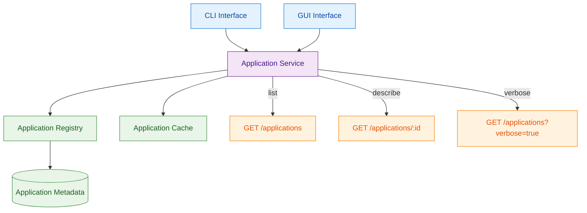

# ADR-0001: Application Listing and Discovery Service

## Context and Problem Statement

The platform needs to provide users with the ability to discover and access available AI applications through both CLI and web interfaces. Users need to list applications (with optional verbose output), get detailed information about specific applications, and handle error cases when requesting non-existent applications. The system must provide consistent behavior and proper error handling with specific exit codes and message formats.

## Decision Drivers

* Need to list available AI applications with their identifiers
* Support for verbose output showing artifact counts in format "Artifacts: X input(s), Y output(s)"
* Display specific application details including artifact identifiers
* Handle unknown applications with exit code 2 and specific error message format
* Support application schema export functionality
* Provide web interface navigation between applications
* Consistent exit code 0 for successful operations across all functions

## Considered Options

1. Centralized Application Service with REST API
2. Simple Configuration Files with Direct Access
3. In-Memory Registry with File Loading
4. Hybrid: Configuration Files with Service Layer

## Decision Outcome

Chosen option: "Centralized Application Service with REST API", because it provides the best balance of consistency, testability, and caching capabilities while avoiding the complexity of file synchronization issues and providing a clean interface for both CLI and GUI components.

### Rationale

The centralized service approach allows for:
- Consistent application listing with identifiers as shown in test evidence
- Standardized verbose output format "Artifacts: X input(s), Y output(s)" across interfaces
- Unified error handling with exit code 2 and message format "Application with ID '[identifier]' not found."
- Support for schema export functionality as demonstrated in tests
- Web interface navigation capabilities between application pages

### Positive Consequences

* Application listing returns identifiers including "he-tme" and "test-app" as evidenced in tests
* Verbose output includes artifact counts in the required format
* Application details display artifact identifiers like "tissue_qc:geojson_polygons"
* Error handling provides exact message format for unknown applications
* Schema export creates zip files with expected naming pattern
* Web interface supports navigation between application pages

### Negative Consequences

* Additional service layer adds some complexity
* Network dependency for application information requests
* Requires service coordination for deployments

## Pros and Cons of the Options

### Centralized Application Service with REST API

Implements a dedicated service component that manages application metadata and provides API endpoints for listing, detailed information, and schema export operations.

#### Pros

* Consistent data access patterns across CLI and GUI interfaces
* Centralized caching improves performance for repeated requests
* Clean separation between data management and interface logic
* Easy to mock service interface for testing different scenarios
* Single place to implement error handling and validation logic
* Can optimize for specific access patterns (e.g., caching verbose output)

#### Cons

* Additional service layer adds some architectural complexity
* Requires service initialization and lifecycle management
* More components to test and maintain than simple file access

### Simple Configuration Files with Direct Access

Store application metadata in JSON or YAML files that are read directly by CLI and GUI components without an intermediate service layer.

#### Pros

* Extremely simple implementation with minimal infrastructure
* Easy to version control application metadata alongside code
* No service dependencies or initialization requirements
* Fast access for small datasets with direct file I/O
* Easy to inspect and modify application metadata by hand
* No network calls or service coordination needed

#### Cons

* File parsing logic needs to be duplicated across CLI and GUI
* Inconsistent caching behavior between different components
* Harder to implement optimizations like pre-computed verbose output
* File locking issues if multiple processes access simultaneously
* Error handling logic scattered across multiple components

### In-Memory Registry with File Loading

Load application metadata from files into memory structures during application startup, providing fast access without file I/O overhead.

#### Pros

* Very fast access once loaded (no file I/O or network calls)
* Simple data structures can be optimized for specific queries
* Still allows version controlling metadata in files
* No concurrent file access issues
* Single loading point allows validation and error handling

#### Cons

* Requires application restart to pick up metadata changes
* Memory usage scales with number of applications
* Loading errors affect entire application startup
* No dynamic updates without restart
* Potential for memory/file inconsistency during development

### Hybrid: Configuration Files with Service Layer

Combine configuration files for metadata storage with a lightweight service layer that handles caching and provides consistent API.

#### Pros

* Version controllable metadata in files
* Service layer provides consistent API and caching
* File changes can trigger service refresh without restart
* Best of both worlds: simple storage, clean interfaces
* Service can optimize file access patterns

#### Cons

* Most complex option with both file and service management
* File watching and refresh logic adds complexity
* Potential for inconsistency between files and service cache
* Two places where errors can occur (file loading + service)

## More Information

### Architecture Diagram

### Components Details

#### Application Service

The core service responsible for managing application metadata and providing consistent APIs for different interface layers.

**Key Responsibilities:**
- List available applications returning identifiers including "he-tme" and "test-app"
- Provide verbose listing with artifact counts in format "Artifacts: X input(s), Y output(s)"
- Display application details including artifact identifiers (e.g., "tissue_qc:geojson_polygons")
- Export application schemas as zip files with naming pattern "{application_version_id}_schemata.zip"
- Handle unknown application requests with exit code 2 and error message "Application with ID '[identifier]' not found."

**Interface Contracts:**
- `list_applications()` - Returns applications including "he-tme" and "test-app" identifiers
- `list_applications_verbose()` - Returns list with artifact counts: "Artifacts: 1 input(s), 6 output(s)"
- `get_application_details(id)` - Returns details with artifact identifiers like "tissue_qc:geojson_polygons"
- `export_application_schema(id, destination, zip)` - Creates zip file with schema files
- `validate_application_id(id)` - Returns appropriate error for unknown applications

#### CLI Interface Layer

Command-line interface implementation that translates user commands to service calls and formats output appropriately.

**Command Implementations:**
- `application list` - Displays available applications including "he-tme" and "test-app"
- `application list --verbose` - Shows applications with "Artifacts: 1 input(s), 6 output(s)" format
- `application describe <id>` - Displays application details including "tissue_qc:geojson_polygons"
- `application dump-schemata <id> --destination <path> --zip` - Creates zip with schema files
- Error handling: exit code 0 for success, exit code 2 for "Application with ID 'unknown' not found."

#### GUI Interface Layer

Web interface components that provide visual application discovery and navigation capabilities.

**Interface Components:**
- Application listing showing available applications with navigation capability
- Application detail pages with information display and artifact details
- Navigation between applications for workflow access
- Integration with application workflow components

#### Error Handling Strategy

**Application Not Found (Exit Code 2):**
- Exact error message format: "Application with ID '[identifier]' not found."
- Consistent across CLI interface for all unknown application requests
- Proper exit code 2 for CLI commands

**Success Responses (Exit Code 0):**
- CLI: Application identifiers and information display
- Verbose output: "Artifacts: 1 input(s), 6 output(s)" format
- Schema export: Zip files with pattern "{application_version_id}_schemata.zip"
- GUI: Application pages with navigation between applications

### Implementation Guidelines

1. **Service Interface Design:**
   - Use dependency injection for service implementation
   - Implement proper error handling with typed exceptions
   - Include comprehensive logging for debugging and monitoring
   - Design for testability with clear mocking boundaries

2. **Data Format Specifications:**
   - Application identifiers: alphanumeric strings with hyphens
   - Artifact counts: formatted as "Artifacts: X input(s), Y output(s)"
   - Error messages: standardized format with application ID inclusion

3. **Performance Considerations:**
   - Implement caching for frequently accessed application information
   - Use lazy loading for detailed application information
   - Consider pagination for large application catalogs in future versions

4. **Testing Strategy:**
   - Unit tests for service logic with mocked dependencies
   - Integration tests for CLI and GUI interface layers
   - End-to-end tests for complete user workflows
   - Error case testing for all supported error conditions

### Validation Criteria

This architectural decision can be considered successful when:
- CLI `application list` command returns "he-tme" and "test-app" identifiers with exit code 0
- CLI `application list --verbose` includes "Artifacts: 1 input(s), 6 output(s)" format
- CLI `application describe he-tme` shows "tissue_qc:geojson_polygons" in output
- CLI `application describe unknown` returns exit code 2 with exact error message
- CLI `application dump-schemata` creates zip files with expected naming and content
- GUI displays applications with navigation capability between application pages
- All successful operations complete with exit code 0
- Error handling provides exact message formats as specified in requirements