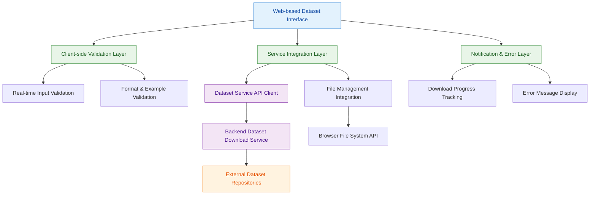

# ADR-10: Dataset Download User Interface

## Context and Problem Statement

The platform requires a user-friendly graphical interface for downloading external datasets that integrates with the existing backend dataset download service. Test evidence from `test_gui_idc_downloads` and `test_gui_idc_download_fails_with_invalid_inputs` shows the system must provide input validation for dataset identifiers, destination selection capabilities, example guidance for users, and clear notifications for download completion and errors. The interface must handle error scenarios like "No download folder selected" and provide specific validation error messages.

The architectural challenge is designing a GUI framework integration that provides intuitive dataset discovery and download while maintaining robust validation, clear user feedback patterns, and seamless integration with the existing backend dataset download service that handles external repository integration, file integrity validation, and comprehensive error handling.

## Decision Drivers

* Integration with existing backend dataset download service for consistent validation and error handling behavior
* Real-time input validation that prevents invalid downloads before backend processing
* Destination selection mechanism that supports both default and custom folder selection with "No download folder selected" error handling
* Example-driven user guidance that demonstrates valid identifier formats from test evidence
* Specific error message patterns for validation failures and network errors
* GUI framework selection that supports cross-platform deployment and maintenance
* Component architecture that separates UI concerns from business logic
* User experience patterns that minimize cognitive load while providing comprehensive functionality

## Considered Options

1. Web-based Interface with Real-time Validation Integration
2. Native Desktop Application with Direct Service Integration  
3. Hybrid Progressive Web Application Approach

## Decision Outcome

Chosen option: "Web-based Interface with Real-time Validation Integration", because it provides optimal integration with the existing platform architecture while supporting the diverse validation and user interaction patterns demonstrated in test evidence from `test_gui_idc_downloads` and `test_gui_idc_download_fails_with_invalid_inputs`.

### Rationale

A web-based interface with real-time validation provides:
- Seamless integration with the existing backend dataset download service through REST API calls
- Cross-platform compatibility without additional desktop application deployment
- Real-time validation that reduces server load by preventing invalid requests
- Consistent user experience across different operating systems and environments
- Easy maintenance and updates through web deployment mechanisms

### Positive Consequences

* Integration with backend dataset download service provides consistent validation and error handling
* Web-based deployment enables cross-platform access without native application distribution
* Real-time validation reduces server load and provides immediate user feedback
* Component-based architecture enables reusable UI patterns across the platform
* Clear separation between UI logic and business logic through service integration

### Negative Consequences

* Web-based interface may have limitations for local file system access compared to native applications
* Client-side validation logic requires maintenance alongside server-side validation rules
* Network dependency for all dataset operations may impact offline usage scenarios

## Pros and Cons of the Options

### Web-based Interface with Real-time Validation Integration

Web application that integrates with the existing backend dataset download service through API calls.

#### Pros

* Direct integration with existing backend dataset download service architecture
* Cross-platform compatibility without additional deployment complexity
* Real-time validation reduces server load and provides immediate feedback
* Easy maintenance and updates through web deployment
* Consistent user experience across different operating systems

#### Cons

* Limited local file system access capabilities
* Network dependency for all operations
* Potential browser compatibility considerations

### Native Desktop Application with Direct Service Integration

Desktop application that provides native file system integration and direct service access.

#### Pros

* Full file system access and native OS integration
* Offline capabilities for previously cached data
* Native user interface patterns and performance
* Direct integration with local file management systems

#### Cons

* Complex deployment and maintenance across multiple operating systems
* Duplicate development effort for different platforms
* More complex integration with web-based platform services

### Hybrid Progressive Web Application Approach

Progressive web application that combines web technologies with native-like capabilities.

#### Pros

* Combines web deployment benefits with enhanced local capabilities
* Progressive enhancement based on browser capabilities
* Single codebase with cross-platform compatibility
* Can leverage both web APIs and enhanced browser features

#### Cons

* Complex implementation requiring multiple technology approaches
* Browser compatibility variations for advanced features
* Limited by least common denominator of browser capabilities

## More Information

### Architecture Diagram

### Components Details

#### Web-based Dataset Interface Framework

**GUI Framework Architecture:**
- React-based component architecture with TypeScript for type safety and maintainability
- Component-based design that separates concerns between validation, service integration, and user feedback
- Responsive design patterns that support both desktop and mobile access
- Integration with platform design system for consistent user experience

**Service Integration Patterns:**
- RESTful API integration with backend dataset download service endpoints
- Asynchronous download operations with real-time progress feedback
- Error handling integration that maps service errors to user-friendly messages
- Authentication and authorization integration with platform security systems

#### Client-side Validation Layer

**Real-time Input Validation:**
- Format validation for dataset identifiers before API calls to reduce server load
- Pattern matching for collection_id, PatientID, StudyInstanceUID, SeriesInstanceUID, SOPInstanceUID formats
- Input sanitization and validation that prevents malformed requests
- Visual feedback for validation states (valid, invalid, pending)

**Error Message Implementation:**
- Specific error messages from test evidence: "No download folder selected" for destination validation failures
- Format validation errors with examples: "Download failed: None of the values passed matched any of the identifiers..."
- Network error handling with retry suggestions and user guidance
- Integration with platform notification system for consistent messaging patterns

#### Service Integration Layer

**Dataset Service API Client:**
- REST API client that interfaces with backend dataset download service endpoints
- Request/response handling with appropriate timeout and retry logic
- Authentication token management for secure API access
- Error response parsing and translation to user-friendly messages

**File Management Integration:**
- Browser File System Access API integration for destination folder selection
- Default download directory management through platform user data utilities
- Download progress tracking and file completion verification
- Integration with browser download management for large file handling

#### Notification & Error Layer

**Download Progress Management:**
- Real-time progress indicators during file download operations
- Download completion notifications with "Download completed" messages as specified in test evidence
- File size and transfer information display during download operations
- Integration with browser notification APIs for background download completion

**Comprehensive Error Handling:**
- Validation error display with specific guidance for identifier format requirements
- Network error handling with retry mechanisms and offline detection
- Service error mapping from backend service error responses to user-friendly messages
- Error recovery suggestions and alternative action recommendations

### Integration Patterns with Backend Service

**API Integration Architecture:**
1. **Download Initiation**: Web interface validates input and calls backend service `/dataset/download` endpoint
2. **Progress Tracking**: Polling or WebSocket integration for real-time download progress updates
3. **Error Handling**: Service error responses mapped to user-friendly error messages with recovery guidance
4. **Completion Notification**: Success responses trigger "Download completed" notifications with file information

**Validation Coordination:**
1. **Client-side Pre-validation**: Format checking and example validation before API calls
2. **Server-side Validation**: Backend service provides authoritative validation and error responses
3. **Error Message Consistency**: Client maps service error codes to specific user guidance messages
4. **Fallback Handling**: Client gracefully handles service unavailability with offline messaging

**File Management Coordination:**
1. **Destination Selection**: Browser File System API for folder selection with platform default fallbacks
2. **Download Coordination**: Service manages actual file download while UI tracks progress and completion
3. **Integrity Verification**: UI displays file size validation results from backend service integrity checking
4. **Error Recovery**: Failed downloads provide retry mechanisms and alternative destination suggestions

### Validation Criteria

This architectural decision can be considered successful when:
- Web interface successfully integrates with backend dataset download service through REST API calls
- Client-side validation prevents invalid identifier submissions while maintaining consistency with server-side validation
- Error messages match test evidence patterns: "No download folder selected", "Download failed: No IDs provided"
- Download completion notifications display "Download completed" messages as specified in test evidence
- File destination selection supports both default and custom folder selection through Browser File System APIs
- Real-time progress tracking provides user feedback during download operations
- Service integration maintains separation of concerns between UI logic and business logic