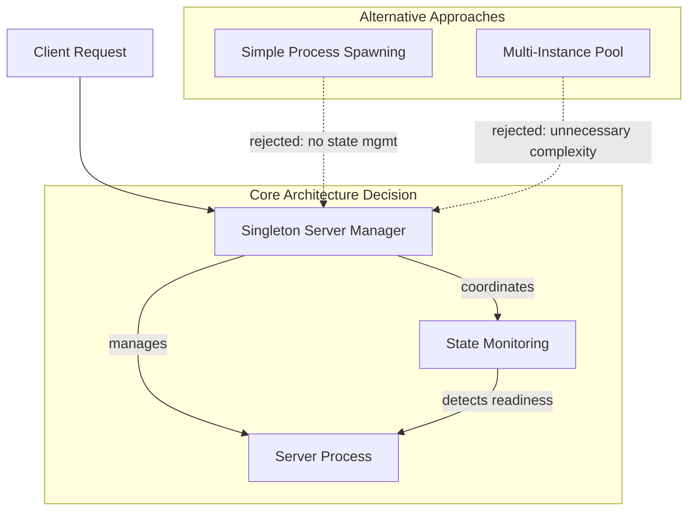

# ADR-14: NOTEBOOK SERVER LIFECYCLE MANAGEMENT

## Context and Problem Statement

The notebook service requires a robust architecture for managing the complete lifecycle of interactive notebook servers (Marimo). Users need to launch notebook environments for data analysis, and the system must handle server startup, monitoring, error conditions, and graceful shutdown. The architecture must ensure reliable server state management, prevent resource conflicts, and provide appropriate error handling for various failure scenarios.

Key requirements include:
- Launching notebook servers on demand with FastAPI backend on localhost:8001
- Monitoring server startup and detecting when servers are ready
- Handling timeout conditions during server initialization
- Managing already running servers without conflicts
- Providing clean shutdown capabilities
- Handling error conditions when server URLs are not properly configured

## Decision Drivers

* Need for reliable notebook server process management with singleton pattern
* Requirement for timeout handling during server startup to prevent indefinite waiting
* Need to detect and handle already running server instances
* Requirement for URL detection and validation after server startup
* Need for graceful server shutdown with proper resource cleanup
* Requirement for error handling when server configuration fails
* Performance requirement to avoid multiple server instances
* Reliability requirement for production-grade server lifecycle management

## Considered Options

1. Simple Process Spawning with Basic Monitoring
2. Singleton Server Manager with State Monitoring and Error Handling
3. Multi-Instance Server Pool with Load Balancing

## Decision Outcome

Chosen option: "Singleton Server Manager with State Monitoring and Error Handling", because it provides the optimal balance between simplicity and reliability for single-user notebook environments while ensuring robust error handling and resource management.

### Rationale

The singleton pattern ensures only one notebook server runs at a time, preventing port conflicts and resource contention. State monitoring with URL detection provides reliable startup verification, while comprehensive error handling covers timeout and configuration failure scenarios. This approach aligns with the single-user nature of the notebook environment and provides the reliability needed for production use.

### Positive Consequences

* Prevents multiple server instances and port conflicts through singleton pattern
* Provides reliable server startup detection through URL monitoring
* Handles timeout scenarios gracefully to prevent indefinite waiting
* Offers comprehensive error handling for configuration failures
* Ensures proper resource cleanup during shutdown
* Maintains server state consistency throughout lifecycle
* Provides clear logging for debugging and monitoring

### Negative Consequences

* Limited to single server instance per service
* Requires careful state management to prevent race conditions
* Additional complexity for error handling and timeout management

## Pros and Cons of the Options

### Simple Process Spawning with Basic Monitoring

Direct process spawning with minimal state tracking and basic startup detection.

#### Pros

* Minimal implementation complexity
* Lower overhead for simple use cases
* Direct control over process lifecycle

#### Cons

* No protection against multiple server instances
* Limited error handling capabilities
* Difficult to detect server readiness reliably
* No timeout protection during startup
* Risk of resource leaks on failure

### Singleton Server Manager with State Monitoring and Error Handling

A comprehensive server manager that maintains singleton state, monitors server lifecycle, and provides robust error handling.

#### Pros

* Prevents resource conflicts through singleton pattern
* Reliable server startup detection with URL monitoring
* Comprehensive timeout and error handling
* Proper resource cleanup and state management
* Clear logging for operational visibility
* Production-ready reliability

#### Cons

* Higher implementation complexity
* Additional overhead for state management
* Single point of failure (though appropriate for single-user context)

### Multi-Instance Server Pool with Load Balancing

Managing multiple notebook server instances with load balancing and instance management.

#### Pros

* Higher availability through multiple instances
* Better resource utilization for multiple users
* Scalability for concurrent sessions

#### Cons

* Significant implementation complexity
* Port management challenges
* Overkill for single-user notebook environment
* Resource overhead for maintaining multiple instances
* Complex state synchronization requirements

## More Information

### Architecture Overview

The notebook server lifecycle management system implements a singleton pattern with comprehensive state monitoring and error handling capabilities.

### Components Details

#### Service Singleton Manager

**Responsibilities:**
- Maintains single server instance per service
- Provides start/stop server functionality
- Handles server state transitions
- Manages server URL detection and validation

**Key Methods:**
- `start()`: Launch server with URL detection and timeout handling
- `stop()`: Graceful server shutdown with resource cleanup
- `_capture_output()`: Monitor server output for URL detection
- `_server_ready`: Threading event for startup synchronization

#### Server Startup Process

**Sequence:**
1. Check if server is already running (return existing URL if true)
2. Start new Marimo server process with configured parameters
3. Monitor server output for URL detection using regex patterns
4. Wait for server ready signal with configurable timeout
5. Validate URL availability and return to caller
6. Handle timeout by raising RuntimeError with descriptive message

**Timeout Handling:**
- Default timeout: MARIMO_SERVER_STARTUP_TIMEOUT seconds
- Error message: "Marimo server didn't start within '[timeout]' seconds (URL not detected)."
- Automatic cleanup of failed server processes

#### Server Shutdown Process

**Sequence:**
1. Check if server is running (log debug message if not)
2. Terminate server process gracefully
3. Clean up monitor threads and resources
4. Log completion messages: "Marimo server stopped" and "Service stopped"
5. Reset internal state for future server starts

### Error Handling Architecture

The chosen architecture implements comprehensive error handling for production reliability, as evidenced by test cases covering timeout scenarios, missing URL conditions, and already-running server detection. This ensures graceful degradation and clear error reporting for operational troubleshooting.

### URL Detection Strategy

The architecture implements server readiness detection by monitoring server output for URL availability indicators. This approach ensures reliable server startup detection without requiring complex health check endpoints or polling mechanisms.

### FastAPI Integration

**Server Configuration:**
- Host: 127.0.0.1 (localhost)
- Port: 8001 (configurable)
- Application: FastAPI instance from notebook service
- Startup: uvicorn.run with configured parameters

**Integration Points:**
- CLI command: `notebook` starts FastAPI server with notebook routes
- GUI interface: Launch button triggers server startup
- HTTP endpoints: Serve notebook content with iframe embedding

### Logging and Monitoring

**Startup Events:**
- "Marimo server started successfully with URL [url]"
- "Marimo server is already running" (warning for duplicate starts)

**Shutdown Events:**
- "Marimo server stopped"
- "Service stopped"
- Debug messages for component states

**Error Events:**
- Timeout errors with duration information
- URL configuration errors with diagnostic details
- Process termination failures with exception details

### Testing and Validation

**Unit Test Coverage:**
- Server startup and shutdown lifecycle
- Timeout handling with mocked wait conditions
- Already running server detection
- URL detection and validation
- Error condition handling

**Integration Test Coverage:**
- Real server process startup and shutdown
- FastAPI integration with uvicorn
- GUI workflow with server interaction
- CLI command execution with server lifecycle
