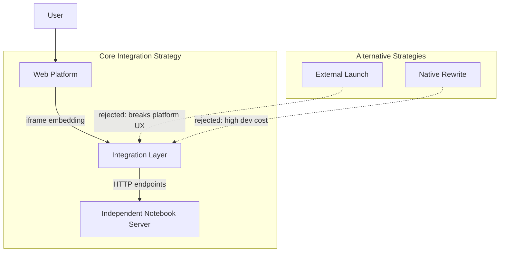

# ADR-15: NOTEBOOK WEB INTEGRATION ARCHITECTURE

## Context and Problem Statement

The notebook functionality requires seamless integration with the web-based platform interface, allowing users to manage notebook extensions and access interactive analysis sessions through both GUI components and HTTP endpoints. The architecture must provide a cohesive user experience that bridges the gap between the standalone notebook server and the platform's web interface.

Key requirements include:
- Providing a graphical management interface for notebook extensions with launch capabilities
- Serving notebook content through HTTP endpoints with iframe embedding for web integration
- Supporting navigation workflows including launch notifications and back navigation
- Enabling parameterized notebook access with application run IDs and results folder paths
- Ensuring responsive user feedback during notebook session transitions
- Integration with FastAPI backend for uvicorn server hosting as evidenced in test workflows

## Decision Drivers

* Need for seamless integration between notebook functionality and existing web platform
* Requirement for iframe-based embedding to maintain consistent platform UX
* Need for parameterized notebook access with application-specific context
* Requirement for clear user workflow with launch notifications and navigation
* Need for HTTP endpoint architecture that supports query parameter handling
* Performance requirement for responsive GUI interactions during server startup
* User experience requirement for intuitive notebook management interface

## Considered Options

1. Direct External Application Launch with URL Redirection
2. Iframe-Based Integration with HTTP Endpoint Architecture  
3. Full Frontend Rewrite with Native Notebook Components

## Decision Outcome

Chosen option: "Iframe-Based Integration with HTTP Endpoint Architecture", because it provides the optimal balance between integration depth and development complexity while maintaining platform consistency and enabling parameterized notebook access.

### Rationale

The iframe-based approach allows deep integration of notebook functionality within the existing platform interface while preserving the notebook server's independence. HTTP endpoints provide flexible parameterization for application-specific contexts, and the GUI workflow ensures clear user guidance through the notebook launch process.

### Positive Consequences

* Seamless integration within existing platform interface through iframe embedding
* Flexible parameterization support for application run IDs and result folders
* Consistent platform UX with guided workflow for notebook management
* Clear separation of concerns between notebook server and web integration layer
* Responsive user feedback through notifications and navigation controls
* Maintainable architecture with standard web technologies

### Negative Consequences

* Additional complexity for iframe security and communication handling
* Dependency on notebook server availability for full functionality
* Limited customization of notebook interface within iframe constraints

## Pros and Cons of the Options

### Direct External Application Launch with URL Redirection

Launch notebook server and redirect users to external URLs in new tabs or windows.

#### Pros

* Minimal integration complexity
* Full notebook interface functionality without constraints
* Clear separation between platform and notebook environments

#### Cons

* Poor user experience with context switching between applications
* Loss of platform context and navigation
* No parameterization support for application-specific workflows
* Difficult to maintain consistent platform branding and UX

### Iframe-Based Integration with HTTP Endpoint Architecture

Embed notebook functionality within platform interface using iframe components served through HTTP endpoints.

#### Pros

* Seamless integration within platform interface
* Parameterized access with application run IDs and folder paths
* Consistent platform UX with guided workflows
* Flexible endpoint architecture for future extensions
* Clear user feedback through notifications and navigation

#### Cons

* Additional complexity for iframe integration and security
* Potential limitations for advanced notebook interface features
* Dependency on reliable notebook server communication

### Full Frontend Rewrite with Native Notebook Components

Reimplement notebook functionality as native platform components without external server dependency.

#### Pros

* Complete control over user interface and experience
* Native platform integration without iframe limitations
* Optimal performance and customization capabilities

#### Cons

* Significant development effort to reimplement existing functionality
* Maintenance burden for keeping up with notebook server feature evolution
* Risk of divergence from standard notebook ecosystem
* High implementation complexity for interactive analysis features

## More Information

### Architecture Overview

The notebook web integration architecture implements iframe-based embedding as the core integration strategy, balancing platform consistency with development complexity.

### Components Details

#### GUI Management Interface

**Responsibilities:**
- Display notebook extension management functionality
- Provide launch button for starting notebook sessions
- Handle user notifications during server startup
- Support navigation workflows with back button functionality

**Key Features:**
- "Manage your Marimo Extension" interface display
- Launch button with "Launching Python Notebook..." notification
- Transition to notebook interface upon successful server startup
- Back navigation to return to main notebook management page

#### HTTP Endpoint Architecture

**Endpoint Architecture:**
- REST-style URL design with application run ID path parameters
- Query parameter support for workspace context (results_folder)
- HTTP 200 response with iframe-embedded notebook content
- Dynamic URL construction targeting localhost notebook servers

#### Iframe Integration Strategy

**Embedding Approach:**
- Iframe source URLs reference notebook server endpoints
- Dynamic URL construction with application-specific parameters
- Host targeting: localhost, 127.0.0.1 for local notebook server integration
- Parameter passing: application_run_id for context preservation

**Security Considerations:**
- Same-origin policy compliance for local server communication
- Parameter validation for application run IDs and folder paths
- Content security policy configuration for iframe restrictions

### User Workflow Integration

**Launch Sequence:**
1. User accesses notebook management interface
2. User clicks launch button to start notebook session
3. System displays "Launching Python Notebook..." notification
4. GUI transitions to notebook interface upon server readiness
5. Iframe loads with parameterized notebook server URL

**Navigation Workflow:**
1. User interacts with embedded notebook interface
2. Back button available for returning to management interface
3. Platform navigation preserved within iframe embedding context
4. Session context maintained through URL parameters

### Integration Strategy Implementation

The chosen iframe-based integration provides seamless embedding of notebook functionality within the platform interface while maintaining server independence. Test evidence shows successful FastAPI integration with uvicorn hosting, GUI workflow validation, and HTTP endpoint responsiveness with parameterized access patterns.

### Error Handling and Resilience

**Server Availability:**
- Graceful handling of notebook server startup delays
- User feedback through notification system during initialization
- Fallback behavior when server is not immediately available

**Parameter Validation:**
- Application run ID format validation
- Results folder path sanitization and validation
- Error handling for invalid or malformed parameters

### Testing and Validation Strategy

**GUI Workflow Testing:**
- User interaction flow from management interface to notebook launch
- Notification display and timing validation
- Navigation workflow testing with back button functionality

**HTTP Endpoint Testing:**
- Parameter handling for application run IDs and folder paths
- Iframe content generation and URL construction
- Response status and content validation

**Integration Testing:**
- End-to-end workflow from GUI launch to embedded notebook access
- Parameter propagation through the complete integration stack
- Cross-browser compatibility for iframe embedding
