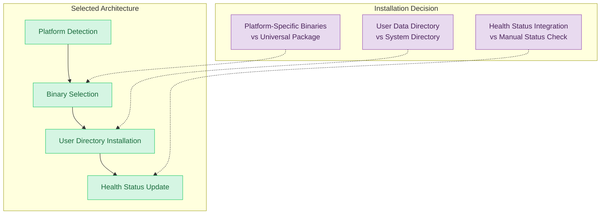

# ADR-11: QUPATH INSTALLATION MANAGEMENT SYSTEM

## Context and Problem Statement

The system requires the ability to install, manage, and uninstall QuPath application across multiple platforms to enable users to visualize whole slide images and analysis results. Users need both command-line and graphical interfaces for managing QuPath installation status, with the system automatically detecting platform configurations and managing binary distributions.

The system must support installation across Windows, Linux, and Darwin platforms (including both amd64 and arm64 architectures), provide installation status monitoring through health checks, and integrate with the GUI to display installation progress and system readiness status. Installation validation occurs through system info commands that return null when QuPath is not installed and proper version information when successfully installed.

## Decision Drivers

* Need for cross-platform QuPath installation support (Windows, Linux, Darwin amd64/arm64)
* Requirement for both CLI and GUI installation interfaces
* Need for platform-specific binary distribution and configuration management
* Integration with system health monitoring for installation status
* Requirement for idempotent installation operations (install can be run multiple times safely)
* Need for clean uninstallation with proper resource cleanup
* User data directory management for application storage
* Version-specific installation with confirmation messaging

## Considered Options

1. Platform-Specific Installation with User Data Directory Management
2. System-Wide Installation with Administrative Privileges
3. Container-Based QuPath Distribution
4. Package Manager Integration (apt, brew, chocolatey)

## Decision Outcome

Chosen option: "Platform-Specific Installation with User Data Directory Management", because it provides the optimal balance of cross-platform compatibility, user isolation, and simplified deployment without requiring administrative privileges or complex system integration.

### Rationale

The user data directory approach enables consistent cross-platform installation without administrative privileges, while platform-specific detection ensures optimal binary compatibility. Health integration provides real-time status monitoring essential for workflow coordination, and the idempotent design prevents conflicts from repeated installations.

### Positive Consequences

* No administrative privileges required for installation
* Consistent cross-platform behavior across Windows, Linux, and Darwin
* Clean user isolation preventing conflicts between different users
* Integrated health monitoring provides real-time installation status
* Version-specific installations enable reproducible environments
* GUI integration provides intuitive installation workflow

### Negative Consequences

* Per-user installations require more disk space in multi-user environments
* Manual updates required (no automatic update mechanism)
* Platform detection complexity increases maintenance overhead

### Confirmation

The implementation can be considered successful when:
- QuPath installs successfully across all supported platforms with exit code 0
- Installation status is accurately reflected in system health checks
- GUI displays correct installation progress and completion notifications
- Uninstallation completely removes QuPath with confirmation messaging
- Multiple installation attempts are handled idempotently without errors

## Pros and Cons of the Options

### Platform-Specific Installation with User Data Directory Management

Downloads platform-appropriate QuPath binaries and installs to user-specific directories with integrated health monitoring.

#### Pros

* No administrative privileges required for installation process
* Consistent cross-platform behavior and user experience
* User isolation prevents conflicts and permission issues
* Integrated health monitoring enables workflow coordination
* Platform detection ensures optimal binary compatibility
* Clean uninstallation with complete resource removal

#### Cons

* Higher disk usage in multi-user environments due to per-user installations
* Manual update process without automatic update mechanisms
* Platform detection logic requires ongoing maintenance for new platform support

### System-Wide Installation with Administrative Privileges

Installs QuPath to system directories accessible by all users with administrative installation.

#### Pros

* Single installation serves multiple users efficiently
* Integration with system package management possible
* Centralized version management and updates
* Reduced per-user disk space requirements

#### Cons

* Requires administrative privileges limiting deployment scenarios
* Complex permission management across different platforms
* Potential conflicts between system and user preferences
* Difficult integration with application-specific health monitoring

### Container-Based QuPath Distribution

Packages QuPath in container images for consistent deployment across platforms.

#### Pros

* Completely isolated environment with dependency management
* Consistent behavior regardless of host platform configuration
* Simplified distribution and deployment process
* Version management through container tags

#### Cons

* Requires container runtime increasing system complexity
* Limited GUI integration capabilities for desktop applications
* Performance overhead from containerization layer
* Complex file system integration for user data access

### Package Manager Integration

Leverages platform-specific package managers (apt, brew, chocolatey) for QuPath installation.

#### Pros

* Native integration with platform package management systems
* Automatic dependency resolution and updates
* Familiar installation process for users
* Reduced maintenance overhead for binary distribution

#### Cons

* Platform-specific implementation complexity
* Limited control over installation process and configuration
* Dependency on external package repositories and maintenance
* Inconsistent availability across different platforms

## More Information

### Architecture Diagram

### Components Details

#### Platform Detection System

The system provides specific platform detection capabilities:

- **Platform System Detection**: CLI supports `--platform-system` parameter for Windows, Linux, Darwin
- **Architecture Detection**: CLI supports `--platform-machine` parameter for amd64, arm64 architectures  
- **Compatibility Validation**: ARM64 Linux combinations are detected and handled as unsupported
- **Cross-Platform Coverage**: Installation validated across multiple platform combinations

#### User Data Directory Management

- **Directory Resolution**: Uses standard `appdirs.user_data_dir()` for cross-platform user directory location
- **Installation Validation**: System info command accurately reports installation path and version
- **Clean Removal**: Uninstallation completely removes QuPath with status reset to null values

#### Installation Process Specification

The installation process follows these technical specifications:

- **Success Confirmation**: System displays "QuPath v0.5.0 installed successfully" message with exit code 0
- **Directory Target**: Installation to `appdirs.user_data_dir(project_name)` ensuring user-isolated deployment
- **Platform Support**: Windows, Linux, Darwin amd64, Darwin arm64 with `--platform-system` and `--platform-machine` CLI options
- **Health Integration**: Status transitions from `{"path": null, "version": null}` to `{"path": "[path]", "version": {"version": "0.5.0"}}` in system info
- **GUI Notifications**: Progress display showing "QuPath installed successfully to '[app_dir]'" with installation directory path
- **Uninstallation Confirmation**: System displays "QuPath uninstalled successfully." message with exit code 0
- **Status Reset**: Health monitoring returns to `{"path": null, "version": null}` after successful uninstallation

#### Health Integration

- **Status Monitoring**: Continuously monitors QuPath installation status and availability
- **Health Reporting**: Provides real-time status updates to system health monitoring
- **GUI Integration**: Updates web interface with installation status and progress
- **Error Detection**: Identifies and reports installation failures or corruption

### Installation Workflow

The installation workflow follows these steps:

1. **Platform Validation**: System validates platform compatibility (skips ARM64 Linux)
2. **Installation Execution**: Downloads and installs QuPath v0.5.0 to user data directory
3. **Status Confirmation**: Displays "QuPath v0.5.0 installed successfully" with exit code 0
4. **Health Status Update**: System info transitions from null to valid path and version data
5. **GUI Integration**: Interface updates from "unhealthy" to "healthy" with version confirmation

### Error Handling Specification

The system handles specific error conditions:

- **ARM64 Linux**: Installation skipped with skip condition "QuPath is not supported on ARM64 Linux"
- **Platform Validation**: Command-line platform parameters validated for supported combinations
- **Installation State**: System accurately detects and reports installation status through JSON system info
- **GUI Health Integration**: Interface correctly displays "Launchpad is unhealthy" when QuPath missing and "Launchpad is healthy" when installed

### Version Management

The system manages QuPath v0.5.0 specifically:

- **Version Reporting**: System info accurately reports `{"version": "0.5.0"}` when installed
- **Installation Validation**: Health checks confirm version availability for workflow integration
- **Status Tracking**: GUI displays version-specific status messages for user confirmation