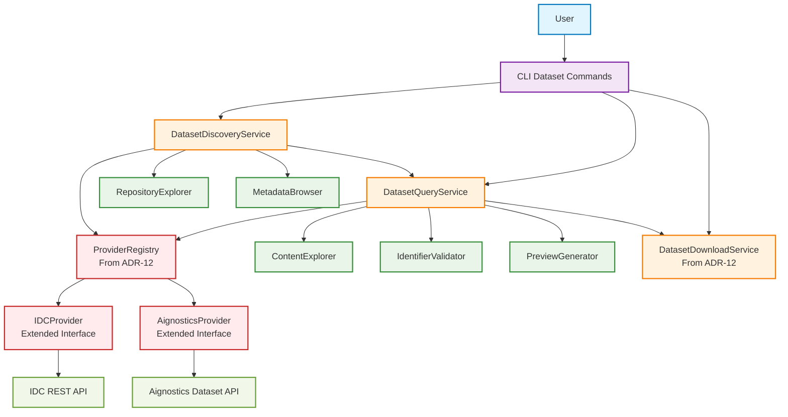

# ADR-14: Dataset Discovery and Query Service Architecture

## Status

Accepted

## Context

Building upon the dataset download infrastructure established in [ADR-12: Dataset Download Service Architecture](ADR-12-DATASET-DOWNLOAD-SERVICE-ARCHITECTURE.md), users require comprehensive dataset discovery and querying capabilities to effectively locate and preview datasets before initiating downloads. This extends the download capabilities by enabling discovery of available repositories and exploration of dataset contents.

The platform needs discovery capabilities that:

* Discover available dataset sources and repositories (IDC, Aignostics) with their capabilities and limitations
* Explore dataset metadata including collection information, patient data, and study details
* Query dataset contents using medical imaging identifiers (collection_id, PatientID, StudyInstanceUID, SeriesInstanceUID, SOPInstanceUID)
* Preview dataset structures and contents before download commitment with size estimates
* Integrate seamlessly with the existing provider abstraction for consistent multi-repository support
* Provide CLI-based tools for efficient dataset exploration workflows

Currently, while users can download datasets through the infrastructure from ADR-12, there is no mechanism to discover what datasets are available or query their contents beforehand. Users need efficient discovery workflows to:

* List available dataset sources and understand their capabilities
* Browse collections and metadata within each repository
* Query specific datasets using medical imaging identifiers
* Preview dataset contents and structures for analysis planning
* Validate queries before committing to large downloads

The architectural challenge is designing a discovery and query system that leverages the existing provider abstraction from ADR-12 while providing intuitive CLI interfaces for dataset exploration and maintaining consistent authentication and error handling patterns.

## Decision Drivers

* **Dataset Source Discovery**: Users must discover available repositories and their capabilities per SWR-DATASET-5
* **Metadata Exploration**: Comprehensive browsing of dataset metadata and collection information per SWR-DATASET-5
* **Content Querying**: Query dataset contents using medical imaging identifiers per SWR-DATASET-6
* **Preview Capabilities**: Preview dataset structures before download commitment per SWR-DATASET-6
* **Provider Integration**: Leverage existing provider abstraction from ADR-12 for consistent multi-repository support
* **CLI Consistency**: Extend existing `aignostics dataset` command group with discovery and query capabilities
* **Authentication Integration**: Use same authentication patterns established in ADR-12
* **Performance**: Efficient metadata queries without triggering large data transfers

## Considered Options

### Option 1: Service Layer Extension with Provider Integration

Extend the dataset service architecture from ADR-12 to include discovery and query capabilities, leveraging the existing provider abstraction for consistent multi-repository operations following the service layer patterns from ADR-1.

**Pros:**
* **Provider Abstraction Reuse**: Leverages existing provider interface from ADR-12 for consistent multi-repository support
* **Authentication Integration**: Uses same OAuth2 patterns through PlatformClient for repository access
* **Service Layer Consistency**: Maintains established service layer patterns from ADR-12 and follows application discovery patterns from ADR-1
* **CLI Integration**: Natural extension of existing `aignostics dataset` command group with consistent interface patterns
* **Testing Consistency**: Builds upon established testing patterns with mocked providers and repository responses
* **Error Handling Reuse**: Leverages same exception types and user feedback patterns from ADR-12
* **Architecture Alignment**: Consistent with application discovery patterns from ADR-1 while supporting dataset-specific requirements

**Cons:**
* **Service Complexity**: Discovery service handles multiple concerns including repository discovery, metadata querying, and content preview
* **Provider Dependencies**: Query capabilities limited by what each repository provider exposes through their APIs
* **CLI Command Growth**: Additional commands increase CLI surface area for documentation and maintenance

### Option 2: Separate Discovery and Query Services

Implement independent services for dataset discovery and content querying with separate provider integrations and CLI interfaces.

**Pros:**
* **Clear Separation of Concerns**: Distinct responsibilities for discovery operations vs content querying
* **Independent Evolution**: Discovery and query services can evolve independently based on different requirements
* **Specialized Optimization**: Each service can optimize specifically for its operation type without affecting the other

**Cons:**
* **Provider Integration Duplication**: Duplicate provider abstraction and authentication logic across services
* **Service Inconsistency**: Creates inconsistent patterns compared to unified service architecture from ADR-12
* **Testing Complexity**: Separate testing infrastructure needed for each service, breaking consistency with existing patterns
* **Maintenance Overhead**: Additional services to maintain with separate lifecycles and dependencies
* **CLI Fragmentation**: Users need to understand multiple service interfaces instead of unified dataset workflow

### Option 3: Repository-Specific Discovery Tools

Implement separate discovery tools for each repository type (IDC, Aignostics) with repository-optimized interfaces and capabilities.

**Pros:**
* **Repository Optimization**: Native query capabilities optimized for each repository's specific features and APIs
* **Maximum Performance**: Direct repository integration without abstraction overhead
* **Specialized Features**: Can leverage repository-specific features that don't map to common abstraction

**Cons:**
* **Implementation Duplication**: Duplicate development and maintenance effort for each repository implementation
* **User Experience Inconsistency**: Different discovery interfaces for different repositories create confusion
* **Provider Abstraction Loss**: Breaks the provider abstraction established in ADR-12 for download operations
* **Testing Complexity**: Testing matrix requires validation across multiple repository-specific implementations
* **CLI Complexity**: Multiple command patterns for different repositories increase user cognitive load

## Decision

We will implement **Option 1: Service Layer Extension with Provider Integration**.

## Rationale

After evaluating the options against our decision drivers and the established architecture from ADR-12, the service layer extension approach provides the optimal balance of consistency, maintainability, and user experience:

**Architecture Benefits:**
* **Provider Abstraction Extension**: Builds upon existing provider interface from ADR-12 to support discovery and query operations consistently across repositories
* **Service Layer Consistency**: Maintains established service layer patterns while extending capabilities for dataset exploration
* **Authentication Integration**: Leverages existing OAuth2 patterns and PlatformClient integration without duplication

**User Experience:**
* **Unified Workflow**: Natural progression from discovery → query → download within consistent CLI interface
* **Consistent Interface**: Same command patterns and error handling across all dataset operations
* **Provider Transparency**: Users get consistent experience regardless of underlying repository differences

**Development Benefits:**
* **Architecture Alignment**: Follows same patterns as application discovery from ADR-1 adapted for dataset-specific requirements
* **Testing Efficiency**: Extends existing testing infrastructure with provider mocking patterns
* **Maintenance Simplicity**: Centralized logic reduces maintenance overhead compared to multiple service coordination

## Relationship to ADR-12

This ADR extends the dataset download infrastructure from [ADR-12: Dataset Download Service Architecture](ADR-12-DATASET-DOWNLOAD-SERVICE-ARCHITECTURE.md):

* **Provider Interface Extension**: Extends existing provider abstraction to support discovery and query operations
* **Authentication Reuse**: Uses same OAuth2 patterns through PlatformClient for repository access
* **CLI Integration**: Extends existing `aignostics dataset` command group with discovery and query commands
* **Error Handling Consistency**: Leverages same exception types and user feedback mechanisms

**Integration Points:**
* Discovery service uses extended provider interface for repository metadata queries
* Query service leverages same provider authentication for content exploration
* Same CLI command structure and help text formatting as download commands
* Consistent logging and progress feedback patterns across all dataset operations

## Consequences

### Positive

* **Architectural Consistency**: Maintains service layer patterns and authentication flows established in ADR-12
* **Discovery Workflow**: Comprehensive dataset exploration workflow from discovery through download
* **Provider Abstraction**: Consistent multi-repository support through extended provider interface
* **CLI Integration**: Natural extension of existing dataset commands for seamless user experience
* **Testing Consistency**: Builds upon established testing patterns while adding discovery-specific scenarios
* **Future Extensibility**: Service layer provides foundation for advanced querying and filtering capabilities

### Negative

* **Service Complexity**: Discovery service handles multiple concerns including repository discovery, metadata querying, and content preview
* **Provider Dependencies**: Query capabilities limited by what each repository provider exposes through their APIs
* **CLI Command Growth**: Additional commands increase CLI surface area for documentation and maintenance

### Risks and Mitigation

* **Repository API Limitations**: Risk of inconsistent query capabilities across repositories
  * *Mitigation*: Provider interface abstracts common operations with repository-specific fallbacks
* **Metadata Query Performance**: Risk of slow responses for large repository metadata queries
  * *Mitigation*: Efficient pagination and caching strategies with timeout handling
* **Provider Authentication**: Risk of authentication failures across multiple repositories
  * *Mitigation*: Robust error handling with clear user guidance per repository authentication requirements

## Implementation Notes

### Architecture Overview



### Core Components

**DatasetDiscoveryService** (`src/aignostics/dataset/discovery_service.py`)
* **Purpose**: Orchestrates dataset repository discovery and metadata exploration operations
* **Key Methods**: `list_available_sources()`, `explore_repository_metadata()`, `browse_collections()`
* **Integration**: Uses extended provider interface for consistent multi-repository discovery
* **Features**: Repository capability discovery, collection browsing, metadata exploration

**DatasetQueryService** (`src/aignostics/dataset/query_service.py`)
* **Purpose**: Manages dataset content querying and preview operations using medical imaging identifiers
* **Key Methods**: `query_by_identifier()`, `preview_dataset_structure()`, `validate_identifier_format()`
* **Integration**: Leverages provider interface for content exploration and validation
* **Features**: Multi-identifier querying, content preview generation, dry-run validation

**Extended Provider Interface** (Extension of ADR-12 providers)
* **Purpose**: Extends existing provider abstraction to support discovery and query operations
* **New Methods**: `list_collections()`, `get_metadata()`, `query_content()`, `preview_structure()`
* **Integration**: Maintains backward compatibility with download operations from ADR-12
* **Repository Support**: IDC provider and Aignostics provider with repository-specific optimizations

### CLI Command Specifications

**Dataset Discovery Commands** (Extending `aignostics dataset` command group)

```bash
# List available dataset sources and their capabilities
aignostics dataset sources list

# Explore metadata for specific repository
aignostics dataset sources explore idc [--collection-id <id>]

# Browse collections in repository
aignostics dataset collections list --source idc
aignostics dataset collections describe <collection-id> --source idc

# Query dataset contents by identifier
aignostics dataset query --patient-id <id> --source idc
aignostics dataset query --study-instance-uid <uid> --source aignostics

# Preview dataset structure without download
aignostics dataset preview --collection-id <id> --source idc --dry-run
```

**Discovery Workflow Integration**
```bash
# Complete dataset discovery workflow
aignostics dataset sources list                    # Discover available repositories
aignostics dataset collections list --source idc   # Browse collections in repository
aignostics dataset query --collection-id TCGA-LUAD --source idc  # Query specific dataset
aignostics dataset preview --collection-id TCGA-LUAD --source idc --dry-run  # Preview structure
aignostics dataset download --collection-id TCGA-LUAD --source idc ./data    # Download dataset
```

### Interface Specifications

**Repository Discovery Output**
```
Available Dataset Sources:
- idc: IDC (Imaging Data Commons)
  - Capabilities: Collection browsing, DICOM metadata, PatientID/StudyUID queries
  - Collections: 50+ public cancer imaging datasets
- aignostics: Aignostics Dataset Repository
  - Capabilities: Curated datasets, SeriesUID queries, quality annotations
  - Collections: 20+ validated medical imaging datasets
```

**Content Query Output**
```
Query Results for PatientID 'TCGA-17-Z058' in source 'idc':
- Studies: 2 studies found
- Series: 5 series (CT: 3, MR: 2)
- Instances: 450 DICOM instances
- Total Size: ~2.3 GB
- Collections: TCGA-LUAD

Preview Structure:
  TCGA-17-Z058/
  ├── CT_2008-12-29/
  │   ├── Series_1.2.840.113654.2.55.../
  │   └── Series_1.2.840.113654.2.55.../
  └── MR_2009-01-15/
      └── Series_1.2.840.113654.2.55.../
```

**Error Handling Strategy**
* Repository unavailability: Clear error messages with alternative repository suggestions
* Invalid identifiers: Format validation with examples of correct identifier patterns
* Query timeouts: Timeout handling with retry suggestions and progress feedback
* Authentication failures: Repository-specific authentication guidance with setup instructions

### Security Considerations

* **Authentication**: Discovery operations use same OAuth2 patterns through PlatformClient as download operations
* **Query Validation**: Identifier validation prevents injection attacks and malformed repository queries
* **Rate Limiting**: Respect repository rate limits during metadata exploration to prevent service disruption
* **Audit Trail**: Complete discovery and query operation logging with correlation IDs for compliance tracking
* **Privacy Protection**: Ensure metadata queries don't expose sensitive patient information inappropriately

### Testing Strategy

**Unit Tests**
* DatasetDiscoveryService methods with mocked provider responses using pytest fixtures
* DatasetQueryService with various identifier types and validation scenarios
* Extended provider interface with repository-specific discovery and query operations
* Error handling scenarios with repository unavailability and invalid query parameters

**Integration Tests**
* End-to-end discovery workflow with real repository APIs and authentication
* Multi-repository query operations with consistent result formatting
* CLI command execution with various discovery and query scenarios
* Authentication integration across different repository providers

**Performance Tests**
* Large metadata query scenarios with pagination and timeout handling
* Concurrent discovery operations across multiple repositories
* Query response time validation for interactive CLI usage
* Memory usage validation during extensive metadata exploration

## Related Decisions

* **Extends**: [ADR-12: Dataset Download Service Architecture](ADR-12-DATASET-DOWNLOAD-SERVICE-ARCHITECTURE.md)
* **Follows**: [ADR-1: Application Discovery Service](../SHR-APPLICATION-1/ADR-1-APPLICATION-LISTING-SERVICE.md) (patterns)
* **Future ADR**: Advanced dataset filtering and search capabilities across repositories
* **Future ADR**: Dataset metadata caching and offline discovery capabilities
* **Future ADR**: GUI interface for dataset discovery and preview operations

## References

* [ADR-12: Dataset Download Service Architecture](ADR-12-DATASET-DOWNLOAD-SERVICE-ARCHITECTURE.md)
* [ADR-1: Application Discovery Service](../SHR-APPLICATION-1/ADR-1-APPLICATION-LISTING-SERVICE.md)
* [SWR-DATASET-5: Discover Available Dataset Sources and Metadata](../4_SWR/SHR-DATASET-1/SWR-DATASET-5.md)
* [SWR-DATASET-6: Query and Preview Dataset Contents](../4_SWR/SHR-DATASET-1/SWR-DATASET-6.md)
* [IDC REST API Documentation](docs/IDC_API.md)
* [Aignostics Dataset API Documentation](docs/AIGNOSTICS_DATASET_API.md)
* [Dataset Discovery Security Guidelines](docs/DATASET_DISCOVERY_SECURITY.md)
* [Medical Imaging Identifier Standards](docs/MEDICAL_IMAGING_IDENTIFIERS.md)