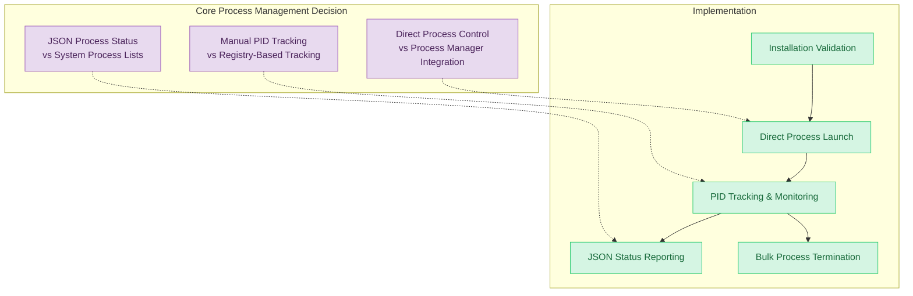

# ADR-12: QUPATH PROCESS LIFECYCLE MANAGEMENT

## Context and Problem Statement

The system requires robust process management capabilities for launching, monitoring, and terminating QuPath application instances. Users need the ability to launch QuPath with proper process tracking, monitor running instances, and cleanly terminate processes when analysis sessions are complete. The system must handle process lifecycle events reliably, including launch failures when QuPath is not installed, and provide comprehensive process status reporting.

Process management must support QuPath UI launches with proper process tracking, monitor running instances through PID validation, and provide clean termination with count reporting. The system must validate QuPath installation before launch attempts, returning exit code 2 with specific error messaging when QuPath is unavailable, and provide JSON-formatted process status information for programmatic integration.

## Decision Drivers

* Need for reliable process launching with proper error handling
* Requirement for accurate process identification and PID tracking
* Need for comprehensive process status monitoring and reporting
* Requirement for clean process termination with resource cleanup
* Support for both interactive and headless QuPath execution modes
* Integration with installation status validation before launch
* Need for JSON-formatted process information for programmatic access
* Requirement for bulk process management operations

## Considered Options

1. Direct Process Spawning with PID Management
2. Container-Based Process Isolation
3. Service-Based QuPath Daemon Architecture
4. System Process Manager Integration

## Decision Outcome

Chosen option: "Direct Process Spawning with PID Management", because it provides optimal performance, direct resource control, and simplified integration while meeting all process lifecycle requirements without introducing unnecessary architectural complexity.

### Rationale

Direct process spawning offers immediate process control with minimal overhead, enabling precise PID tracking and resource management essential for desktop application integration. The approach provides straightforward error handling for installation validation and supports both interactive and programmatic process management workflows.

### Positive Consequences

* Direct process control enables precise resource management and monitoring
* Minimal overhead compared to containerization or service-based approaches
* Simplified integration with existing system health monitoring
* Native desktop application support without virtualization layers
* Comprehensive error handling for installation and launch failures
* Efficient bulk process management for cleanup operations

### Negative Consequences

* Platform-specific process management complexity across Windows, Linux, Darwin
* Manual process lifecycle tracking without automatic cleanup mechanisms
* Potential for orphaned processes if termination handling fails

### Confirmation

The implementation can be considered successful when:
- QuPath launches successfully with valid PID tracking and confirmation messages
- Process status reporting accurately reflects running QuPath instances in JSON format
- Termination operations cleanly shutdown processes with proper resource cleanup
- Installation validation prevents launch attempts when QuPath is not available
- Error conditions are handled gracefully with appropriate exit codes and messaging

## Pros and Cons of the Options

### Direct Process Spawning with PID Management

Native process launching with explicit PID tracking and lifecycle management provides the architectural foundation.

#### Pros

* Direct control over process creation and termination enables precise resource management
* Native desktop application support without compatibility layers
* Straightforward integration with system monitoring and health checks
* Efficient process enumeration and bulk management operations

#### Cons

* Platform-specific implementation complexity requiring cross-platform abstractions
* Manual process lifecycle management without automatic cleanup mechanisms

### Container-Based Process Isolation

#### Pros

* Complete process isolation preventing conflicts and resource leaks
* Consistent behavior across different host platforms

#### Cons

* Significant performance overhead from containerization layer
* Complex desktop application integration requiring GUI forwarding

## More Information

### Architecture Diagram

### Components Details

#### Process Launch System

- **Installation Validation**: System validates QuPath availability before launch attempts
- **Launch Confirmation**: Returns "QuPath launched successfully with process id '[pid]'" with exit code 0
- **Installation Error**: Returns exit code 2 with "QuPath is not installed. Use 'uvx aignostics qupath install' to install it." when unavailable
- **PID Management**: Tracks process identifiers for subsequent monitoring and termination operations

#### Process Status and Monitoring

- **JSON Process Reporting**: Provides structured output including `"pid": [process_id]` for running instances
- **Status Validation**: Confirms process execution through `psutil.Process(pid).is_running()` checks
- **Process Enumeration**: Lists all running QuPath processes with detailed status information
- **Cross-Platform Support**: Handles process identification across Windows, Linux, Darwin platforms

#### Process Termination System

- **Bulk Termination**: Terminates all running QuPath processes with single command
- **Termination Confirmation**: Returns "Terminated [count] running QuPath processes." with actual count
- **Exit Code Management**: Returns exit code 0 for successful termination operations
- **Resource Cleanup**: Ensures proper process cleanup and resource deallocation

### Launch and Termination Workflows

**Launch Process**:
1. Validate QuPath installation status
2. Spawn QuPath process with platform parameters
3. Record PID for monitoring and management
4. Return confirmation with process identifier

**Termination Process**:
1. Enumerate running QuPath processes
2. Terminate identified processes
3. Validate cleanup completion
4. Report termination count

### Error Handling and JSON Reporting

**Error Conditions**:
- Missing installation: Exit code 2 with installation instruction message
- PID validation: Process existence confirmed through system process queries
- Termination failures: Graceful handling with appropriate error reporting

**JSON Output Format**:
- Process lists include `"pid": [process_id]` entries for running QuPath instances
- Structured format designed for programmatic consumption and system integration