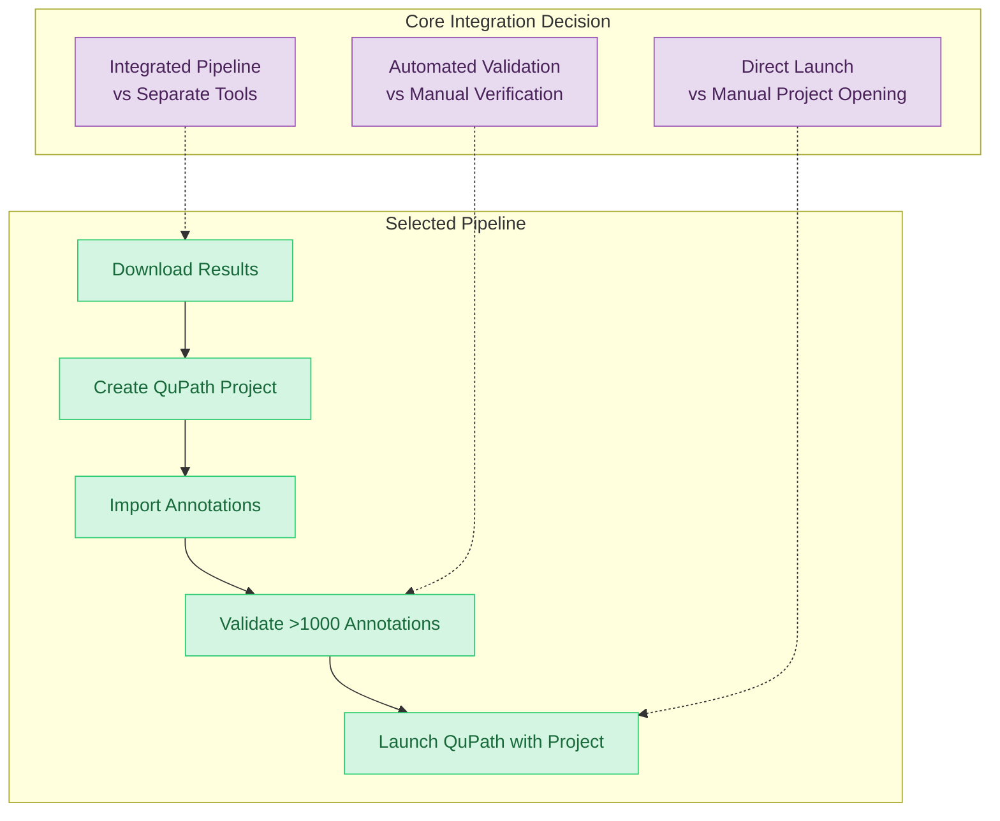

# ADR-13: QUPATH RESULTS INTEGRATION PIPELINE

## Context and Problem Statement

The system requires seamless integration between analysis results and QuPath visualization capabilities, enabling users to automatically download completed analysis results, create structured QuPath projects, and launch QuPath with prepared project data for visualization and further analysis. Users need a streamlined workflow that transforms application run results into QuPath-compatible project structures with imported annotations and properly configured image references.

The integration pipeline must handle result download operations, create QuPath project directories with proper structure, import analysis annotations into QuPath format, and launch QuPath with the prepared project. The system must validate successful annotation import by ensuring annotation counts exceed 1000 annotations, confirming successful conversion of analysis results into actionable QuPath projects with "Download and QuPath project creation completed." notifications.

## Decision Drivers

* Need for automated result download and QuPath project creation workflow
* Requirement for proper QuPath project structure generation with annotation import
* Need for seamless transition from analysis results to QuPath visualization
* Requirement for annotation validation ensuring successful result integration
* Need for integrated download and launch workflow reducing user manual steps
* Support for various analysis result formats and annotation types
* Requirement for QuPath project launch with prepared data
* Need for proper resource organization and file structure management

## Considered Options

1. Integrated Download-to-Project Pipeline with Direct Launch
2. Separate Download and Manual Project Creation Workflow
3. QuPath Plugin-Based Result Import System
4. External Conversion Tool with Manual Integration

## Decision Outcome

Chosen option: "Integrated Download-to-Project Pipeline with Direct Launch", because it provides the optimal user experience with automated workflow integration, eliminates manual conversion steps, and ensures seamless transition from analysis completion to visualization readiness.

### Rationale

The integrated pipeline approach minimizes user intervention while ensuring robust result validation and proper QuPath project structure. Direct launch integration provides immediate access to visualization capabilities, and automated annotation import ensures analysis results are immediately actionable within QuPath's analysis environment.

### Positive Consequences

* Streamlined user workflow from analysis completion to visualization
* Automated project creation eliminates manual configuration steps
* Integrated validation ensures annotation import success before launch
* Proper QuPath project structure enables full feature utilization
* Direct launch integration provides immediate visualization access
* Centralized result management with organized file structures

### Negative Consequences

* Tight coupling between result formats and QuPath project structure requirements
* Complex error handling for annotation import failures or format incompatibilities
* Dependency on QuPath project format specifications and compatibility

### Confirmation

The implementation can be considered successful when:
- Download and project creation completes with "Download and QuPath project creation completed." notification
- QuPath launches successfully with prepared project showing "QuPath opened successfully with process id '[pid]'"
- Created QuPath projects contain significant annotation counts (minimum 1000 annotations) validating successful import
- Project structure enables full QuPath functionality for visualization and analysis

## Pros and Cons of the Options

### Integrated Download-to-Project Pipeline with Direct Launch

Complete workflow automation combining result download, project creation, annotation import, and QuPath launch.

#### Pros

* Complete workflow automation eliminates manual user intervention steps
* Integrated validation ensures annotation import success before visualization
* Seamless transition from analysis completion to QuPath visualization
* Centralized progress reporting throughout pipeline

#### Cons

* Complex integration requiring coordination between download, project creation, and launch systems
* Tight coupling between analysis result formats and QuPath requirements

### Separate Download and Manual Project Creation Workflow

#### Pros

* Simplified system integration with clear separation of concerns
* User control over project organization and annotation selection

#### Cons

* Manual steps increase user workload and potential for configuration errors
* No automated validation of annotation import success

## More Information

### Architecture Diagram

### Components Details

#### Integration Pipeline Components

- **Download and Project Creation**: Downloads analysis results and creates QuPath project structure with proper directory organization
- **Annotation Import and Validation**: Imports analysis annotations and validates minimum 1000 annotation count for successful integration
- **Completion Notification**: Displays "Download and QuPath project creation completed." message upon successful pipeline completion
- **QuPath Launch Integration**: Launches QuPath with prepared project and displays "QuPath opened successfully with process id '[pid]'" confirmation

#### Technical Specifications

- **Project Structure**: Creates `qupath/` subdirectory with project files alongside downloaded results
- **Annotation Validation**: Confirms annotation import success through count verification exceeding 1000 annotations
- **File Organization**: Maintains organized structure with analysis results in item directories and QuPath project in dedicated subdirectory
- **Process Integration**: Combines download, project creation, and launch operations in single workflow

### Integration Workflow and Validation

**Core Workflow**:
1. Download analysis results to organized directory structure
2. Create QuPath project with proper configuration and structure
3. Import annotations and validate >1000 annotation count
4. Launch QuPath with prepared project

**Validation Requirements**:
- Annotation count exceeding 1000 confirms successful import
- Project structure enables full QuPath functionality
- Process launch confirmation with PID tracking

### Error Handling

**Pipeline Failures**:
- Download errors handled with user notification and retry options
- Project creation failures reported with diagnostic information
- Annotation import failures identified through validation count checks
- Launch integration errors handled with appropriate error messaging