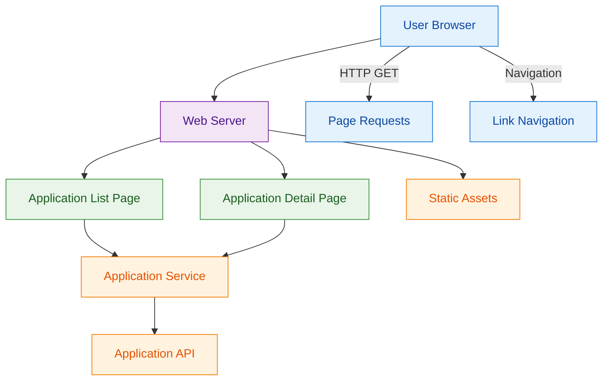

# ADR-0002: Application Web Interface for Discovery and Navigation

## Context and Problem Statement

The platform requires a web interface that enables users to view available AI applications and navigate between different application pages. Users need to access application information through an intuitive web interface and be able to navigate to detailed application pages to access application functionality.

## Decision Drivers

* Need for web interface to display available AI applications
* Navigation capability between application pages
* Display of application information in web format
* Access to detailed application pages for further functionality
* Integration with backend application service for data retrieval

## Considered Options

1. Server-Side Rendered Pages with Simple Navigation
2. Single Page Application with Client-Side Routing
3. Multi-Page Application with Progressive Enhancement
4. Hybrid Approach with Server-Side Base and Client-Side Enhancement

## Decision Outcome

Chosen option: "Server-Side Rendered Pages with Simple Navigation", because it provides reliable page loading, simple navigation between applications, and straightforward integration with the application service while meeting the basic requirements for application discovery and information display.

### Rationale

The server-side rendering approach allows for:
- Reliable page loading with application information
- Simple navigation links between application pages
- Direct integration with the application service API
- Standard web page behavior that works in all browsers
- Easy implementation and maintenance

### Positive Consequences

* Excellent user experience with fast initial loads and responsive interactions
* Real-time updates for workflow progress and run status changes
* Good accessibility support with progressive enhancement
* Scalable architecture that supports future feature additions
* Clear separation between presentation and business logic
* Strong integration with existing backend services

### Negative Consequences

* More complex architecture than pure SPA or SSR approaches
* WebSocket infrastructure adds operational complexity
* State synchronization between client and server requires careful design

## Pros and Cons of the Options

### Server-Side Rendered Pages with Simple Navigation

Traditional web pages rendered on the server with HTML links for navigation between application pages.

#### Pros

* Simple and reliable implementation
* Fast initial page loads with complete content
* Standard browser navigation behavior
* No JavaScript dependencies for core functionality
* Easy to cache and optimize for performance
* Works across all browsers and devices
* Straightforward integration with application service

#### Cons

* Page reloads required for each navigation
* Limited client-side interactivity
* Less dynamic user experience than modern web apps
* Requires server round-trip for each page view

### Single Page Application with Client-Side Routing

Client-side application that loads once and handles navigation through JavaScript routing.

#### Pros

* Smooth navigation without page reloads
* Rich interactive user experience
* Fast navigation after initial load
* Modern web application feel

#### Cons

* Complex JavaScript application to build and maintain
* Slower initial page load
* Requires JavaScript for basic functionality
* More complex state management
* SEO challenges without server-side rendering

### Multi-Page Application with Progressive Enhancement

Server-rendered pages with optional JavaScript enhancements for improved user experience.

#### Pros

* Works without JavaScript (baseline functionality)
* Can add interactive features where beneficial
* Good balance of reliability and enhancement
* SEO-friendly with server-rendered content

#### Cons

* More complex to implement than pure server-side approach
* Need to maintain both server and client-side logic
* Potential for inconsistent behavior between enhanced and basic modes

### Hybrid Approach with Server-Side Base and Client-Side Enhancement

Combines server-side rendering for initial page loads with client-side routing for subsequent navigation.

#### Pros

* Fast initial page loads
* Smooth navigation after first load
* Progressive enhancement capabilities
* Good performance characteristics

#### Cons

* Most complex implementation option
* Requires coordination between server and client routing
* Potential for inconsistent user experience
* Higher development and maintenance overhead

## More Information

### Architecture Diagram

### Components Details

#### Web Server

Standard web server that handles HTTP requests and serves HTML pages with application information.

**Key Responsibilities:**
- Serve application list page showing available applications
- Serve individual application detail pages
- Handle static assets (CSS, JavaScript, images)
- Integrate with application service to retrieve current application data

#### Application List Page

Server-rendered HTML page that displays available applications with navigation links.

**Page Features:**
- List of available applications including "he-tme" and "test-app"
- Navigation links to individual application detail pages
- Application names and basic information display
- Simple HTML structure with standard web navigation

#### Application Detail Page

Server-rendered HTML page that shows detailed information for a specific application.

**Page Features:**
- Detailed application information including artifact identifiers
- Application-specific content and descriptions
- Navigation back to application list
- Links to access application functionality

#### Integration with Application Service

The web interface consumes the application service API to retrieve current application data for page rendering.

**Data Integration:**
- Retrieve application list for list page rendering
- Retrieve specific application details for detail page rendering
- Handle application service errors gracefully
- Cache application data appropriately for performance