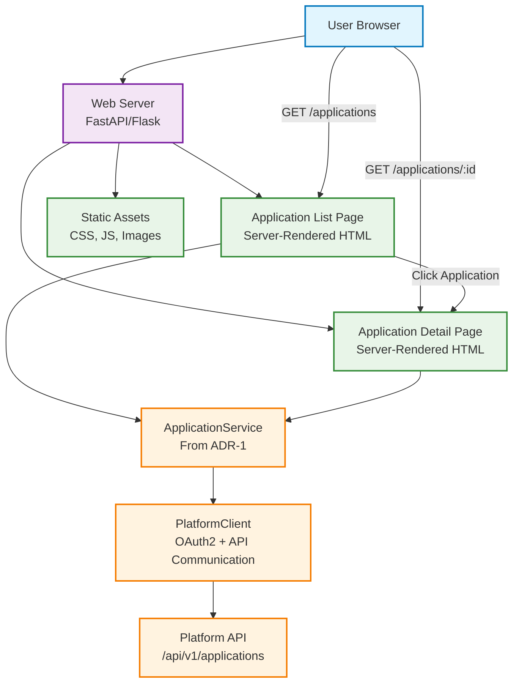

# ADR-2: Application Web Interface for Discovery and Navigation

## Status

Accepted

## Context

Building upon the application discovery service architecture established in [ADR-1: Application Discovery Service](ADR-1-APPLICATION-LISTING-SERVICE.md), users require a web-based interface that complements the existing CLI capabilities. The web interface must enable:

* Visual navigation between available AI applications without CLI expertise
* Intuitive browser-based application discovery for non-technical users
* Seamless integration with the existing ApplicationService architecture
* Consistent presentation of application metadata across web and CLI interfaces

Currently, application discovery is only available through CLI commands (`aignostics application list`, `aignostics application describe`) and Python API interfaces. A web interface is needed to provide broader accessibility and improved user experience for application discovery workflows, particularly for users who prefer graphical interfaces over command-line tools.

The challenge is designing a web interface that leverages the existing ApplicationService while providing optimal user experience, maintaining architectural consistency with ADR-1, and ensuring security best practices.

## Decision Drivers

* **User Accessibility**: Non-technical users need web-based application discovery without CLI requirements
* **Architectural Consistency**: Leverage existing ApplicationService from ADR-1 for consistent data access patterns
* **Developer Experience**: Frontend developers need clear patterns for application data integration using established service layer
* **Performance**: Fast page loads and responsive navigation between applications with server-side rendering
* **SEO and Shareability**: Application pages should be linkable and searchable for knowledge sharing across teams
* **Security**: Proper authentication and authorization using existing OAuth2 infrastructure from PlatformClient
* **Future Extensibility**: Architecture should support enhanced features like filtering, search, and interactive workflows

## Considered Options

### Option 1: Server-Side Rendered Web Interface with Service Layer Integration

Implement a web server that renders HTML pages server-side, consuming the existing ApplicationService for consistent data access and error handling patterns established in ADR-1.

### Option 2: Single-Page Application with REST API

Build a client-side JavaScript application that communicates with a new REST API endpoint, bypassing the service layer for direct Platform API access.

### Option 3: Hybrid Approach with Progressive Enhancement

Combine server-side rendering for initial page loads with client-side JavaScript for enhanced interactivity and dynamic features.

## Decision

We will implement **Option 1: Server-Side Rendered Web Interface with Service Layer Integration**.

## Rationale

After evaluating the options against our decision drivers, the server-side rendering approach with service layer integration provides the optimal balance of consistency, performance, and maintainability:

**Architecture Benefits:**
* **Service Layer Reuse**: Leverages existing ApplicationService for identical data access patterns as CLI, maintaining consistency from ADR-1
* **Consistent Error Handling**: Same NotFoundException handling and user feedback across all interfaces
* **Authentication Integration**: Uses existing OAuth2 flow through PlatformClient without additional API endpoints
* **SEO Optimization**: Server-rendered pages provide better search engine indexing and faster initial loads

**Developer Experience:**
* **Familiar Patterns**: Web developers can use established service layer patterns from ADR-1
* **Simplified Testing**: Unit tests with mocked ApplicationService, consistent with existing test patterns
* **Clear Architecture**: Clean separation between presentation (templates) and business logic (service)

**Performance Characteristics:**
* **Fast Initial Loads**: Server-side rendering eliminates client-side API round trips for initial page content
* **Progressive Enhancement**: JavaScript can be added later for enhanced features without architectural changes
* **Shared Caching**: Benefits from any future ApplicationService caching implementations

## Relationship to ADR-1

This ADR builds directly on [ADR-1: Application Discovery Service](ADR-1-APPLICATION-LISTING-SERVICE.md):

* **Service Layer Reuse**: Web interface consumes the same ApplicationService for consistent data access
* **Error Handling**: Leverages NotFoundException from ADR-1 for 404 page rendering
* **Authentication**: Uses same OAuth2 flow through PlatformClient
* **Data Consistency**: Identical application metadata format across CLI and web interfaces

**Integration Points:**
* Web server instantiates ApplicationService for each request using established patterns
* 404 errors mapped to user-friendly "Application not found" pages
* Same artifact format display as CLI `--verbose` output
* Consistent authentication flow with token management

## Consequences

### Positive

* **Architectural Consistency**: Maintains service layer patterns established in ADR-1
* **Reduced Development Overhead**: No new API endpoints or authentication flows required
* **Comprehensive Testing**: Leverages existing service layer test infrastructure
* **SEO Benefits**: Server-rendered pages improve discoverability and link sharing
* **Performance**: Fast initial page loads without client-side API dependencies
* **Future Extensibility**: Server-side architecture supports progressive enhancement

### Negative

* **Limited Interactivity**: Initial implementation lacks dynamic client-side features
* **Page Refresh Navigation**: Traditional web navigation requires full page reloads
* **JavaScript Dependency for Enhancement**: Future interactive features require additional client-side complexity

### Risks and Mitigation

* **Authentication Session Management**: Risk mitigated by leveraging existing OAuth2 token handling from PlatformClient
* **Template Maintenance**: Risk mitigated by clear separation between templates and business logic
* **Performance at Scale**: Risk mitigated by potential future ApplicationService caching implementation

## Implementation Notes

### Architecture Overview



### Core Components

**Web Server** (`src/aignostics/web/server.py`)
* **Purpose**: Serves application discovery pages with server-side rendering using FastAPI framework
* **Key Routes**: `/applications` (list), `/applications/{id}` (details), `/static/*` (assets)
* **Integration**: Consumes ApplicationService from ADR-1 for consistent data access

**Application List Page** (`src/aignostics/web/templates/applications/list.html`)
* **Purpose**: Displays available applications with navigation links using Jinja2 templates
* **Data Source**: `ApplicationService.applications()` method from ADR-1
* **Features**: Application cards, search functionality, navigation to details

**Application Detail Page** (`src/aignostics/web/templates/applications/detail.html`)
* **Purpose**: Shows detailed application information and metadata
* **Data Source**: `ApplicationService.application(id)` method from ADR-1
* **Features**: Artifact display, metadata tables, navigation back to list

### Interface Specifications

**URL Structure**
```
GET /applications              # Renders list of available applications
GET /applications/{id}         # Renders detailed application page (404 if not found)
GET /static/{path}            # Serves CSS, JavaScript, images
```

**Error Handling Strategy**
* 404 pages for missing applications using NotFoundException from service layer
* Authentication redirects using existing OAuth2 flow
* User-friendly error messages consistent with CLI interface
* Proper HTTP status codes aligned with REST principles

### Security Considerations

* **Authentication**: Web interface requires same OAuth2 authentication as CLI through PlatformClient
* **CSRF Protection**: Form submissions protected with CSRF tokens using FastAPI security features
* **XSS Prevention**: All user-generated content properly escaped in Jinja2 templates
* **Content Security Policy**: Strict CSP headers to prevent script injection
* **Session Management**: Secure cookie handling for authentication state following coding guidelines

### Testing Strategy

**Unit Tests**
* Web route handlers with mocked ApplicationService using pytest fixtures
* Template rendering with sample application data
* Error handling scenarios (404, authentication failures)

**Integration Tests**
* End-to-end page rendering with real ApplicationService
* Navigation flow between list and detail pages
* Authentication integration with Platform API

**UI Tests**
* Browser-based testing of user navigation flows using pytest-playwright
* Responsive design validation across devices
* Accessibility compliance (WCAG 2.1 AA)

### Alternative Options Considered

**Option 2: Single-Page Application**
* *Pros*: Rich interactivity, modern user experience
* *Cons*: Requires new API endpoints, duplicates service logic, complex authentication, violates DRY principle
* *Rejected*: Violates architectural consistency and increases maintenance overhead

**Option 3: Hybrid Approach**
* *Pros*: Best of both worlds - SEO and interactivity
* *Cons*: Increased complexity, harder testing, multiple rendering paths
* *Deferred*: Can be implemented as progressive enhancement in future iterations

## Related Decisions

* **Extends**: [ADR-1: Application Discovery Service](ADR-1-APPLICATION-LISTING-SERVICE.md)
* **Future ADR**: Client-side interactivity and progressive enhancement patterns
* **Future ADR**: Application filtering and search user interface design
* **Future ADR**: Mobile-responsive design patterns for application discovery

## References

* [ADR-1: Application Discovery Service](ADR-1-APPLICATION-LISTING-SERVICE.md)
* [FastAPI Documentation](https://fastapi.tiangolo.com/)
* [Jinja2 Template Engine](https://jinja.palletsprojects.com/)
* [Platform Authentication Flow Documentation](docs/AUTHENTICATION.md)