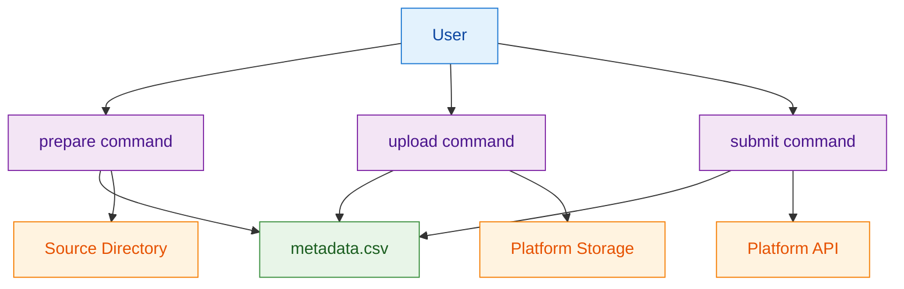

# ADR-3: Application Run Data Pipeline Architecture

## Context and Problem Statement

The platform needs to support AI application runs by enabling users to prepare metadata from whole slide images, upload those images to cloud storage, and submit runs for processing. For CLI-based workflows, the key architectural question is how to structure this data pipeline to balance user control, error handling, and system reliability. The solution must be appropriate for individual users working with datasets interactively, where immediate feedback and the ability to make corrections are important.

## Decision Drivers

* Users need control over metadata preparation and the ability to make manual corrections
* System must validate data at each step to prevent failures in downstream processing
* Clear error feedback is essential for users to identify and resolve issues
* Platform storage integration requires validation of file existence and URL formats
* Application run submission needs validation of application versions and metadata content
* CLI interface should provide predictable behavior with consistent exit codes

## Considered Options

1. Sequential CLI Commands with Intermediate Files
2. Single Unified Command with All-in-One Processing
3. Interactive Command with Step-by-Step Prompts

## Decision Outcome

Chosen option: "Sequential CLI Commands with Intermediate Files", because it provides users with control over the workflow, enables validation at each step, allows for metadata editing between steps, and aligns with the CLI-first user experience while maintaining clear separation of concerns.

### Rationale

Sequential commands provide the optimal balance for CLI-based interactive workflows:
- Appropriate complexity for individual user workflows (not enterprise-scale processing)
- Users can validate metadata before committing to expensive upload operations
- Each step can be independently tested and debugged
- Intermediate CSV files serve as both user interface and system checkpoints
- Aligns with CLI patterns users expect for data processing workflows

### Positive Consequences

* Users can inspect and modify metadata before upload
* Failed operations don't require restarting the entire pipeline
* Clear separation enables independent testing of each pipeline stage
* Intermediate files provide audit trail and debugging capabilities
* Consistent CLI patterns across different workflow stages

### Negative Consequences

* Multiple commands required for complete workflow
* Intermediate file management adds complexity
* Users must understand sequential dependencies
* More CLI surface area to document and maintain

## Pros and Cons of the Options

### Sequential CLI Commands with Intermediate Files

Implements three distinct CLI commands: prepare (metadata generation), upload (file transfer), and submit (run creation).

#### Pros

* Clear separation of concerns with independent validation at each step
* Users can edit intermediate metadata files to correct issues
* Failed operations can be retried without repeating successful steps
* Each command has focused responsibility and clear success/failure conditions
* Enables partial automation while preserving user control points

#### Cons

* Multiple command invocations required for complete workflow
* Intermediate CSV file management adds user complexity
* Sequential dependencies must be understood and followed correctly
* More complex error handling across multiple command boundaries

### Single Unified Command with All-in-One Processing

Single command that handles metadata generation, file upload, and run submission automatically without intermediate files.

#### Pros

* Simplified user experience with single command execution
* No intermediate file management required
* Reduced opportunity for user error in workflow execution
* Atomic operation reduces partial failure scenarios

#### Cons

* No opportunity for metadata inspection or correction
* Complete restart required if any step fails
* Less flexible for different user workflows and use cases
* Harder to debug issues when process fails mid-execution

### Interactive Command with Step-by-Step Prompts

Single command that guides users through each step with interactive prompts for validation and confirmation.

#### Pros

* Combines simplicity of single command with user control
* Interactive prompts guide users through the process
* Can validate and confirm each step before proceeding
* Provides immediate feedback and correction opportunities

#### Cons

* Interactive mode not suitable for scripting or automation
* More complex command implementation with state management
* Terminal interaction requirements limit deployment scenarios
* Harder to provide consistent behavior across different terminal environments

## More Information

### Architecture Diagram

### Components Details

#### CLI Command Interface

The three-command pipeline provides clear separation of responsibilities while maintaining user control over the workflow.

**Prepare Command:**
- Scans source directories for whole slide images
- Extracts file metadata and generates CSV with standard format
- Leaves user-editable fields empty for manual completion
- Provides immediate feedback on file scanning and metadata extraction

**Upload Command:**
- Validates file existence before attempting uploads
- Transfers files to platform storage with integrity checking
- Provides progress feedback and completion confirmation
- Handles upload errors with clear messaging

**Submit Command:**
- Validates application versions and metadata content
- Submits runs to platform API with proper error handling
- Returns run identifiers for tracking and reference
- Handles platform communication errors gracefully

#### Intermediate File Format

CSV files serve as the interface between pipeline stages and provide users with inspection and editing capabilities. The standardized format enables consistent processing while allowing manual adjustments for tissue types, staining methods, and disease classifications.

#### Integration Points

**Platform Storage Integration:**
- Secure file transfer with authentication
- Validation of storage URLs and accessibility
- Support for different cloud storage providers through URL scheme validation

**Platform API Integration:**
- Application version validation against registry
- Metadata content validation against application requirements
- Run creation with unique identifier generation

### Error Handling Strategy

Each command provides specific error codes and messages to help users identify and resolve issues:
- File validation errors for missing or inaccessible files
- Format validation errors for CSV content issues
- Platform integration errors for storage and API communication failures
- Clear success confirmations for completed operations

### Validation Criteria

This architectural decision can be considered successful when:
- Users can successfully execute the three-command workflow with clear feedback at each step
- Metadata CSV files are generated with correct format and can be edited by users
- File validation prevents upload attempts for missing files with clear error messages
- Platform integration handles authentication and communication errors gracefully
- Run submission provides unique identifiers and proper confirmation
- Error conditions provide actionable feedback for user resolution