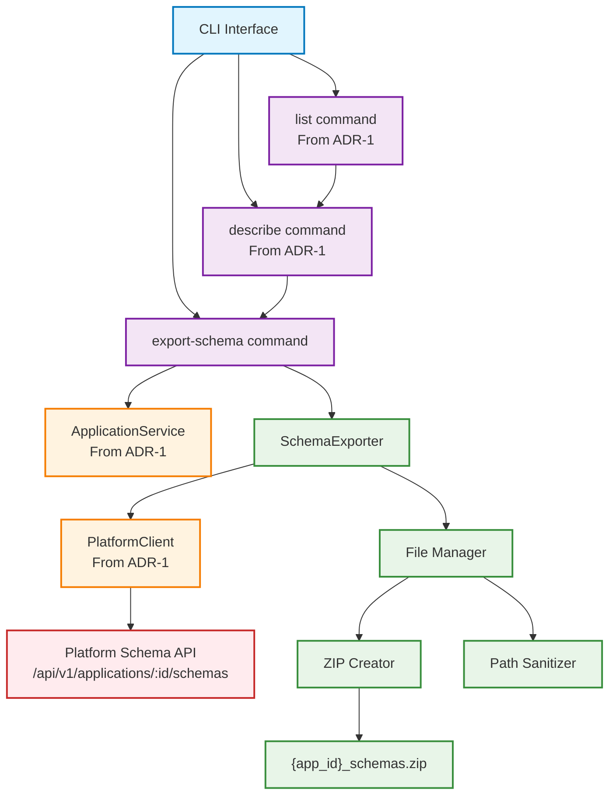

# ADR-3: Application Schema Export System

## Status

Accepted

## Context

Building upon the application discovery capabilities established in [ADR-1: Application Discovery Service](ADR-0001-APPLICATION-DISCOVERY-SERVICE.md) and [ADR-2: Application Web Interface](ADR-0002-APPLICATION-WEB-INTERFACE.md), developers require the ability to export application schema files for integration and development purposes. This functionality extends the discovery and navigation capabilities by enabling:

* Export of application schema files (OpenAPI specs, JSON schemas, artifact definitions) to local destinations
* Creation of organized ZIP archives for distribution and integration workflows
* Programmatic access to schema files for API development and testing
* Consistent schema format export across different application versions

Currently, while users can discover and inspect applications through CLI and web interfaces, there is no mechanism to export the underlying schema files needed for integration development. Developers working with platform applications need local access to:

* OpenAPI specifications for API endpoint integration
* JSON schema files for request/response validation
* Artifact definition files for input/output specifications
* Metadata files for version compatibility information

The challenge is designing a schema export system that integrates with the existing ApplicationService while providing reliable file organization, path handling, and export validation as part of the discovery and navigation workflow.

## Decision Drivers

* **Developer Integration Workflow**: Developers need exportable schema files for API client generation and testing as part of application discovery
* **Schema Organization**: Exported files must be logically organized for development tool consumption
* **Platform Integration**: Leverage existing ApplicationService and authentication patterns from ADR-1
* **CLI Consistency**: Extend existing `aignostics application` command group with export capabilities
* **File System Compatibility**: Handle path sanitization for cross-platform compatibility
* **Export Reliability**: Ensure complete and accurate schema file exports with validation
* **Discovery Extension**: Natural extension of application discovery workflow for developers

## Considered Options

### Option 1: CLI Command Extension with Service Layer Integration

Extend the ApplicationService to include schema export capabilities with CLI commands that follow existing patterns from ADR-1.

### Option 2: Separate Schema Management Service

Create a dedicated schema service independent of the ApplicationService for schema operations.

### Option 3: Web Interface Schema Download

Implement schema export through the web interface from ADR-2 with download links.

## Decision

We will implement **Option 1: CLI Command Extension with Service Layer Integration**.

## Rationale

After evaluating the options against our decision drivers, the CLI extension approach provides the optimal consistency with existing discovery architecture:

**Architecture Benefits:**
* **Service Layer Consistency**: Extends existing ApplicationService patterns from ADR-1 for schema operations
* **Authentication Integration**: Uses same OAuth2 flow through PlatformClient for schema API access
* **Error Handling Consistency**: Leverages same exception types and user feedback patterns from ADR-1
* **CLI Integration**: Natural extension of existing `aignostics application` command group

**Developer Experience:**
* **Familiar Patterns**: Schema export follows same service layer patterns as application discovery
* **Consistent CLI**: Commands like `aignostics application export-schema <app-id> <destination>` align with existing interface
* **Discovery Workflow**: Seamless progression from `list` → `describe` → `export-schema` for complete discovery workflow

**Technical Benefits:**
* **Memory Efficiency**: Streaming export handles large schema sets without memory constraints
* **Progress Tracking**: Real-time feedback during export operations following CLI patterns
* **Path Sanitization**: Handles complex application version IDs safely across platforms
* **Export Validation**: Ensures complete and accurate schema file exports

## Relationship to ADR-1 and ADR-2

This ADR extends the application discovery architecture from [ADR-1: Application Discovery Service](ADR-0001-APPLICATION-DISCOVERY-SERVICE.md) and complements [ADR-2: Application Web Interface](ADR-0002-APPLICATION-WEB-INTERFACE.md):

**ADR-1 Integration:**
* **Service Layer Extension**: Adds schema export methods to existing ApplicationService
* **Authentication Reuse**: Uses same OAuth2 tokens through PlatformClient for platform API access
* **Error Handling Consistency**: Leverages NotFoundException and other exceptions from ADR-1
* **CLI Integration**: Extends existing command registration patterns and error handling

**ADR-2 Complement:**
* **CLI-First Approach**: Provides developer-focused CLI export while web interface focuses on user navigation
* **Same Data Source**: Both interfaces use ApplicationService for consistent application data access
* **Complementary Workflows**: Web interface for discovery, CLI for development integration

**Integration Points:**
* Schema export validates application existence using ApplicationService.application() method
* PlatformClient handles schema API authentication and communication
* Same CLI command structure and error handling as application discovery commands
* Consistent logging and progress feedback patterns across all application commands

## Consequences

### Positive

* **Architectural Consistency**: Maintains service layer patterns and authentication flows from ADR-1
* **Developer Workflow Support**: Enables local development with exported schema files as part of discovery process
* **CLI Integration**: Natural extension of existing application commands for seamless user experience
* **Export Reliability**: Streaming operations with validation ensure complete exports
* **Cross-Platform Compatibility**: Path sanitization handles complex version identifiers safely
* **Discovery Completion**: Completes the application discovery workflow with actionable schema exports

### Negative

* **Additional CLI Commands**: Increases CLI surface area for documentation and maintenance
* **File System Dependencies**: Export operations depend on local file system access and permissions
* **Path Complexity**: Version ID sanitization adds complexity for cross-platform compatibility

### Risks and Mitigation

* **Large Schema Sets**: Risk of memory issues with large exports, mitigated by streaming implementation
* **Path Sanitization**: Risk of filename conflicts, mitigated by validation and clear error messages
* **API Changes**: Risk of platform schema API changes, mitigated by service layer abstraction
* **CLI Complexity**: Risk of command confusion, mitigated by clear help text and consistent patterns

## Implementation Notes

### Architecture Overview



### Core Components

**SchemaExporter** (`src/aignostics/application/schema.py`)
* **Purpose**: Manages application schema retrieval and export operations as extension of discovery workflow
* **Key Methods**: `export_application_schemas()`, `list_available_schemas()`, `validate_export_path()`
* **Integration**: Uses ApplicationService for app validation, PlatformClient for API communication

**FileManager** (`src/aignostics/application/export.py`)
* **Purpose**: Handles file organization, path sanitization, and ZIP creation for schema exports
* **Key Methods**: `sanitize_application_path()`, `create_schema_archive()`, `organize_schema_files()`
* **Integration**: Consumes schema data from SchemaExporter, manages local file operations

### CLI Command Specifications

**Export Schema Command** (`aignostics application export-schema <app-id> [destination]`)
* **Purpose**: Export application schema files to specified destination (defaults to current directory)
* **Options**: `--format` (zip, files), `--include` (openapi, schemas, artifacts), `--verbose`
* **Validation**: Application existence via ApplicationService, destination path access, schema availability
* **Output**: ZIP archive or organized directory structure with schema files
* **Progress**: Real-time export progress with file count and completion status

**Discovery Workflow Integration**
```bash
# Complete discovery workflow
aignostics application list                    # Discover available applications
aignostics application describe my-app:v1.0.0  # Inspect application details
aignostics application export-schema my-app:v1.0.0 ./schemas  # Export for development
```

### Interface Specifications

**Path Sanitization Rules**
* Replace colons with underscores for version IDs: `app:v1.0.0` → `app_v1.0.0`
* Handle Windows reserved characters and path length limits
* Preserve readability while ensuring cross-platform compatibility
* Generate unique names for conflicting application IDs

**ZIP Archive Structure**
```
{sanitized_application_id}_schemas.zip
├── openapi/
│   ├── application_api_v1.yaml
│   └── application_api_v2.yaml
├── schemas/
│   ├── input_schemas.json
│   └── output_schemas.json
├── artifacts/
│   ├── artifact_definitions.json
│   └── validation_rules.json
├── metadata/
│   ├── application_info.json
│   └── version_compatibility.json
└── README.md
```

**Error Handling Strategy**
* Application not found: Use NotFoundException from ApplicationService with helpful suggestions
* Schema API errors: Clear error messages with retry suggestions and API status information
* File system errors: Specific messages about permissions, disk space, and path validity
* Export validation: Verify file counts and archive integrity with detailed failure information

### Security Considerations

* **Authentication**: Schema export requires same OAuth2 authentication as other platform operations
* **Path Validation**: Prevent directory traversal attacks in destination path handling
* **File Permissions**: Respect local file system permissions for export destinations
* **Schema Access**: Validate user permissions for schema access through platform API
* **Sensitive Data**: Ensure exported schemas don't contain sensitive runtime information

### Testing Strategy

**Unit Tests**
* Schema export methods with mocked Platform API responses using pytest fixtures
* Path sanitization logic with various version ID formats and edge cases
* File export operations with temporary directories and permission scenarios

**Integration Tests**
* End-to-end schema export with real ApplicationService and platform authentication
* CLI command execution with various options and error scenarios
* Discovery workflow integration from list → describe → export-schema

**Performance Tests**
* Large schema set export with memory usage validation
* Streaming ZIP creation with progress tracking and interruption handling
* Network failure recovery during schema retrieval with timeout scenarios

### Alternative Options Considered

**Option 2: Separate Schema Management Service**
* *Pros*: Clear separation of concerns, specialized schema handling
* *Cons*: Duplicates authentication logic, violates service layer pattern, inconsistent with ADR-1
* *Rejected*: Violates architectural consistency and creates unnecessary service duplication

**Option 3: Web Interface Schema Download**
* *Pros*: User-friendly interface, no CLI required
* *Cons*: Not suitable for developer workflows, doesn't integrate with CLI discovery process
* *Deferred*: Could be implemented as additional interface option complementing CLI export

## Related Decisions

* **Extends**: [ADR-1: Application Discovery Service](ADR-0001-APPLICATION-DISCOVERY-SERVICE.md)
* **Complements**: [ADR-2: Application Web Interface](ADR-0002-APPLICATION-WEB-INTERFACE.md)
* **Future ADR**: Schema versioning and compatibility validation framework
* **Future ADR**: Selective schema export and filtering capabilities for large applications
* **Future ADR**: Schema import and validation tools for development workflows

## References

* [ADR-1: Application Discovery Service](ADR-0001-APPLICATION-DISCOVERY-SERVICE.md)
* [ADR-2: Application Web Interface](ADR-0002-APPLICATION-WEB-INTERFACE.md)
* [Platform Schema API Documentation](docs/SCHEMA_API.md)
* [CLI Command Patterns](docs/CLI_PATTERNS.md)
* [File Export Security Guidelines](docs/EXPORT_SECURITY.md)
* [Developer Integration Workflows](docs/DEVELOPER_WORKFLOWS.md)