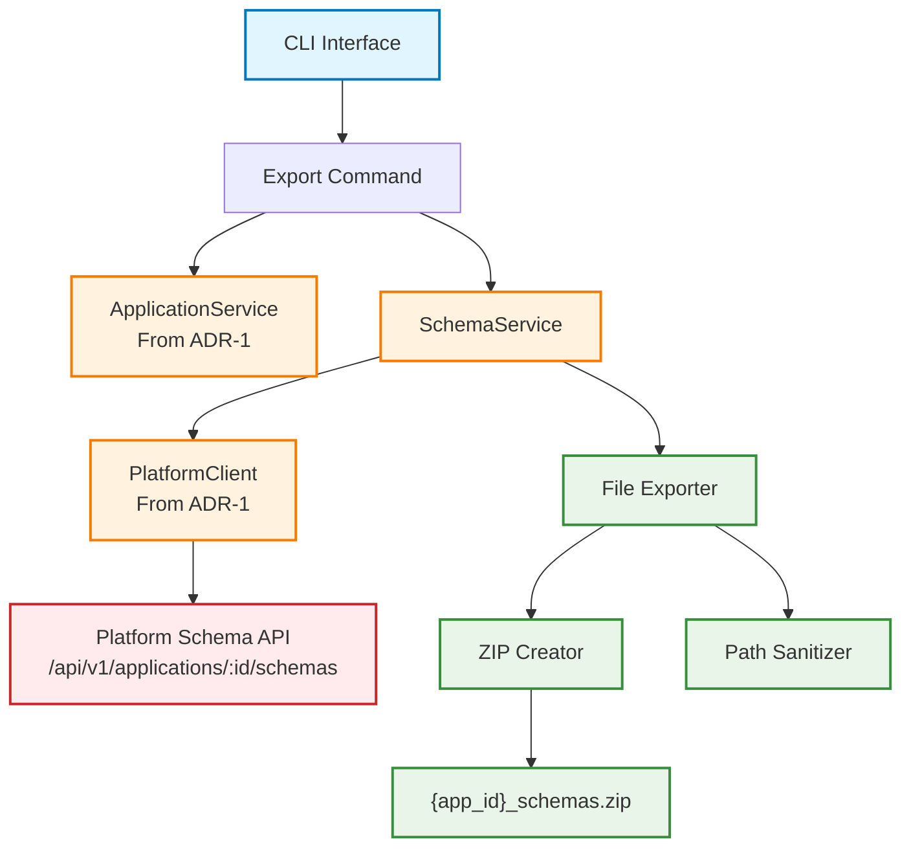

# ADR-3: Application Schema Export System

## Status

Accepted

## Context

Building upon the application discovery capabilities established in [ADR-1: Application Discovery Service](ADR-1-APPLICATION-LISTING-SERVICE.md), users require the ability to export application schema files for integration and development purposes. This functionality must enable:

* Export of application schema files (OpenAPI specs, JSON schemas, artifact definitions) to local destinations
* Creation of organized ZIP archives for distribution and integration workflows
* Programmatic access to schema files for API development and testing
* Consistent schema format export across different application versions

Currently, while users can discover and inspect applications through CLI and web interfaces, there is no mechanism to export the underlying schema files needed for integration development. Developers working with platform applications need access to:

* OpenAPI specifications for API endpoint integration
* JSON schema files for request/response validation
* Artifact definition files for input/output specifications
* Metadata files for version compatibility information

The challenge is designing a schema export system that integrates with the existing ApplicationService while providing reliable file organization, path handling, and export validation.

## Decision Drivers

* **Developer Integration Workflow**: Developers need exportable schema files for API client generation and testing
* **Schema Organization**: Exported files must be logically organized for development tool consumption
* **Platform Integration**: Leverage existing ApplicationService and authentication patterns from ADR-1
* **File System Compatibility**: Handle path sanitization for cross-platform compatibility
* **Export Reliability**: Ensure complete and accurate schema file exports with validation
* **CLI Consistency**: Maintain command patterns and error handling established in ADR-1
* **Future Extensibility**: Support for selective schema export and different output formats

## Considered Options

### Option 1: Service Layer Integration with Streaming Export

Extend the ApplicationService to include schema export capabilities with streaming file operations for memory efficiency and progress tracking.

### Option 2: Direct Platform API Schema Access

Implement direct API calls to platform schema endpoints without service layer abstraction.

### Option 3: Template-Based Schema Generation

Generate schema files dynamically from templates during export operations.

## Decision

We will implement **Option 1: Service Layer Integration with Streaming Export**.

## Rationale

After evaluating the options against our decision drivers, the service layer integration approach provides the optimal consistency with existing architecture:

**Architecture Benefits:**
* **Service Layer Consistency**: Extends existing ApplicationService patterns from ADR-1 for schema operations
* **Authentication Integration**: Uses same OAuth2 flow through PlatformClient for schema API access
* **Error Handling Consistency**: Leverages same exception types and user feedback patterns
* **CLI Integration**: Natural extension of existing `aignostics application` command group

**Developer Experience:**
* **Familiar Patterns**: Schema export follows same service layer patterns as application discovery
* **Consistent CLI**: Commands like `aignostics application export-schema <app-id> <destination>` align with existing interface
* **Reliable Export**: Streaming operations provide progress feedback and memory efficiency

**Technical Benefits:**
* **Memory Efficiency**: Streaming export handles large schema sets without memory constraints
* **Progress Tracking**: Real-time feedback during export operations
* **Path Sanitization**: Handles complex application version IDs safely across platforms
* **Export Validation**: Ensures complete and accurate schema file exports

## Relationship to ADR-1

This ADR extends the service layer architecture from [ADR-1: Application Discovery Service](ADR-1-APPLICATION-LISTING-SERVICE.md):

* **Service Layer Extension**: Adds schema export methods to existing ApplicationService
* **Authentication Reuse**: Uses same OAuth2 tokens through PlatformClient for platform API access
* **Error Handling Consistency**: Leverages NotFoundException and other exceptions from ADR-1
* **CLI Integration**: Extends existing command registration patterns and error handling

**Integration Points:**
* Schema export validates application existence using ApplicationService.application() method
* PlatformClient handles schema API authentication and communication
* Same CLI command structure and error handling as application discovery commands
* Consistent logging and progress feedback patterns

## Consequences

### Positive

* **Architectural Consistency**: Maintains service layer patterns and authentication flows from ADR-1
* **Developer Workflow Support**: Enables local development with exported schema files
* **CLI Integration**: Natural extension of existing application commands
* **Export Reliability**: Streaming operations with validation ensure complete exports
* **Cross-Platform Compatibility**: Path sanitization handles complex version identifiers
* **Future Extensibility**: Service layer supports additional export formats and selective export

### Negative

* **Additional CLI Commands**: Increases CLI surface area for documentation and maintenance
* **File System Dependencies**: Export operations depend on local file system access and permissions
* **Path Complexity**: Version ID sanitization adds complexity for cross-platform compatibility

### Risks and Mitigation

* **Large Schema Sets**: Risk of memory issues with large exports, mitigated by streaming implementation
* **Path Sanitization**: Risk of filename conflicts, mitigated by validation and clear error messages
* **API Changes**: Risk of platform schema API changes, mitigated by service layer abstraction

## Implementation Notes

### Architecture Overview



### Core Components

**SchemaService** (`src/aignostics/application/schema.py`)
* **Purpose**: Manages application schema retrieval and export operations
* **Key Methods**: `get_schemas()`, `export_schemas()`, `list_schema_types()`
* **Integration**: Uses PlatformClient for API communication, validates applications via ApplicationService

**FileExporter** (`src/aignostics/application/export.py`)
* **Purpose**: Handles file organization, path sanitization, and ZIP creation
* **Key Methods**: `sanitize_path()`, `create_zip()`, `export_files()`
* **Integration**: Consumes schema data from SchemaService, manages local file operations

### CLI Command Specifications

**Export Schema Command** (`aignostics application export-schema <app-id> <destination>`)
* **Purpose**: Export application schema files to specified destination
* **Options**: `--format` (zip, files), `--include` (openapi, schemas, artifacts)
* **Validation**: Application existence, destination path access, schema availability
* **Output**: ZIP archive or organized directory structure with schema files

**List Schema Command** (`aignostics application list-schemas <app-id>`)
* **Purpose**: Display available schema types and file counts for application
* **Output**: Table showing schema types, file counts, and descriptions
* **Integration**: Uses SchemaService to retrieve schema metadata

### Interface Specifications

**Path Sanitization Rules**
* Replace colons with underscores for version IDs: `app:v1.0.0` → `app_v1.0.0`
* Handle Windows reserved characters and path length limits
* Preserve readability while ensuring cross-platform compatibility

**ZIP Archive Structure**
```
{application_id}_schemas.zip
├── openapi/
│   ├── api_v1.yaml
│   └── api_v2.yaml
├── schemas/
│   ├── request_schemas.json
│   └── response_schemas.json
├── artifacts/
│   ├── input_definitions.json
│   └── output_definitions.json
└── README.md
```

**Error Handling Strategy**
* Application not found: Use NotFoundException from ApplicationService
* Schema API errors: Clear error messages with retry suggestions
* File system errors: Specific messages about permissions and disk space
* Export validation: Verify file counts and archive integrity

### Security Considerations

* **Authentication**: Schema export requires same OAuth2 authentication as other platform operations
* **Path Validation**: Prevent directory traversal attacks in destination path handling
* **File Permissions**: Respect local file system permissions for export destinations
* **Schema Access**: Validate user permissions for schema access through platform API

### Testing Strategy

**Unit Tests**
* Schema service methods with mocked Platform API responses
* Path sanitization logic with various version ID formats
* File export operations with temporary directories

**Integration Tests**
* End-to-end schema export with real ApplicationService
* Platform API integration with authentication
* CLI command execution with various options and error scenarios

**Performance Tests**
* Large schema set export with memory usage validation
* Streaming ZIP creation with progress tracking
* Network failure recovery during schema retrieval

### Alternative Options Considered

**Option 2: Direct Platform API Access**
* *Pros*: Simpler implementation, direct API access
* *Cons*: Duplicates authentication logic, violates service layer pattern, inconsistent with ADR-1
* *Rejected*: Violates architectural consistency established in ADR-1

**Option 3: Template-Based Generation**
* *Pros*: Always current schema format, customizable output
* *Cons*: Complex template management, generation overhead, inconsistent with platform data
* *Deferred*: Could be implemented as additional export format option

## Related Decisions

* **Extends**: [ADR-1: Application Discovery Service](ADR-1-APPLICATION-LISTING-SERVICE.md)
* **Future ADR**: Schema versioning and compatibility validation
* **Future ADR**: Selective schema export and filtering capabilities
* **Future ADR**: Schema import and validation for development workflows

## References

* [ADR-1: Application Discovery Service](ADR-1-APPLICATION-LISTING-SERVICE.md)
* [Platform Schema API Documentation](docs/SCHEMA_API.md)
* [CLI Command Patterns](docs/CLI_PATTERNS.md)
* [File Export Security Guidelines](docs/EXPORT_SECURITY.md)