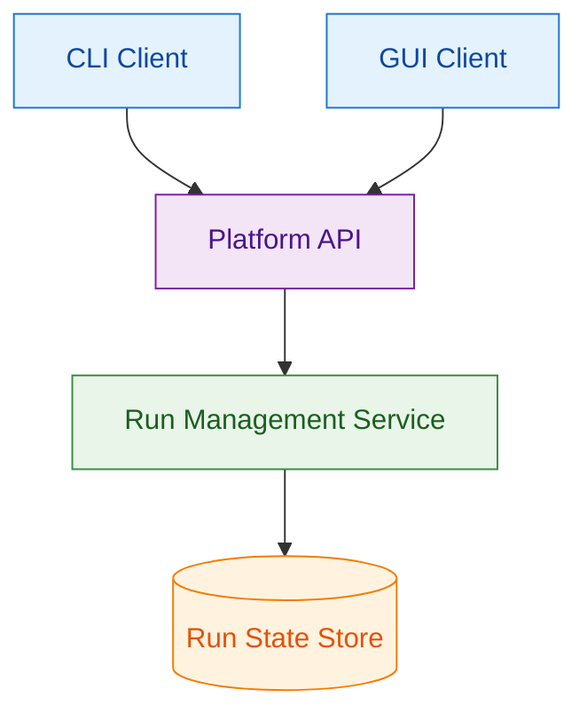

# ADR-0004: Cross-Interface Run State Management Architecture

## Context and Problem Statement

The platform provides both CLI and GUI interfaces for managing application runs. Users need to list, describe, cancel, and monitor runs across different client types while expecting consistent state representation. The architectural challenge is designing the client-server interaction pattern when the same run entities are accessed and modified through multiple interface types (command-line tools and web browsers).

## Decision Drivers

* CLI tools must work reliably in automated scripts without persistent connections
* GUI interfaces need responsive updates for user monitoring workflows
* Run state consistency is critical when users switch between interface types
* Both interfaces must handle identical run lifecycle states and operations
* System must support concurrent access from multiple users and interface types
* Authentication and error handling should be consistent across client types

## Considered Options

1. Stateless Clients with Shared Backend State
2. Stateful Clients with Session-Based State Management
3. Hybrid Approach with Interface-Specific State Patterns

## Decision Outcome

Chosen option: "Stateless Clients with Shared Backend State", because it provides the optimal balance of simplicity, reliability, and consistency for multi-interface scenarios while supporting both automation and interactive use cases.

### Rationale

Stateless client design aligns with the fundamental differences between CLI and GUI usage patterns:
- CLI commands execute independently and work reliably in batch/automation contexts
- GUI can implement client-side polling without complex connection state management
- Single source of truth eliminates state synchronization complexity
- Identical API contracts for both interface types simplify development and testing

### Positive Consequences

* Perfect state consistency across all client interfaces
* CLI commands remain simple and automation-friendly
* No complex connection management or recovery logic
* Straightforward horizontal scaling of stateless API services
* Identical authentication and error handling patterns

### Negative Consequences

* GUI requires polling for real-time updates rather than push notifications
* Some latency between state changes and client visibility
* Higher API request volume compared to stateful alternatives

## Pros and Cons of the Options

### Stateless Clients with Shared Backend State

All clients query the same backend API for current run state, with no client-side state persistence.

#### Pros

* Single authoritative state source guarantees consistency
* CLI commands work independently without session dependencies
* Simple API design with standard REST patterns
* No connection state to manage or recover from failures
* Identical error handling and authentication across interfaces
* Predictable behavior suitable for both automation and interactive use

#### Cons

* GUI polling required for real-time updates
* Increased API request volume during active monitoring
* Some delay in reflecting state changes across interfaces

### Stateful Clients with Session-Based State Management

Clients maintain local state synchronized with backend through persistent connections or session management.

#### Pros

* Reduced API requests through local state caching
* Immediate updates possible through push notifications
* Better offline capabilities for GUI applications

#### Cons

* Complex session management differs between CLI and GUI
* State synchronization conflicts during concurrent access
* CLI automation complicated by session dependencies
* Connection recovery and error handling complexity
* Higher risk of inconsistent state views

### Hybrid Approach with Interface-Specific State Patterns

Different state management strategies optimized for each interface type.

#### Pros

* Optimized patterns for each interface's usage characteristics
* CLI remains stateless while GUI uses stateful patterns
* Flexibility to evolve each interface independently

#### Cons

* Inconsistent behavior between interfaces creates user confusion
* Complex dual-pattern architecture increases maintenance burden
* Different error conditions and recovery mechanisms
* Higher complexity in testing and debugging state issues

## More Information

### Architecture Diagram

### Components Details

#### Client Interaction Patterns

**CLI Client Pattern:**
- Each command execution queries current state from API
- No persistent state or connection management
- Commands return current information and exit
- Suitable for automation and scripting workflows

**GUI Client Pattern:**
- Page loads query initial state from API
- JavaScript polling refreshes state periodically
- User actions trigger immediate API calls with page updates
- Provides responsive user experience without connection complexity

#### Backend State Management

**Platform API:**
- RESTful endpoints providing consistent state representation
- Stateless request handling with identical behavior for all clients
- Standard authentication and authorization patterns
- Pagination and filtering support for large datasets

**Run Management Service:**
- Authoritative source for all run state information
- Atomic state transitions with proper concurrency handling
- Event logging for audit and debugging capabilities

### Validation Criteria

This architectural decision can be considered successful when:
- CLI and GUI interfaces show identical run information when querying the same entities
- User actions in one interface are reflected in other interfaces within expected timeframes
- Both interfaces handle error conditions consistently with appropriate user feedback
- CLI commands work reliably in automated environments without session dependencies
- System performance scales appropriately under concurrent multi-interface usage