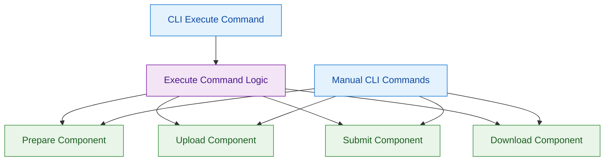

# ADR-5: Automated Workflow Composition Architecture

## Context and Problem Statement

The platform provides manual step-by-step application run workflows through separate CLI commands (prepare→upload→submit→download), as demonstrated in the three-command pipeline. Users also need automated end-to-end workflow execution that handles the complete pipeline automatically. The test evidence shows automation that downloads datasets, generates metadata using file patterns, uploads files, submits runs, and downloads results in a single command execution. The architectural challenge is how to build this workflow automation - whether to create dedicated automation components or orchestrate the existing manual workflow components. This decision impacts reliability, maintainability, and user experience when automation encounters issues.

## Decision Drivers

* Automation must achieve the same reliability as proven manual workflow components
* Automation must handle file pattern matching for metadata completion (as shown in test evidence)
* Users need ability to fallback to manual steps when automation encounters issues
* Development and maintenance effort should leverage existing validated components
* Single-command execution must provide equivalent results to multi-step manual workflows

## Considered Options

1. Orchestrated Composition of Manual Components
2. Dedicated Automation Pipeline Implementation
3. Hybrid Automation with Manual Component Interfaces

## Decision Outcome

Chosen option: "Orchestrated Composition of Manual Components", because it maximizes reliability by reusing proven manual workflow logic while providing clear fallback paths and maintaining the ability to debug issues at component granularity.

### Rationale

Orchestrating existing manual components provides optimal balance for automation reliability:
- Automation inherits the reliability and validation of battle-tested manual components
- Users can execute individual manual steps when automation fails at specific stages
- Component-level testing remains intact and automation testing focuses on orchestration logic
- Error handling can provide specific guidance about which manual command to run
- Development effort focuses on orchestration rather than reimplementing workflow logic

### Positive Consequences

* Automation reliability matches proven manual workflow reliability
* Clear fallback strategy when automation encounters issues
* Component-level debugging remains available for complex failures
* Reduced development and testing effort by reusing existing components
* Consistent validation and error handling across automated and manual workflows

### Negative Consequences

* Orchestration layer adds complexity compared to dedicated automation
* Some performance overhead from component boundaries
* Automation interface must accommodate manual component contracts

## Pros and Cons of the Options

### Orchestrated Composition of Manual Components

Automation layer that calls the same underlying functions used by manual CLI commands in sequence.

#### Pros

* Inherits reliability and validation logic from proven manual components
* Clear fallback path - users can run individual manual commands when automation fails
* Consistent behavior between automated and manual workflows
* Component-level testing and debugging remains intact
* Error messages can reference specific manual commands for user guidance
* Reduced development effort by avoiding duplicate implementation

#### Cons

* Orchestration layer adds architectural complexity
* Component interface contracts must accommodate both manual and automated usage
* Some performance overhead from component coordination
* Automation testing requires both orchestration and component integration testing

### Dedicated Automation Pipeline Implementation

Purpose-built automation component that implements complete workflow logic independently.

#### Pros

* Optimized implementation for automation use cases
* Simplified automation architecture with single responsible component
* No coordination overhead between multiple components
* Automation-specific error handling and recovery patterns

#### Cons

* Duplicate implementation of workflow logic increases maintenance burden
* No clear fallback when automation fails - users must restart entire process
* Separate testing required for automation vs manual workflow implementations
* Risk of behavior divergence between automated and manual workflows
* Higher development effort to implement and validate complete pipeline

### Hybrid Automation with Manual Component Interfaces

Automation components that can optionally delegate to manual components for specific workflow stages.

#### Pros

* Flexibility to optimize automation while preserving manual fallback options
* Can evolve automation independently while maintaining manual compatibility
* Supports mixed automated-manual workflows for complex scenarios

#### Cons

* Complex interface design to support both automation and manual delegation
* Difficult to maintain consistency across hybrid execution paths
* More complex testing scenarios covering all possible execution combinations
* Higher cognitive load for users to understand when manual intervention is needed

## More Information

### Architecture Diagram

### Components Details

#### Execute Command Implementation

**Pattern-Based Automation:**
- Downloads external datasets with integrity validation
- Generates metadata using file pattern matching (e.g., `.*\\.tiff:staining_method=H&E,tissue=LUNG,disease=LUNG_CANCER`)
- Calls same prepare, upload, submit, and download logic as manual commands
- Provides single-command execution with equivalent results to manual multi-step workflow

**Error Handling and Fallback:**
- Error messages reference specific manual CLI commands for user fallback
- Component-level error details provide actionable debugging information

#### Component Interface Contracts

**Shared Component Design:**
- Components accept both programmatic calls and CLI invocations
- Identical validation logic regardless of calling context
- Consistent error reporting and exit code behavior

### Workflow Execution Patterns

**Automated Execution Flow:**
- Pattern-based file discovery and metadata preparation
- Automatic metadata completion using file naming conventions
- Bulk upload with progress tracking and error recovery
- Run submission with validation and unique ID generation
- Result download with organized directory structure creation

**Manual Fallback Scenarios:**
- Metadata preparation failures → user runs manual prepare command for inspection
- Upload failures → user runs manual upload command with corrected files
- Submission failures → user runs manual submit command with validated metadata
- Download failures → user runs manual download command with custom destination

### Validation Criteria

This architectural decision can be considered successful when:
- Execute command produces identical file outputs to manual step-by-step execution (9 expected files with correct sizes and checksums)
- File pattern matching correctly generates metadata equivalent to manual prepare command output
- Component failures in automation provide specific manual command references for user resolution
- Single execute command completes with same exit code 0 as successful manual workflow sequence