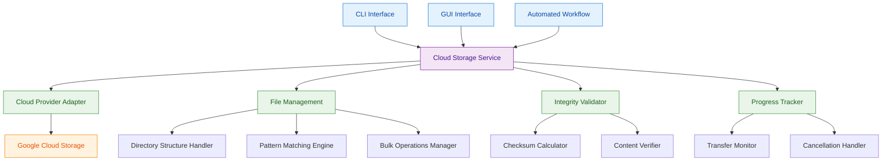

# ADR-6: Cloud Storage Infrastructure Architecture

## Context and Problem Statement

The platform requires comprehensive cloud storage operations to support application workflows and user data management. The test evidence demonstrates complex storage requirements including uploading files with directory structure preservation, downloading files with content verification, finding files with pattern matching capabilities, and deleting files with confirmation. The storage system must handle large-scale data transfers (1MB+ files), maintain file integrity through checksums, support bulk operations with progress tracking, and provide robust error handling for network failures and permission issues.

The architectural challenge is designing a storage infrastructure that balances performance, reliability, and usability while supporting both automated workflows and manual user operations across different interfaces (CLI and GUI).

## Decision Drivers

* Storage operations must preserve directory structure during upload/download operations
* File integrity verification through checksums is required for data reliability
* Pattern matching and bulk operations are needed for efficient file management
* Both CLI and GUI interfaces must provide consistent storage operation capabilities
* Large file transfers require progress tracking and resumption capabilities
* Error handling must distinguish between recoverable and non-recoverable failures
* Storage operations must integrate seamlessly with automated workflow execution

## Considered Options

1. Unified Cloud Storage Service with Abstract Backend
2. Direct Cloud Provider SDK Integration
3. Microservice-Based Storage Architecture

## Decision Outcome

Chosen option: "Unified Cloud Storage Service with Abstract Backend", because it provides the optimal balance of operational simplicity, consistent behavior across interfaces, and flexibility for future cloud provider changes while meeting all performance and reliability requirements.

### Rationale

A unified storage service with abstract backend provides:
- Consistent storage operations across CLI and GUI interfaces
- Centralized implementation of directory structure preservation and integrity verification
- Single point of optimization for large file transfers and bulk operations
- Simplified error handling and recovery patterns
- Clear abstraction layer that can accommodate future cloud provider changes
- Integrated progress tracking and cancellation capabilities

### Positive Consequences

* Consistent storage behavior across all platform interfaces
* Centralized optimization for large file transfers and bulk operations
* Simplified testing and maintenance with single storage implementation
* Built-in support for directory structure preservation and file integrity
* Clear error handling patterns for network and permission failures
* Integrated progress tracking for long-running operations

### Negative Consequences

* Single service becomes critical path for all storage operations
* Abstraction layer may limit access to provider-specific optimizations
* Service scaling becomes important as storage usage grows

## Pros and Cons of the Options

### Unified Cloud Storage Service with Abstract Backend

Centralized storage service that abstracts cloud provider details and provides consistent operations.

#### Pros

* Consistent API and behavior across all platform interfaces
* Centralized implementation of complex operations (directory preservation, integrity verification)
* Single point for optimization of bulk operations and large file transfers
* Clear abstraction enables cloud provider flexibility
* Unified error handling and recovery patterns
* Integrated progress tracking and cancellation support
* Simplified testing with single storage implementation

#### Cons

* Service becomes single point of failure for storage operations
* Abstraction layer may prevent leveraging provider-specific optimizations
* Service scaling and performance tuning becomes critical as usage grows
* Additional service maintenance overhead

### Direct Cloud Provider SDK Integration

Each interface (CLI/GUI) integrates directly with cloud provider SDKs.

#### Pros

* Direct access to all provider-specific features and optimizations
* No additional service layer to maintain
* Maximum performance potential with direct SDK usage
* Reduced architectural complexity

#### Cons

* Duplicate storage logic implementation across interfaces
* Inconsistent behavior between CLI and GUI operations
* Complex testing scenarios with multiple integration points
* Difficult to change cloud providers
* No centralized optimization for bulk operations
* Error handling varies across different integration points

### Microservice-Based Storage Architecture

Separate microservices for different storage operations (upload, download, find, delete).

#### Pros

* Independent scaling of different storage operations
* Clear separation of concerns for each operation type
* Fault isolation between different storage functions
* Specialized optimization for each operation type

#### Cons

* Complex service coordination for bulk operations
* Difficult to maintain consistency across multiple services
* Higher operational overhead with multiple services
* Complex error handling across service boundaries
* Challenging to implement atomic operations spanning multiple services

## More Information

### Architecture Diagram

### Components Details

#### Cloud Storage Service

**Core Operations Implementation:**
- Upload operations with directory structure preservation using source directory scanning
- Download operations with integrity verification using CRC32 checksums
- Find operations with pattern matching support for file discovery
- Delete operations with confirmation and batch processing capabilities

**File Transfer Optimization:**
- Large file handling with resumable uploads for files >1MB
- Bulk operation batching to minimize API calls
- Progress tracking with real-time updates for long-running operations
- Parallel transfer support for multiple files with configurable concurrency

#### Directory Structure Handler

**Upload Structure Preservation:**
- Scans source directories recursively maintaining relative path structure
- Creates corresponding cloud storage hierarchy with prefix-based organization
- Handles special characters and path sanitization across platforms
- Preserves empty directories through marker file creation

**Download Structure Recreation:**
- Reconstructs local directory structure from cloud storage prefixes
- Creates missing parent directories automatically
- Handles path conflicts and duplicate file resolution
- Maintains original file timestamps and attributes where possible

#### Pattern Matching Engine

**File Discovery Capabilities:**
- Supports glob patterns for flexible file finding (*.tiff, **/*.dcm)
- Regular expression matching for complex file name patterns
- Metadata-based filtering for file size, creation date, and content type
- Hierarchical pattern matching across directory structures

#### Integrity Validator

**File Verification Implementation:**
- CRC32 checksum calculation and verification for all transfers
- Content comparison for critical files during download operations
- Corruption detection and automatic retry for failed verifications
- Detailed error reporting for integrity failures with recovery recommendations

#### Progress Tracker

**Transfer Monitoring:**
- Real-time progress updates with bytes transferred and estimated completion
- Cancellation support with cleanup of partial transfers
- Error recovery with automatic retry for transient failures
- Detailed logging for troubleshooting complex transfer issues

### Storage Operation Patterns

**Upload Workflow:**
1. Directory scanning and file enumeration with size calculation
2. Checksum pre-calculation for integrity verification
3. Hierarchical upload with directory structure preservation
4. Progress tracking with real-time updates
5. Verification of uploaded content with checksum comparison
6. Summary reporting with success/failure counts

**Download Workflow:**
1. Pattern-based file discovery with metadata filtering
2. Local directory structure creation with conflict resolution
3. Parallel download with configurable concurrency limits
4. Content verification with checksum validation
5. Progress tracking with cancellation support
6. Summary reporting with verification results

**Bulk Operations:**
1. Operation batching to optimize API usage
2. Error isolation to prevent single failures from affecting batch
3. Partial success handling with detailed failure reporting
4. Transaction-like behavior for critical operations
5. Rollback capabilities for failed bulk operations

### Error Handling Patterns

**Network Error Recovery:**
- Automatic retry with exponential backoff for transient network failures
- Connection timeout handling with user notification
- Bandwidth adaptation for poor network conditions
- Graceful degradation when cloud services are unavailable

**Permission and Access Errors:**
- Clear error messages for authentication failures
- Guidance for resolving access permission issues
- Fallback options when write permissions are unavailable
- Security audit logging for access violations

**File System Errors:**
- Disk space validation before large downloads
- Read-only file system detection and user notification
- Path length validation across different operating systems
- File locking conflict resolution

### Validation Criteria

This architectural decision can be considered successful when:
- Upload operations preserve complete directory structure with 9 files across 3 directories
- Download operations verify content integrity with 100% checksum match success rate
- Find operations return complete file listings with proper pattern matching
- Delete operations confirm removal with zero false positive confirmations
- Bulk operations complete with detailed success/failure reporting
- Error recovery successfully handles network interruptions without data loss
- Progress tracking provides accurate estimates within 10% margin for large transfers