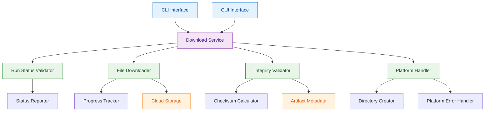

# ADR-7: Result Download Infrastructure

## Context and Problem Statement

The platform needs robust infrastructure to download application run results with comprehensive validation, status handling, and error management. Test evidence shows complex download scenarios including downloading from completed runs, handling downloads from still-running applications, validating file integrity through checksum verification, and managing cross-platform file system behaviors. The architectural challenge is designing a download infrastructure that handles these varied scenarios reliably while providing consistent user feedback and maintaining data integrity.

Users need to download analysis results from both completed and running application runs, with the system providing appropriate status information and validation. The infrastructure must handle platform-specific behaviors (Windows vs Unix directory creation) and ensure downloaded files maintain integrity through checksum verification against artifact metadata.

## Decision Drivers

* Download infrastructure must handle both completed and running application runs with appropriate status feedback
* File integrity validation through checksum comparison is critical for data reliability
* Cross-platform compatibility required with different error handling behaviors (Windows vs Unix)
* Status information must be clear when downloading from running applications
* Directory creation failures need platform-appropriate error handling and exit codes
* Integration with existing storage and validation components is essential
* Performance must support downloading multiple result files with size validation

## Considered Options

1. Unified Download Service with Integrated Validation
2. Separated Download and Validation Services
3. Platform-Specific Download Implementations

## Decision Outcome

Chosen option: "Unified Download Service with Integrated Validation", because it provides the optimal balance of consistency, reliability, and maintainability while handling the complex cross-platform requirements and integrity validation needs demonstrated in the test evidence.

### Rationale

A unified download service with integrated validation provides:
- Consistent download behavior across all interfaces and application run states
- Built-in integrity validation that cannot be bypassed or forgotten
- Centralized platform-specific error handling logic
- Simplified status reporting for both completed and running applications
- Single point of optimization for multi-file downloads with progress tracking
- Clear abstraction for cross-platform file system differences

### Positive Consequences

* Consistent download experience regardless of application run status
* Automatic integrity validation ensures data reliability
* Centralized cross-platform handling reduces maintenance complexity
* Single service simplifies testing and debugging of download issues
* Built-in status reporting provides clear user feedback
* Integrated validation prevents corrupted downloads from being accepted

### Negative Consequences

* Single service becomes critical path for all download operations
* Validation overhead may impact download performance for large result sets
* Service complexity increases with cross-platform and validation requirements

## Pros and Cons of the Options

### Unified Download Service with Integrated Validation

Single service that handles downloads, status reporting, validation, and platform-specific behaviors.

#### Pros

* Consistent download behavior across all scenarios and platforms
* Automatic integrity validation prevents data corruption issues
* Centralized status handling for both completed and running applications
* Single point for cross-platform error handling and exit code management
* Simplified testing with unified download logic
* Clear abstraction layer for file system operations
* Integrated progress tracking and user feedback

#### Cons

* Service becomes single point of failure for download operations
* Increased service complexity with validation, status, and platform handling
* Validation overhead may impact performance for large downloads
* All download scenarios must be handled within single service architecture

### Separated Download and Validation Services

Separate services for download operations and integrity validation.

#### Pros

* Clear separation of concerns between download and validation
* Independent scaling of download and validation operations
* Validation can be optional or configurable per download
* Simpler individual service implementations

#### Cons

* Risk of downloads without validation if services are not properly coordinated
* Complex error handling across service boundaries
* Inconsistent behavior if services have different platform handling
* Additional coordination required for status reporting
* More complex testing scenarios with multiple service interactions

### Platform-Specific Download Implementations

Different download implementations for Windows and Unix-like systems.

#### Pros

* Optimized behavior for each platform's file system characteristics
* Native error handling for platform-specific issues
* Maximum performance with platform-specific optimizations

#### Cons

* Duplicate implementation and maintenance for each platform
* Inconsistent behavior between platforms beyond necessary differences
* Complex testing matrix across multiple platform implementations
* Risk of feature divergence between platform implementations
* Higher development and maintenance overhead

## More Information

### Architecture Diagram

### Components Details

#### Download Service Implementation

**Core Download Functionality:**
- Downloads analysis results from completed application runs with confirmation messaging
- Handles downloads from running applications with appropriate status information display
- Coordinates file downloads with integrity validation and platform-specific error handling
- Provides consistent interface for both CLI and GUI download operations

**Status Handling for Running Applications:**
- Detects application run status during download initiation
- Displays status information "status: running on plat" when no-wait-for-completion option is used
- Provides appropriate user feedback for downloads from incomplete runs
- Maintains exit code 0 for successful status reporting operations

#### Run Status Validator

**Application Run Status Detection:**
- Queries application run status before initiating download operations
- Determines appropriate download behavior based on run completion status
- Provides status information for user feedback during download process
- Handles edge cases where run status changes during download

#### File Downloader

**Multi-File Download Management:**
- Downloads multiple result files maintaining original directory structure
- Creates organized directory structure with run ID as top-level directory name
- Handles large file downloads with progress tracking and resumption capabilities
- Manages concurrent downloads for improved performance

**Progress Tracking:**
- Provides real-time download progress for large result sets
- Tracks individual file download status within result sets
- Reports completion status with confirmation messaging
- Supports cancellation of long-running downloads

#### Integrity Validator

**Checksum Verification Implementation:**
- Calculates file checksums for all downloaded artifacts using platform-appropriate algorithms
- Compares calculated checksums against artifact metadata using specified checksum attribute keys
- Validates integrity of downloaded files before marking download as complete
- Raises assertion errors with detailed mismatch information when validation fails

**Validation Error Handling:**
- Generates specific error messages in format "Metadata checksum != file checksum [metadata] <> [calculated]"
- Provides actionable information for resolving integrity failures
- Logs validation failures for debugging and audit purposes
- Supports different checksum algorithms based on artifact metadata

#### Platform Handler

**Cross-Platform Directory Creation:**
- Handles destination directory creation with platform-appropriate error responses
- Implements Windows-specific behavior (exit code 0 on directory creation failure)
- Implements Unix-like system behavior (exit code 2 with error message on failure)
- Provides consistent directory structure creation across platforms

**Platform-Specific Error Handling:**
- Generates error messages in format "Failed to create destination directory '[path]/[run_id]'"
- Manages different file system permission models across platforms
- Handles path length limitations and special character restrictions
- Provides platform-appropriate recovery suggestions for directory creation failures

### Download Operation Patterns

**Completed Run Download Flow:**
1. Validate run exists and is accessible
2. Create destination directory with run ID structure
3. Download all result files with progress tracking
4. Validate file integrity using checksum comparison
5. Report successful completion with confirmation message
6. Return exit code 0 for successful operations

**Running Application Download Flow:**
1. Detect application run is still in progress
2. Display status information indicating "running on plat" when no-wait option used
3. Download available partial results if supported
4. Provide appropriate user feedback about incomplete status
5. Return exit code 0 for successful status reporting

**Directory Creation Error Handling:**
1. Attempt to create destination directory structure
2. On Windows: Continue with download operation, exit code 0 even on directory failure
3. On Unix-like systems: Report error with exit code 2 and descriptive message
4. Provide platform-appropriate error messaging and recovery guidance

### Validation Criteria

This architectural decision can be considered successful when:
- Downloads from completed runs produce 9 expected result files with correct directory structure
- Checksum validation successfully detects and reports any file corruption during download
- Status information is correctly displayed for downloads from running applications
- Platform-specific directory creation behavior matches OS expectations (Windows vs Unix exit codes)
- Download confirmation messages follow specified format "Downloaded results of run '[run_id]'"
- Integrity validation errors provide actionable checksum mismatch information
- Cross-platform compatibility maintained without compromising functionality