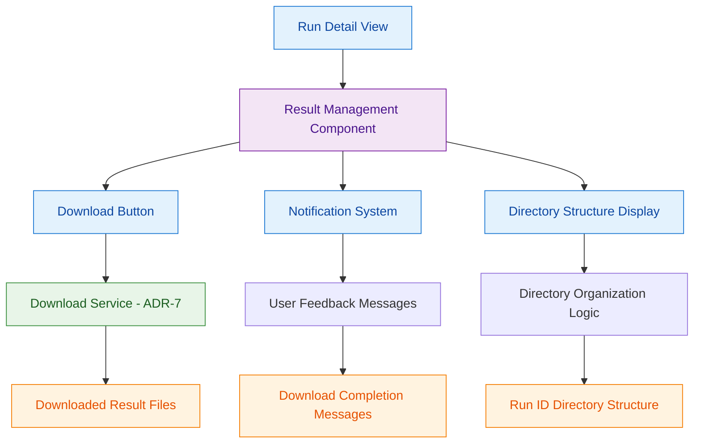

# ADR-8: Result Management User Interface

## Context and Problem Statement

The platform requires a graphical user interface for managing application run results, specifically enabling users to download results through an intuitive web interface. Test evidence shows users need a download button that triggers result downloads with proper user feedback and directory organization. The architectural challenge is designing a GUI interface that integrates seamlessly with the download infrastructure (ADR-7) while providing clear user experience patterns for result management.

The interface must provide download controls, handle user interactions with appropriate feedback, and organize downloaded results in a user-friendly directory structure using run IDs as top-level directory names.

## Decision Drivers

* GUI interface must provide intuitive download controls for application run results
* User feedback through notifications is essential for download completion confirmation
* Directory organization with run ID structure must be clearly communicated to users
* Integration with backend download infrastructure (ADR-7) must be seamless and reliable
* Interface should follow established platform GUI patterns and user experience guidelines
* Download operations must provide visual feedback during long-running downloads

## Considered Options

1. Integrated Result Management Component
2. Standalone Download Dialog Interface  
3. Embedded Download Controls in Run Detail View

## Decision Outcome

Chosen option: "Integrated Result Management Component", because it provides the optimal user experience by contextualizing download operations within the broader result management workflow while maintaining clear integration with the download infrastructure.

### Rationale

An integrated result management component provides:
- Contextual download controls within the natural result viewing workflow
- Consistent user experience with other platform management interfaces
- Clear visual feedback for download operations and completion status
- Seamless integration with backend download services without complex coordination
- Scalable foundation for additional result management features

### Positive Consequences

* Intuitive user experience with download controls in expected locations
* Consistent notification patterns with other platform operations
* Clear directory organization communication through integrated interface design
* Simplified testing with unified result management component
* Future extensibility for additional result management features

### Negative Consequences

* Component complexity increases with integrated download and management features
* Interface must handle various result states and download scenarios
* Coordination required between UI state and backend download operations

## Pros and Cons of the Options

### Integrated Result Management Component

Single component that handles result viewing, download controls, and user feedback.

#### Pros

* Natural user workflow with download controls in context of result viewing
* Consistent interface patterns with other platform management components
* Unified user feedback and notification system
* Clear integration point with backend download infrastructure
* Scalable architecture for additional result management features
* Single component testing and maintenance

#### Cons

* Increased component complexity with multiple responsibilities
* Must handle various result states and download scenarios
* Requires coordination between UI state and backend operations
* Interface design must accommodate different result types and sizes

### Standalone Download Dialog Interface

Separate modal dialog specifically for download operations and configuration.

#### Pros

* Focused interface design specifically for download operations
* Clear separation between result viewing and download functionality
* Dedicated space for download options and progress feedback
* Reusable across different result viewing contexts

#### Cons

* Additional UI navigation required for download operations
* Breaks user workflow with modal interruption
* Complex state management between dialog and parent views
* Inconsistent with platform's integrated management approach
* Additional testing complexity with modal interactions

### Embedded Download Controls in Run Detail View

Download controls embedded directly in existing run detail interfaces.

#### Pros

* Minimal interface changes required
* Download controls in immediate context of run information
* Leverages existing run detail interface patterns
* Simple integration with current UI architecture

#### Cons

* Limited space for download feedback and progress information
* Potential UI clutter in run detail views
* Difficult to provide comprehensive result management features
* May not scale well for complex result organization needs
* Limited notification space for download completion feedback

## More Information

### Architecture Diagram

### Components Details

#### Result Management Component

**Download Interface Implementation:**
- Provides download button that initiates result download operations
- Integrates with backend download service (ADR-7) for actual file retrieval
- Handles user interactions and translates them to backend service calls
- Maintains UI state during download operations with appropriate visual feedback

**User Feedback and Notifications:**
- Displays notification message "Download completed." upon successful download completion
- Provides real-time feedback during download operations for large result sets
- Handles error scenarios with appropriate user-friendly error messages
- Integrates with platform notification system for consistent user experience

#### Directory Structure Communication

**Run ID Organization Display:**
- Communicates directory structure to users with run ID as top-level directory name
- Provides clear indication of where downloaded files will be organized
- Shows expected directory structure before download initiation
- Guides users on file organization and location after download completion

#### Download Button Implementation

**User Interaction Handling:**
- Provides clear visual download controls integrated into result management interface
- Handles click events and initiates download operations through backend service integration
- Manages button state during download operations (disabled during active downloads)
- Provides visual feedback for download progress and completion

#### Integration with Download Infrastructure

**Backend Service Coordination:**
- Seamless integration with unified download service from ADR-7
- Passes download parameters and configuration to backend infrastructure
- Receives download status and completion notifications from backend services
- Handles error scenarios and provides appropriate user feedback

### User Interface Patterns

**Download Workflow:**
1. User navigates to result management interface for specific application run
2. Interface displays available results with download button clearly visible
3. User clicks download button to initiate download operation
4. Interface provides visual feedback during download process
5. Notification system displays "Download completed." message upon successful completion
6. Directory structure information guides user to downloaded files location

**Error Handling Interface:**
1. Download service errors are translated to user-friendly notifications
2. Interface provides actionable guidance for resolving download issues
3. Button state reset allows users to retry failed download operations
4. Clear error messaging helps users understand and resolve problems

### Integration Points

**Backend Download Service (ADR-7):**
- Direct integration with unified download service for actual file operations
- Receives download status updates and completion notifications
- Handles backend errors and translates them to user interface feedback
- Coordinates download parameters and configuration between UI and backend

**Platform Notification System:**
- Consistent notification patterns with other platform operations
- Standard notification timing and message formatting
- Integration with platform-wide notification management
- User preference handling for notification display and duration

### Validation Criteria

This architectural decision can be considered successful when:
- Download button is clearly visible and accessible in result management interface
- Users receive "Download completed." notification upon successful download operations
- Downloaded results are organized with run ID as top-level directory name as expected
- Interface integration with backend download service (ADR-7) functions seamlessly
- User feedback is provided throughout download process with appropriate visual indicators
- Error scenarios are handled gracefully with actionable user guidance
- Interface follows established platform GUI patterns and user experience guidelines