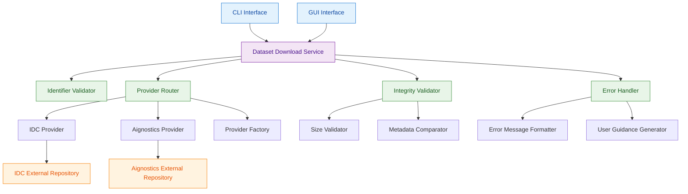

# ADR-9: Dataset Download Service Architecture

## Context and Problem Statement

The platform needs to integrate with external dataset repositories to allow users to download publicly available datasets using various identifier types. Test evidence shows the system must handle downloads from multiple external sources (IDC and Aignostics repositories), validate different identifier formats (collection_id, PatientID, StudyInstanceUID, SeriesInstanceUID, SOPInstanceUID), and ensure file integrity through size verification. The architectural challenge is designing a service that can reliably integrate with multiple external dataset providers while providing consistent validation, error handling, and integrity checking.

The system must handle various failure scenarios including invalid identifiers, missing parameters, and integrity validation while providing clear error messages and maintaining robust download operations across different dataset sources.

## Decision Drivers

* Integration with multiple external dataset repositories (IDC, Aignostics) with different protocols
* Support for various dataset identifier types with appropriate validation
* File integrity verification through size validation against metadata expectations
* Comprehensive error handling for invalid identifiers, missing parameters, and download failures
* Consistent download experience regardless of external dataset source
* Reliable handling of large files with different expected sizes (1369290 bytes, 14681750 bytes)
* Clear error messaging that guides users toward correct identifier formats

## Considered Options

1. Unified Dataset Download Service with Provider Abstraction
2. Provider-Specific Download Services
3. External Service Proxy Pattern

## Decision Outcome

Chosen option: "Unified Dataset Download Service with Provider Abstraction", because it provides the optimal balance of consistency, maintainability, and extensibility while handling the diverse external integration requirements and validation needs demonstrated in the test evidence.

### Rationale

A unified dataset download service with provider abstraction provides:
- Consistent download behavior across all external dataset sources
- Centralized validation for multiple identifier types and formats
- Single point of integrity verification and error handling
- Clear abstraction layer that simplifies adding new dataset providers
- Unified error messaging and user feedback patterns
- Centralized optimization for large file downloads with progress tracking

### Positive Consequences

* Consistent download experience regardless of external dataset source
* Centralized validation and error handling reduces duplicate logic
* Simple abstraction for adding new dataset providers in the future
* Single point for optimization of download performance and reliability
* Unified file integrity validation prevents corrupted downloads
* Clear error messaging patterns for all download scenarios

### Negative Consequences

* Service becomes critical path for all dataset download operations
* Abstraction layer may limit access to provider-specific optimizations
* Service complexity increases with multiple provider integrations

## Pros and Cons of the Options

### Unified Dataset Download Service with Provider Abstraction

Single service that abstracts multiple external dataset providers behind a unified interface.

#### Pros

* Consistent download API and behavior across all dataset sources
* Centralized validation for all identifier types and formats
* Single point for file integrity verification and error handling
* Clear abstraction enables easy addition of new dataset providers
* Unified error messaging and user feedback patterns
* Single point for optimization of download performance and caching
* Simplified testing with unified download service interface

#### Cons

* Service becomes single point of failure for dataset operations
* Abstraction layer may prevent leveraging provider-specific features
* Service complexity increases with multiple provider integrations
* Provider-specific error handling must be normalized to unified patterns

### Provider-Specific Download Services

Separate services for each external dataset provider (IDC, Aignostics, etc.).

#### Pros

* Direct integration with each provider's specific APIs and features
* Maximum performance with provider-specific optimizations
* Clear separation of concerns for each dataset source
* Independent scaling and maintenance of provider integrations

#### Cons

* Duplicate validation and error handling logic across services
* Inconsistent user experience between different dataset sources
* Complex coordination required for unified download operations
* Difficult to maintain consistent error messaging across providers
* Higher development and maintenance overhead

### External Service Proxy Pattern

Proxy service that forwards requests to external providers with minimal processing.

#### Pros

* Minimal abstraction preserves provider-specific behaviors
* Simple implementation with direct request forwarding
* Low maintenance overhead with minimal custom logic
* Direct access to all provider-specific features and errors

#### Cons

* No unified validation or error handling patterns
* Inconsistent user experience across different providers
* No central point for integrity verification or optimization
* Complex client-side logic required to handle different provider behaviors
* Difficult to implement cross-provider features like caching

## More Information

### Architecture Diagram

### Components Details

#### Dataset Download Service Implementation

**Core Download Functionality:**
- Downloads files from external datasets using various dataset identifier types
- Provides unified interface for CLI and GUI download operations
- Handles destination directory creation and file organization
- Displays confirmation messages "Successfully downloaded" with filename information
- Maintains exit code 0 for successful download operations

**Provider Integration Management:**
- Routes download requests to appropriate external dataset providers
- Handles authentication and API communication with external repositories
- Manages provider-specific protocols and request formats
- Abstracts provider differences behind unified service interface

#### Identifier Validator

**Multi-Format Validation:**
- Validates dataset identifiers against supported types: collection_id, PatientID, StudyInstanceUID, SeriesInstanceUID, SOPInstanceUID
- Performs format validation before attempting external API calls
- Provides early validation to prevent unnecessary network requests
- Generates appropriate error messages for invalid identifier formats

**Input Parameter Validation:**
- Validates that dataset identifiers are provided before processing
- Handles empty and whitespace-only input scenarios
- Validates identifier format compatibility with target providers
- Provides guidance on correct identifier formats for users

#### Provider Router

**External Repository Integration:**
- Routes requests to IDC (Imaging Data Commons) for medical imaging datasets
- Routes requests to Aignostics repository for sample and training datasets
- Handles provider-specific authentication and API protocols
- Manages provider availability and fallback scenarios

**Provider Factory Pattern:**
- Creates appropriate provider instances based on identifier types and user requests
- Handles provider-specific configuration and initialization
- Manages provider lifecycle and connection pooling
- Supports dynamic addition of new dataset providers

#### Integrity Validator

**File Size Verification:**
- Validates downloaded file sizes against expected values from dataset metadata
- Verifies specific file sizes (1369290 bytes, 14681750 bytes) as demonstrated in test evidence
- Handles size validation for different file types and dataset sources
- Ensures download completeness and data integrity

**Metadata Comparison:**
- Compares downloaded file attributes against dataset metadata specifications
- Validates file integrity using available metadata from external providers
- Provides detailed validation reports for failed integrity checks
- Supports different validation methods based on provider capabilities

#### Error Handler

**Comprehensive Error Scenarios:**
- Handles "No IDs provided" scenarios with message "Download failed: No IDs provided."
- Handles invalid identifier scenarios with detailed message "Download failed: None of the values passed matched any of the identifiers: collection_id, PatientID, StudyInstanceUID, SeriesInstanceUID, SOPInstanceUID."
- Provides network error handling for external repository communication failures
- Manages timeout and retry scenarios for large file downloads

**User Guidance Generation:**
- Generates actionable error messages that guide users toward correct identifier formats
- Provides examples of valid identifiers for each supported type
- Suggests alternative approaches when specific providers are unavailable
- Maintains consistent error message formats across all providers

### Download Operation Patterns

**Successful Download Flow:**
1. Validate dataset identifiers against supported formats
2. Route request to appropriate external provider based on identifier type
3. Authenticate and communicate with external repository
4. Download file to specified destination directory
5. Validate file size against expected metadata values
6. Display confirmation message with filename and complete with exit code 0

**Error Handling Flow:**
1. Validate input parameters and identifier formats
2. Provide immediate feedback for validation failures
3. Handle external repository communication errors
4. Generate user-friendly error messages with guidance
5. Log detailed error information for debugging and monitoring

**Integrity Validation Flow:**
1. Retrieve expected file metadata from dataset provider
2. Download file and calculate actual file size
3. Compare actual size against expected values
4. Validate file completeness and integrity
5. Report validation results and handle integrity failures

### Validation Criteria

This architectural decision can be considered successful when:
- Downloads from IDC repository produce files with correct sizes (1369290 bytes for thumbnail files)
- Downloads from Aignostics repository produce files with correct sizes (14681750 bytes for sample files)
- Error handling provides clear guidance with specified error message formats
- Identifier validation correctly rejects invalid formats with appropriate feedback
- File integrity validation successfully detects size mismatches and corruption
- Provider abstraction enables seamless addition of new dataset repositories
- Download operations complete with exit code 0 and display confirmation messages