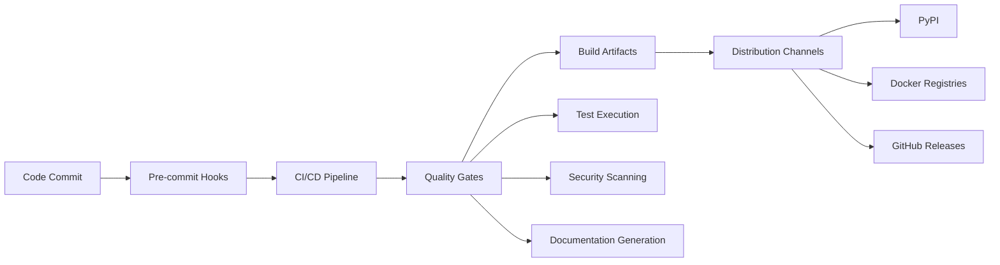

## 1. Description

### 1.1 Purpose

The Build Chain and CI/CD Module provides a comprehensive automated pipeline for the Aignostics Python SDK, encompassing code quality assurance, testing, security scanning, documentation generation, and multi-platform distribution. It ensures consistent, reliable, and secure software delivery through a series of automated quality gates and deployment mechanisms.

### 1.2 Functional Requirements

The Build Chain and CI/CD Module shall:

- **[FR-01]** Execute automated quality gates including linting, type checking, and security scanning on every code change
- **[FR-02]** Run comprehensive test suites across multiple Python versions and operating systems with coverage reporting
- **[FR-03]** Generate and publish documentation automatically including API references and user guides
- **[FR-04]** Build and distribute Python packages to PyPI with semantic versioning
- **[FR-05]** Create and publish multi-architecture Docker images for both slim and full variants
- **[FR-06]** Generate compliance artifacts including SBOM, license reports, and vulnerability assessments
- **[FR-07]** Provide local development environment consistency through pre-commit hooks and development tools
- **[FR-08]** Support multiple distribution channels including PyPI, Docker registries, and GitHub releases
- **[FR-09]** Enable local CI/CD testing through Act integration for GitHub Actions workflows
- **[FR-10]** Implement automated dependency monitoring and security vulnerability detection

### 1.3 Non-Functional Requirements

- **Performance**: Build pipeline optimized for fast feedback with parallel execution across multiple platforms, efficient caching strategies for dependencies and Docker layers
- **Security**: Secrets managed through GitHub secrets, vulnerability scanning integrated, OIDC token-based authentication for secure service communication
- **Reliability**: Manual retry capabilities through GitHub Actions UI, comprehensive error reporting through job summaries and artifacts
- **Usability**: Clear feedback through GitHub status checks, detailed test reports in job summaries, one-command local development setup
- **Scalability**: Matrix builds across multiple platforms, parallel test execution, efficient caching strategies

### 1.4 Constraints and Limitations

- GitHub Actions runner limitations for concurrent jobs and execution time
- Docker registry rate limits requiring authenticated access for heavy usage
- Platform-specific testing constraints (e.g., macOS GitHub Actions limitations)
- Secret management restricted to repository administrators and configured environments

---

## 2. Architecture and Design

### 2.1 Module Structure

```
.github/
├── workflows/           # GitHub Actions workflow definitions
│   ├── ci-cd.yml       # Main orchestration workflow
│   ├── _lint.yml       # Code quality and formatting checks
│   ├── _test.yml       # Multi-platform testing pipeline
│   ├── _audit.yml      # Security and compliance scanning
│   ├── _package-publish.yml # PyPI package publishing
│   ├── _docker-publish.yml  # Container image publishing
│   ├── _codeql.yml     # GitHub CodeQL security analysis
│   └── _ketryx_report_and_check.yml # Compliance reporting
├── copilot-instructions.md # AI pair programming guidelines
└── dependabot.yml      # Automated dependency updates

Makefile                # Local development task orchestration
noxfile.py             # Python environment management and task automation
pyproject.toml         # Project configuration and dependencies
.pre-commit-config.yaml # Git hook definitions for quality gates
```

### 2.2 Key Components

| Component              | Type         | Purpose                                   | Public Interface               | Dependencies           |
| ---------------------- | ------------ | ----------------------------------------- | ------------------------------ | ---------------------- |
| `ci-cd.yml`            | Workflow     | Main orchestration of all pipeline stages | GitHub Actions triggers        | All sub-workflows      |
| `_lint.yml`            | Workflow     | Code formatting and linting validation    | Ruff formatter and linter      | UV, Python environment |
| `_test.yml`            | Workflow     | Multi-platform testing with coverage      | Pytest execution across matrix | UV, test dependencies  |
| `_audit.yml`           | Workflow     | Security and license compliance scanning  | pip-audit, pip-licenses        | Python environment     |
| `_package-publish.yml` | Workflow     | PyPI package building and publishing      | UV build tools, PyPI API       | GitHub release tags    |
| `_docker-publish.yml`  | Workflow     | Container image building and publishing   | Docker Buildx, registries      | Docker Hub, GHCR       |
| `Makefile`             | Build System | Local development task orchestration      | Command-line interface         | Nox, UV, system tools  |
| `noxfile.py`           | Task Runner  | Python environment and session management | Python API and CLI             | UV, pytest, ruff, mypy |

### 2.3 Design Patterns

- **Pipeline as Code**: All CI/CD logic defined in version-controlled YAML files
- **Matrix Strategy**: Parallel execution across multiple platforms and Python versions
- **Dependency Injection**: Environment-specific configuration through secrets and variables
- **Service Layer Pattern**: Reusable workflow components through callable workflows
- **Fail Fast**: Early termination on critical quality gate failures

---

## 3. Inputs and Outputs

### 3.1 Inputs

| Input Type    | Source                | Data Type/Format              | Validation Rules          | Business Rules             |
| ------------- | --------------------- | ----------------------------- | ------------------------- | -------------------------- |
| Code Changes  | Git Push/PR           | Git commits                   | Pre-commit hooks, linting | Must pass quality gates    |
| Version Tags  | Git Tags              | Semantic versioning (v*.*.\*) | Format validation         | Triggers release pipeline  |
| Configuration | Environment Variables | Key-value pairs               | Secret validation         | Secure handling required   |
| Dependencies  | Package Managers      | Python packages, system tools | Vulnerability scanning    | License compliance checked |
| Test Data     | Fixtures/Mocks        | JSON, YAML, binary files      | Schema validation         | Test isolation maintained  |

### 3.2 Outputs

| Output Type      | Destination      | Data Type/Format                   | Success Criteria              | Error Conditions                        |
| ---------------- | ---------------- | ---------------------------------- | ----------------------------- | --------------------------------------- |
| Python Package   | PyPI             | Wheel and source distribution      | Successful upload             | Authentication/validation failures      |
| Docker Images    | Docker Hub, GHCR | Multi-arch container images        | Multi-platform build success  | Registry authentication failures        |
| Documentation    | Read The Docs    | HTML/PDF documentation             | Successful deployment         | Build/rendering failures                |
| Test Reports     | GitHub Actions   | JUnit XML, coverage reports        | All tests pass, coverage >85% | Test failures, coverage below threshold |
| Security Reports | Artifacts        | JSON vulnerability/license reports | Clean vulnerability scan      | Critical vulnerabilities detected       |
| Release Assets   | GitHub Releases  | Binaries, documentation, reports   | Successful asset upload       | Asset creation/upload failures          |

### 3.3 Data Schemas

**Workflow Trigger Schema:**

```yaml
# GitHub Actions event schema
workflow_dispatch:
  inputs:
    skip_tests:
      type: boolean
      description: Skip test execution
      default: false

push:
  branches: ["**"]
  tags: ["v*.*.*"]

pull_request:
  branches: [main]
  types: [opened, synchronize, reopened]
```

**Test Matrix Schema:**

```yaml
# Test execution matrix configuration
strategy:
  matrix:
    runner: [ubuntu-latest, macos-latest, windows-latest]
    python-version: ["3.11", "3.12", "3.13"]
    experimental: [false]
    include:
      - runner: ubuntu-24.04-arm
        experimental: true
```

**Release Artifact Schema:**

```yaml
# Release asset structure
release_assets:
  - type: python_package
    format: [wheel, sdist]
    platform: any
  - type: docker_image
    variants: [slim, full]
    architectures: [amd64, arm64]
  - type: documentation
    formats: [html, pdf]
  - type: compliance_reports
    formats: [json, csv, xml]
```

### 3.4 Data Flow



---

## 4. Interface Definitions

### 4.1 Public API

#### GitHub Actions Workflow Interface

**Main Workflow**: `ci-cd.yml`

- **Purpose**: Orchestrates the complete CI/CD pipeline from code quality to deployment
- **Triggers**: Git push, pull request, release creation, manual dispatch
- **Key Jobs**:
  - `lint`: Code quality validation using Ruff formatter and linter
  - `audit`: Security vulnerability and license compliance scanning
  - `test`: Multi-platform testing with coverage reporting
  - `codeql`: GitHub CodeQL security analysis
  - `ketryx_report_and_check`: Compliance reporting and validation
  - `package_publish`: PyPI package publishing (tags only)
  - `docker_publish`: Container image publishing (tags only)

**Input/Output Contracts**:

- **Input Types**: Git events, environment variables, secrets
- **Output Types**: GitHub status checks, artifacts, deployments
- **Error Conditions**: Quality gate failures, authentication errors, platform unavailability

#### Local Development Interface

**Make Commands**:

```bash
# Primary development commands
make install          # Setup development environment
make all              # Run all quality gates locally
make test             # Execute test suite
make lint             # Run code quality checks
make audit            # Security and compliance scanning
make docs             # Generate documentation
make dist             # Build distribution packages
```

**Nox Sessions**:

```bash
# Python environment management
uv run nox -s lint    # Code quality validation
uv run nox -s test    # Test execution with coverage
uv run nox -s audit   # Security and compliance
uv run nox -s docs    # Documentation generation
uv run nox -s dist    # Package building
```

### 4.2 CLI Interface

**Make Interface**:

| Command             | Purpose                     | Input Requirements       | Output Format                |
| ------------------- | --------------------------- | ------------------------ | ---------------------------- |
| `make all`          | Run complete build pipeline | None                     | Console output, artifacts    |
| `make test`         | Execute test suite          | Optional: Python version | JUnit XML, coverage reports  |
| `make lint`         | Code quality checks         | None                     | Console output, exit codes   |
| `make audit`        | Security/compliance scan    | None                     | JSON reports, console output |
| `make docker_build` | Build container images      | None                     | Docker images (local)        |
| `make dist`         | Build Python packages       | None                     | Wheel/sdist in dist/         |

**Common Options**:

- Environment variables for configuration override
- Skip patterns for CI (e.g., `skip:ci` in commit messages)
- Python version selection for testing
- Platform-specific build targets

### 4.3 GitHub Actions Interface

**Workflow Call Interface**:

| Workflow               | Method          | Purpose                 | Permissions Required               | Secrets Used       |
| ---------------------- | --------------- | ----------------------- | ---------------------------------- | ------------------ |
| `_lint.yml`            | `workflow_call` | Code quality validation | `contents: read`                   | None               |
| `_test.yml`            | `workflow_call` | Multi-platform testing  | `contents: read, packages: write`  | Test credentials   |
| `_audit.yml`           | `workflow_call` | Security scanning       | `contents: read`                   | None               |
| `_package-publish.yml` | `workflow_call` | PyPI publishing         | `contents: write, packages: write` | `UV_PUBLISH_TOKEN` |
| `_docker-publish.yml`  | `workflow_call` | Container publishing    | `packages: write`                  | Docker credentials |

**Environment Variables**:

- `GITHUB_TOKEN`: Automatic GitHub authentication
- `PYTHONIOENCODING`: UTF-8 encoding for Python output
- Platform-specific configuration through matrix variables

---

## 5. Dependencies and Integration

### 5.1 Internal Dependencies

| Dependency Module | Usage Purpose                   | Interface/Contract Used    | Criticality |
| ----------------- | ------------------------------- | -------------------------- | ----------- |
| Source Code       | Build target for all operations | Python package structure   | Required    |
| Test Suite        | Quality validation              | pytest test discovery      | Required    |
| Documentation     | User guide generation           | Sphinx configuration       | Required    |
| Configuration     | Build parameter control         | pyproject.toml, noxfile.py | Required    |

### 5.2 External Dependencies

| Dependency         | Min Version | Purpose                       | Optional/Required | Fallback Behavior      |
| ------------------ | ----------- | ----------------------------- | ----------------- | ---------------------- |
| GitHub Actions     | N/A         | CI/CD execution platform      | Required          | Local testing with Act |
| UV Package Manager | Latest      | Python environment management | Required          | Fallback to pip/venv   |
| Docker             | 20.10+      | Container image building      | Required          | Skip container builds  |
| Ruff               | 0.1.0+      | Code formatting and linting   | Required          | Pipeline failure       |
| MyPy               | 1.0+        | Static type checking          | Required          | Pipeline failure       |
| pytest             | 7.0+        | Test execution framework      | Required          | Pipeline failure       |
| Nox                | 2023.4+     | Session management            | Required          | Direct tool execution  |

### 5.3 Integration Points

- **Aignostics Platform API**: Authentication and service integration for E2E tests
- **PyPI**: Package publishing and distribution
- **Docker Hub/GHCR**: Container image registry publication
- **Read The Docs**: Automated documentation deployment
- **Codecov**: Test coverage reporting and analysis
- **SonarQube**: Code quality and security analysis
- **Slack**: Release notifications and alerts

---

## 6. Configuration and Settings

### 6.1 Configuration Parameters

| Parameter              | Type   | Default                      | Description                        | Required |
| ---------------------- | ------ | ---------------------------- | ---------------------------------- | -------- |
| `TEST_PYTHON_VERSIONS` | List   | ["3.11", "3.12", "3.13"]     | Python versions for testing        | Yes      |
| `PYTHON_VERSION`       | String | "3.13"                       | Default Python version             | Yes      |
| `API_VERSIONS`         | List   | ["v1"]                       | API versions to test               | Yes      |
| `JUNIT_XML_PREFIX`     | String | "--junitxml=reports/junit\_" | Test report file prefix            | Yes      |
| `UTF8`                 | String | "utf-8"                      | Default encoding                   | Yes      |
| `LATEXMK_VERSION_MIN`  | Float  | 4.86                         | Minimum LaTeX version for PDF docs | No       |

### 6.2 Environment Variables

| Variable                      | Purpose                        | Example Value         |
| ----------------------------- | ------------------------------ | --------------------- |
| `GITHUB_TOKEN`                | GitHub API authentication      | `ghp_xxxxxxxxxxxx`    |
| `UV_PUBLISH_TOKEN`            | PyPI publishing authentication | `pypi-xxxxxxx`        |
| `DOCKER_USERNAME`             | Docker Hub authentication      | `username`            |
| `DOCKER_PASSWORD`             | Docker Hub token               | `dckr_pat_xxxxx`      |
| `CODECOV_TOKEN`               | Coverage reporting             | `xxxxxxxx-xxxx-xxxx`  |
| `SONAR_TOKEN`                 | SonarQube authentication       | `squ_xxxxxxxx`        |
| `AIGNOSTICS_CLIENT_ID_DEVICE` | Platform API testing           | `client_id_value`     |
| `AIGNOSTICS_REFRESH_TOKEN`    | Platform API testing           | `refresh_token_value` |
| `GCP_CREDENTIALS`             | Google Cloud authentication    | `base64_encoded_json` |

---

## 7. Error Handling and Validation

### 7.1 Error Categories

| Error Type                 | Cause                                          | Handling Strategy                        | User Impact                               |
| -------------------------- | ---------------------------------------------- | ---------------------------------------- | ----------------------------------------- |
| `QualityGateFailure`       | Linting, type checking, or test failures       | Fail pipeline, provide detailed reports  | Development blocked until fixed           |
| `SecurityVulnerability`    | Critical vulnerabilities in dependencies       | Fail pipeline, generate security report  | Security review required                  |
| `AuthenticationFailure`    | Invalid credentials for external services      | Fail deployment steps only               | Development continues, deployment blocked |
| `PlatformUnavailability`   | GitHub Actions runner or external service down | Retry with backoff, mark as experimental | Temporary delays, alternative paths used  |
| `CoverageThresholdFailure` | Test coverage below 85% requirement            | Fail pipeline, highlight uncovered code  | Code quality improvement required         |

### 7.2 Input Validation

- **Version Tags**: Must match semantic versioning pattern `v*.*.*`
- **Commit Messages**: Validated for conventional commits format
- **Environment Variables**: Presence and format validation for required secrets
- **Python Code**: Syntax validation through AST parsing before execution
- **Docker Configuration**: Dockerfile and compose file validation

### 7.3 Graceful Degradation

- **When GitHub Actions runners unavailable**: Local testing with Act recommended
- **When external registries unreachable**: Build continues, deployment skipped with warning
- **When optional tools missing**: Core functionality preserved, enhanced features disabled
- **When experimental platforms fail**: Pipeline continues with warnings, main platforms must succeed

---

## 8. Security Considerations

### 8.1 Data Protection

- **Authentication**: GitHub OIDC tokens for secure service-to-service communication
- **Secret Management**: All credentials stored in GitHub Secrets with restricted access
- **Access Control**: Repository permissions control workflow execution and secret access
- **Audit Logging**: All pipeline executions logged with full traceability

### 8.2 Security Measures

- **Input Sanitization**: All external inputs validated and sanitized before use
- **Dependency Scanning**: pip-audit integration for vulnerability detection in dependencies
- **Secret Detection**: detect-secrets pre-commit hook prevents credential leakage
- **Container Security**: Multi-stage docker builds with minimal base images, non-root execution
- **Supply Chain Security**: SBOM generation in CycloneDX and SPDX formats, dependency vulnerability tracking
- **Code Analysis**: GitHub CodeQL and SonarQube integration for security analysis

---

## 9. Implementation Details

### 9.1 Key Algorithms and Business Logic

- **Caching Strategy**: UV dependency caching with lock file-based invalidation for optimal performance
- **Parallel Execution**: Test parallelization using pytest-xdist with intelligent load balancing
- **Version Management**: Semantic versioning with bump-my-version for automated releases
- **Artifact Collection**: Systematic gathering of build outputs, test results, and compliance reports

### 9.2 State Management and Data Flow

- **State Type**: Stateless pipelines with artifact-based state passing between jobs
- **Data Persistence**: Artifacts stored in GitHub Actions with configurable retention
- **Session Management**: Isolated environments per job with clean setup/teardown
- **Cache Strategy**: Multi-level caching (UV dependencies, Docker layers, build artifacts)

### 9.3 Performance and Scalability Considerations

- **Performance Characteristics**:
  - Matrix testing: Parallel execution across 6+ platforms
  - Caching: UV dependency and Docker layer caching implemented
  - Optimization: Efficient resource usage through UV package manager and container builds
- **Scalability Patterns**: Horizontal scaling through GitHub Actions matrix builds
- **Resource Management**: Memory and CPU optimization through UV and container limits
- **Concurrency Model**: Parallel job execution with dependency-based ordering

---

## Documentation Maintenance

### Verification and Updates

**Last Verified**: 2025-09-11 when spec was created and accuracy-verified against implementation  
**Verification Method**: Comprehensive analysis of .github/workflows/, Makefile, noxfile.py, pyproject.toml, and actual workflow configurations  
**Next Review Date**: 2025-12-11 (quarterly review cycle)

### Change Management

**Interface Changes**: Changes to workflow interfaces or Make commands require spec updates and version bumps  
**Implementation Changes**: Internal workflow changes don't require spec updates unless behavior changes  
**Dependency Changes**: Major tool updates (UV, Ruff, pytest) should be reflected in constraints section

### References

**Implementation**: See `.github/workflows/`, `Makefile`, `noxfile.py` for current implementation  
**Tests**: See `tests/aignostics/` for build system integration tests  
**Documentation**: See `CONTRIBUTING.md` and `OPERATIONAL_EXCELLENCE.md` for detailed usage examples
