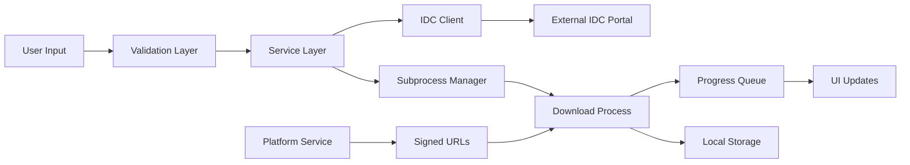

## 1. Description

### 1.1 Purpose

The Dataset Module provides functionality for downloading and managing medical imaging datasets from external sources, specifically the National Cancer Institute's Image Data Commons (IDC) Portal and Aignostics proprietary datasets. It enables users to discover, query, and download DICOM datasets with progress tracking and integration with both command-line and web-based interfaces.

### 1.2 Functional Requirements

The Dataset Module shall:

- **[FR-01]** Enable discovery and browsing of IDC Portal datasets through web portal integration
- **[FR-02]** Support SQL-based querying of IDC metadata indices for dataset discovery
- **[FR-03]** Download DICOM datasets using hierarchical identifier matching (collection, patient, study, series, instance)
- **[FR-04]** Provide configurable directory layout templates for organized dataset storage
- **[FR-05]** Support Aignostics proprietary dataset downloads via signed URLs
- **[FR-06]** Implement progress tracking for download operations with real-time updates
- **[FR-07]** Provide both CLI and web-based interfaces for dataset operations
- **[FR-08]** Support dry-run operations for validation before actual downloads

### 1.3 Non-Functional Requirements

- **Performance**: Handle large DICOM dataset downloads through subprocess isolation to maintain UI responsiveness
- **Security**: Signed URL generation for Aignostics datasets, secure credential handling, process isolation
- **Reliability**: Process lifecycle management with automatic cleanup, graceful error handling with retry mechanisms
- **Usability**: Web interface with file picker integration, CLI with rich console output and progress indicators
- **Scalability**: Support concurrent download operations, efficient memory usage for large datasets

### 1.4 Constraints and Limitations

- Requires external IDC Portal services and metadata availability
- Download operations run in isolated subprocesses for UI responsiveness
- All operations require internet connectivity
- Downloaded DICOM datasets can be large, requiring adequate local storage
- Path length limitations on Windows systems (260 characters)
- Dependencies on external IDC index data updates

---

## 2. Architecture and Design

### 2.1 Module Structure

```
dataset/
├── _service.py          # Core business logic and service implementation
├── _cli.py             # Command-line interface implementation
├── _gui.py             # Web-based GUI components
├── assets/             # Static assets for web interface
│   └── NIH-IDC-logo.svg
└── __init__.py        # Module exports and public API
```

### 2.2 Key Components

| Component     | Type        | Purpose                                     | Public Interface                      | Dependencies     |
| ------------- | ----------- | ------------------------------------------- | ------------------------------------- | ---------------- |
| `Service`     | Class       | Core dataset operations and subprocess mgmt | `download_with_queue()`, health, info | Platform, Utils  |
| `cli`         | Typer CLI   | Command-line interface for all operations   | `idc`, `aignostics` commands          | Service, Typer   |
| `PageBuilder` | Class       | Web interface for interactive dataset mgmt  | Page registration                     | NiceGUI, Service |
| `IDCClient`   | Third-party | Modified IDC client for portal integration  | Query and download methods            | idc-index-data   |

_Note: For detailed implementation, refer to the source code in the module directory._

### 2.3 Design Patterns

- **Service Layer Pattern**: Business logic encapsulated in Service class with clear separation from presentation layers
- **Subprocess Isolation**: Download operations run in separate processes for UI responsiveness and better resource management
- **Progress Observer Pattern**: Queue-based progress communication between main and subprocess
- **Command Pattern**: CLI commands structured as discrete operations with consistent interfaces

---

## 3. Inputs and Outputs

### 3.1 Inputs

| Input Type          | Source        | Data Type/Format | Validation Rules                        | Business Rules                  |
| ------------------- | ------------- | ---------------- | --------------------------------------- | ------------------------------- |
| Dataset Identifiers | CLI/GUI/API   | String/CSV       | Non-empty, comma-separated valid UIDs   | Must match IDC hierarchy levels |
| Target Directory    | CLI/GUI/API   | Path             | Existing directory, write permissions   | Adequate storage space required |
| Layout Template     | Configuration | String           | Valid template with supported variables | Default template available      |
| SQL Query           | CLI/API       | String           | Valid SQL syntax for IDC indices        | Must target available indices   |
| Aignostics URL      | CLI/GUI       | URL              | Valid gs:// or https:// protocol        | Must be authorized resource     |

### 3.2 Outputs

| Output Type      | Destination      | Data Type/Format      | Success Criteria                | Error Conditions              |
| ---------------- | ---------------- | --------------------- | ------------------------------- | ----------------------------- |
| Downloaded DICOM | Local Filesystem | DICOM Files           | All files downloaded intact     | Network, permissions, space   |
| Query Results    | CLI/Console      | Pandas DataFrame      | Valid result set returned       | Invalid query, service down   |
| Progress Updates | GUI/Queue        | Progress Values (0-1) | Continuous progress updates     | Subprocess communication fail |
| IDC Metadata     | CLI/Console      | JSON/Table format     | Metadata successfully retrieved | IDC service unavailable       |
| Operation Status | Logs/Console     | Structured Logs       | Operation completion logged     | Process errors logged         |

### 3.3 Data Schemas

**Dataset Identifier Schema:**

```yaml
DatasetIdentifier:
  type: object
  properties:
    collection_id:
      type: string
      description: IDC collection identifier
      pattern: "^[a-zA-Z0-9_-]+$"
    patient_id:
      type: string
      description: DICOM Patient ID
      pattern: "^[0-9.]+$"
    study_instance_uid:
      type: string
      description: DICOM Study Instance UID
      pattern: "^[0-9.]+$"
    series_instance_uid:
      type: string
      description: DICOM Series Instance UID
      pattern: "^[0-9.]+$"
    sop_instance_uid:
      type: string
      description: DICOM SOP Instance UID
      pattern: "^[0-9.]+$"
```

**Download Progress Schema:**

```yaml
DownloadProgress:
  type: object
  properties:
    progress:
      type: number
      minimum: 0.0
      maximum: 1.0
      description: Progress as decimal (0.0-1.0)
    status:
      type: string
      enum: ["initializing", "downloading", "completed", "error"]
      description: Current operation status
    message:
      type: string
      description: Status message for user display
```

### 3.4 Data Flow



---

## 4. Interface Definitions

### 4.1 Public API

#### Core Service Interface

**Service Class**: `Service`

- **Purpose**: Core dataset operations with subprocess management and progress tracking
- **Key Methods**:
  - `info(mask_secrets: bool = True) -> dict[str, Any]`: Service information and configuration
  - `health() -> Health`: Service health status
  - `download_with_queue(queue, source, target, target_layout, dry_run) -> None`: Download with progress tracking

**Input/Output Contracts**:

- **Input Types**: Dataset identifiers (string/CSV), target paths (Path), layout templates (string)
- **Output Types**: Health status, progress updates via queue, downloaded DICOM files
- **Error Conditions**: `ValueError` for invalid inputs, network errors for IDC service issues

_Note: For detailed method signatures, refer to the module's `__init__.py` and service class documentation._

### 4.2 CLI Interface

**Command Structure:**

```bash
uvx aignostics dataset [subcommand] [options]
```

**Available Commands:**

| Command                            | Purpose                        | Input Requirements            | Output Format       |
| ---------------------------------- | ------------------------------ | ----------------------------- | ------------------- |
| `idc browse`                       | Open IDC portal in browser     | None                          | Browser navigation  |
| `idc indices`                      | List available IDC indices     | None                          | Console list        |
| `idc columns [index]`              | List columns in specific index | Optional index name           | Console list        |
| `idc query [sql]`                  | Execute SQL query on IDC data  | SQL query string              | Pandas DataFrame    |
| `idc download <source> [target]`   | Download dataset from IDC      | Dataset IDs, target directory | Progress indicators |
| `aignostics download <url> [dest]` | Download Aignostics dataset    | Signed URL, destination       | Progress indicators |

**Common Options:**

- `--help`: Display command help
- `--target-layout`: Directory layout template for downloads
- `--dry-run`: Validate without actual download
- `--indices`: Additional indices to sync for queries

### 4.3 Web Interface

**Endpoint Structure:**

| Route          | Purpose                      | Components                        | User Interactions       |
| -------------- | ---------------------------- | --------------------------------- | ----------------------- |
| `/dataset/idc` | Interactive dataset download | ID input, folder picker, progress | Select, download, track |

**Key Features**:

- Dataset ID input with validation
- File picker for target directory selection
- Real-time progress tracking with visual indicators
- Integration with IDC portal for dataset discovery

---

## 5. Dependencies and Integration

### 5.1 Internal Dependencies

| Dependency Module | Usage Purpose                  | Interface/Contract Used    | Criticality |
| ----------------- | ------------------------------ | -------------------------- | ----------- |
| Platform Service  | Signed URL generation          | `generate_signed_url()`    | Required    |
| Utils Module      | Base services, logging, health | `BaseService`, `Health`    | Required    |
| GUI Module        | Web interface framework        | `BasePageBuilder`, routing | Optional    |

### 5.2 External Dependencies

| Dependency     | Min Version | Purpose                       | Optional/Required | Fallback Behavior |
| -------------- | ----------- | ----------------------------- | ----------------- | ----------------- |
| idc-index-data | ==21.0.0    | IDC metadata and index access | Required          | Service fails     |
| pandas         | <=2.3.1     | DataFrame operations          | Required          | Service fails     |
| requests       | >=2.32.3    | HTTP client for downloads     | Required          | Service fails     |
| typer          | Latest      | CLI framework                 | Required          | CLI unavailable   |
| nicegui        | Latest      | Web GUI framework             | Optional          | GUI unavailable   |

_Note: For exact version requirements, refer to `pyproject.toml` and dependency lock files._

### 5.3 Integration Points

- **IDC Portal Services**: RESTful APIs for metadata access and DICOM downloads
- **Aignostics Platform API**: Authentication and signed URL generation
- **Local File System**: DICOM file storage with configurable layouts

---

## 6. Configuration and Settings

### 6.1 Configuration Parameters

| Parameter            | Type | Default                                          | Description                   | Required |
| -------------------- | ---- | ------------------------------------------------ | ----------------------------- | -------- |
| `target_layout`      | str  | `%collection_id/%PatientID/%StudyInstanceUID/`   | Directory layout template     | No       |
| `portal_url`         | str  | `https://portal.imaging.datacommons.cancer.gov/` | IDC portal base URL           | No       |
| `example_dataset_id` | str  | `1.3.6.1.4.1.5962.99.1.1069745200...`            | Example dataset for testing   | No       |
| `path_length_max`    | int  | 260                                              | Maximum path length (Windows) | No       |

### 6.2 Environment Variables

| Variable              | Purpose                | Example Value                 |
| --------------------- | ---------------------- | ----------------------------- |
| `AIGNOSTICS_DATA_DIR` | Default data directory | `/Users/user/data/aignostics` |
| `IDC_CLIENT_TIMEOUT`  | IDC client timeout     | `60`                          |
| `DOWNLOAD_CHUNK_SIZE` | Download chunk size    | `8192`                        |

---

## 7. Error Handling and Validation

### 7.1 Error Categories

| Error Type        | Cause                         | Handling Strategy              | User Impact                   |
| ----------------- | ----------------------------- | ------------------------------ | ----------------------------- |
| `ValueError`      | Invalid identifiers or paths  | Input validation with feedback | Clear error message displayed |
| `NetworkError`    | IDC service unavailable       | Retry with user notification   | Graceful degradation          |
| `ProcessError`    | Subprocess failure            | Cleanup and error logging      | Progress tracking stops       |
| `PermissionError` | Insufficient file permissions | Path validation                | Alternative path suggested    |

### 7.2 Input Validation

- **Dataset Identifiers**: Validated against IDC metadata indices using hierarchical matching
- **Target Directories**: Existence, write permissions, and available space checks
- **SQL Queries**: Basic syntax validation for IDC metadata querying
- **URLs**: Protocol validation (gs://, https://) for Aignostics dataset URLs

### 7.3 Graceful Degradation

- **When IDC service is unavailable**: Cache last known indices, show offline mode message
- **When GUI dependencies missing**: Fall back to CLI-only mode
- **When subprocess fails**: Clean up resources, log detailed error information

---

## 8. Security Considerations

### 8.1 Data Protection

- **Authentication**: Signed URL authentication for Aignostics datasets using platform service
- **Data Encryption**: HTTPS for all external communications, no local encryption of DICOM files
- **Access Control**: Process isolation through subprocess architecture, file system permissions

### 8.2 Security Measures

- **Input Sanitization**: All file paths and identifiers validated against known patterns
- **Process Management**: Automatic cleanup of subprocesses on exit with graceful termination
- **Audit Logging**: All operations logged with timestamps and user context
- **Secret Management**: No secrets stored in code, signed URLs have expiration times

---

## 9. Implementation Details

### 9.1 Key Algorithms and Business Logic

- **Progress Monitoring**: Regex pattern matching on subprocess stderr for real-time progress updates
- **Hierarchical Identifier Matching**: Multi-level DICOM hierarchy matching (collection → patient → study → series → instance)
- **Process Lifecycle Management**: Graceful termination with timeout and force-kill fallback
- **Directory Layout Templating**: Variable substitution system for flexible file organization

### 9.2 State Management and Data Flow

- **State Type**: Stateless service with transient subprocess state
- **Data Persistence**: No persistent state, downloads to specified local directories
- **Session Management**: Process-based sessions for download operations
- **Cache Strategy**: IDC indices cached temporarily during session

### 9.3 Performance and Scalability Considerations

- **Performance Characteristics**: Subprocess isolation prevents UI blocking, concurrent downloads supported
- **Scalability Patterns**: Process-per-download model scales with system resources
- **Resource Management**: Memory-efficient streaming downloads, automatic process cleanup
- **Concurrency Model**: Thread-safe queue communication, daemon threads for monitoring

---

## Documentation Maintenance

### Verification and Updates

**Last Verified**: September 11, 2025  
**Verification Method**: Code review against implementation in `src/aignostics/dataset/`  
**Next Review Date**: October 11, 2025

### Change Management

**Interface Changes**: Changes to public APIs require spec updates and version bumps  
**Implementation Changes**: Internal changes don't require spec updates unless behavior changes  
**Dependency Changes**: Major dependency changes should be reflected in constraints section

### References

**Implementation**: See `src/aignostics/dataset/` for current implementation  
**Tests**: See `tests/aignostics/dataset/` for usage examples and verification  
**API Documentation**: Auto-generated from docstrings in service classes

---

```

```
