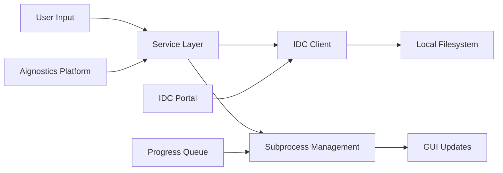

# Software Item Specification: Dataset Module

---

**Item ID:** SPEC-DATASET-SERVICE  
**Item Type:** Software Item Spec  
**Item Fulfills:** FE-6386  
**Module:** Dataset  
**Layer:** Domain Service  
**Version:** 0.2.105  
**Date:** September 1, 2025

---

## 1. Description

### 1.1 Purpose

The Dataset Module provides comprehensive functionality for downloading and managing medical imaging datasets from external sources, primarily the National Cancer Institute's Image Data Commons (IDC) Portal and Aignostics proprietary datasets. It enables users to discover, query, and download DICOM datasets with sophisticated filtering capabilities, progress tracking, and integration with both command-line and web-based interfaces.

### 1.2 Functional Requirements

The Dataset Module shall:

- **[FR-01]** Enable discovery and browsing of IDC Portal datasets with interactive web portal integration
- **[FR-02]** Support SQL-based querying of IDC metadata indices with pandas DataFrame results
- **[FR-03]** Download DICOM datasets using multi-level identifier matching (collection, patient, study, series, instance)
- **[FR-04]** Provide configurable directory layout templates for organized dataset storage
- **[FR-05]** Support Aignostics proprietary dataset downloads via signed URL authentication
- **[FR-06]** Implement real-time progress tracking for long-running download operations through subprocess monitoring

### 1.3 Non-Functional Requirements

- **Performance**: Handle large DICOM dataset downloads through subprocess isolation, progress monitoring with 0.1s update intervals
- **Security**: Signed URL generation for Aignostics datasets, secure credential handling, subprocess cleanup to prevent orphans
- **Reliability**: Process lifecycle management with automatic cleanup, graceful termination with fallback force kill
- **Usability**: Web interface with file picker integration, CLI with rich console output, example datasets for quick start
- **Scalability**: Support concurrent downloads through subprocess architecture, configurable directory layouts

### 1.4 Constraints and Limitations

- IDC Dependency: Requires external IDC Portal services and metadata availability
- Subprocess Architecture: Download operations run in isolated subprocesses for UI responsiveness
- Network Dependency: All operations require internet connectivity for IDC and Aignostics services
- Storage Requirements: Downloaded DICOM datasets can be large, requiring adequate local storage space

---

## 2. Architecture and Design

### 2.1 Module Structure

```
dataset/
├── _service.py          # Core business logic with subprocess management and progress tracking
├── _cli.py             # Command-line interface with IDC and Aignostics subcommands
├── _gui.py             # Web-based GUI using NiceGUI with file picker integration
├── assets/             # Static assets including NIH-IDC logo
│   └── NIH-IDC-logo.svg
└── __init__.py        # Module exports: IDCClient, Service, cli, and conditional PageBuilder
```

### 2.2 Key Components

| Component     | Type  | Purpose                                      | Public API                                             |
| ------------- | ----- | -------------------------------------------- | ------------------------------------------------------ |
| `Service`     | Class | Core dataset operations with subprocess mgmt | `download_with_queue()`, `health()`, `info()`          |
| `cli`         | Typer | Command-line interface for dataset ops       | `idc browse/query/download`, `aignostics download`     |
| `PageBuilder` | Class | Web interface for interactive management     | `register_pages()` with dataset selection UI           |
| `IDCClient`   | Class | Modified IDC client with proxy support       | `client()`, `download_from_selection()`, `sql_query()` |

### 2.3 Design Patterns

- **Service Layer Pattern**: Business logic encapsulated in Service class with health monitoring
- **Subprocess Isolation**: Download operations isolated in subprocesses for UI responsiveness
- **Observer Pattern**: Queue-based progress monitoring with real-time UI updates
- **Adapter Pattern**: Modified IDC client for corporate proxy compatibility

---

## 3. Inputs and Outputs

### 3.1 Inputs

| Input Type          | Source        | Format/Type | Validation Rules                                         |
| ------------------- | ------------- | ----------- | -------------------------------------------------------- |
| Dataset Identifiers | CLI/GUI/API   | String/CSV  | Valid IDC identifiers (collection, patient, study, etc.) |
| Target Directory    | CLI/GUI/API   | Path        | Must exist and be writable for downloads                 |
| Layout Template     | Configuration | String      | Valid template with IDC metadata placeholders            |
| SQL Query           | CLI/API       | String      | Valid SQL syntax for IDC metadata querying               |
| Aignostics URL      | CLI/GUI       | URL         | Valid gs:// URL format for proprietary datasets          |

### 3.2 Outputs

| Output Type      | Destination      | Format/Type      | Success Criteria                              |
| ---------------- | ---------------- | ---------------- | --------------------------------------------- |
| Downloaded DICOM | Local Filesystem | DICOM Files      | Complete download with directory structure    |
| Query Results    | CLI/Console      | Pandas DataFrame | Successful SQL execution against IDC metadata |
| Progress Updates | GUI/Queue        | Progress Values  | Real-time download progress (0.0-1.0)         |
| IDC Metadata     | CLI/Console      | JSON/Table       | Available indices and column information      |
| Operation Status | Logs/Console     | Structured Logs  | Success/failure with detailed error messages  |

### 3.3 Data Flow



---

## 4. Interface Definitions

### 4.1 Public API

#### Core Service Interface

```python
class Service(BaseService):
    """Dataset service for IDC and Aignostics dataset operations."""

    def info(self, mask_secrets: bool = True) -> dict[str, Any]:
        """Determine info of this service.
        Args:
            mask_secrets: Whether to mask sensitive information in the output
        Returns:
            Service information dictionary
        """

    def health(self) -> Health:
        """Determine health of dataset service.
        Returns:
            Health status with components information
        """

    @staticmethod
    def download_with_queue(queue: Queue, source: str, target: str = str(Path.cwd()),
                           target_layout: str = TARGET_LAYOUT_DEFAULT,
                           dry_run: bool = False) -> None:
        """Download from manifest file, identifier, or comma-separate set of identifiers.
        Args:
            queue: Queue for progress updates
            source: Source identifiers to download from
            target: Target directory to download to
            target_layout: Layout of the target directory
            dry_run: If True, perform a dry run
        Raises:
            ValueError: If target directory does not exist or no IDs provided
        """
```

### 4.2 CLI Interface

**Command Structure:**

```bash
uvx aignostics dataset [subcommand] [options]
```

**Available Commands:**

**IDC Commands:**

- `idc browse`: Open IDC Portal in default browser
- `idc indices`: List available dataset indices
- `idc columns [index]`: Show columns for specified index
- `idc query [sql]`: Execute SQL query against IDC metadata
- `idc download <source> [target]`: Download specified datasets

**Aignostics Commands:**

- `aignostics download <url> [destination]`: Download from Aignostics storage

### 4.3 GUI Interface

- **Navigation**: Accessible via `/dataset/idc` route in main SDK GUI
- **Key UI Components**: Dataset ID input, file picker, progress indicators, example dataset button
- **User Workflows**: Interactive dataset selection, real-time download tracking, file manager integration

---

## 5. Dependencies and Integration

### 5.1 Internal Dependencies

| Dependency Module | Usage Purpose             | Interface Used                  |
| ----------------- | ------------------------- | ------------------------------- |
| Platform Service  | Signed URL generation     | `generate_signed_url()`         |
| Utils Module      | Logging and base services | `BaseService`, `get_logger`     |
| GUI Module        | Web interface framework   | `frame` component for UI layout |

### 5.2 External Dependencies

| Dependency     | Version  | Purpose                      | Optional/Required |
| -------------- | -------- | ---------------------------- | ----------------- |
| idc-index-data | ==21.0.0 | IDC metadata and index files | Required          |
| pandas         | <=2.3.1  | DataFrame operations         | Required          |
| requests       | >=2.32.3 | HTTP client for downloads    | Required          |
| showinfm       | Latest   | File manager integration     | External          |
| typer          | Latest   | CLI framework                | Required          |
| nicegui        | Latest   | Web GUI framework            | Optional          |

### 5.3 Integration Points

- **IDC Portal**: External dataset discovery and metadata querying at `https://portal.imaging.datacommons.cancer.gov/explore/`
- **Aignostics Platform**: Proprietary dataset access via signed URLs and Google Cloud Storage
- **Local Filesystem**: DICOM file storage with configurable directory layouts

---

## 6. Configuration and Settings

### 6.1 Configuration Parameters

| Parameter            | Type | Default                                                                     | Description               | Required |
| -------------------- | ---- | --------------------------------------------------------------------------- | ------------------------- | -------- |
| `target_layout`      | str  | `%collection_id/%PatientID/%StudyInstanceUID/%Modality_%SeriesInstanceUID/` | Directory layout template | No       |
| `portal_url`         | str  | `https://portal.imaging.datacommons.cancer.gov/explore/`                    | IDC Portal URL            | No       |
| `example_dataset_id` | str  | `1.3.6.1.4.1.5962.99.1.1069745200.1645485340.1637452317744.2.0`             | Example SOP Instance UID  | No       |

### 6.2 Environment Variables

| Variable              | Purpose                   | Example Value                            |
| --------------------- | ------------------------- | ---------------------------------------- |
| `PATH_LENGTH_MAX`     | Windows path length limit | `260`                                    |
| User data directories | Default download location | `~/.local/share/aignostics/datasets/idc` |

---

## 7. Error Handling and Validation

### 7.1 Error Categories

| Error Type        | Cause                        | Handling Strategy              | User Impact                   |
| ----------------- | ---------------------------- | ------------------------------ | ----------------------------- |
| `ValueError`      | Invalid identifiers or paths | Input validation with feedback | Clear error message shown     |
| `NetworkError`    | IDC service unavailable      | Retry with user notification   | Temporary delay, retry        |
| `ProcessError`    | Subprocess failure           | Cleanup and error logging      | Download fails gracefully     |
| `ValidationError` | Invalid target directory     | Path validation before start   | Operation blocked until fixed |

### 7.2 Input Validation

- **Dataset Identifiers**: Validated against IDC metadata indices, comma-separated format support
- **Target Directories**: Existence and write permission checks before download initiation
- **SQL Queries**: Basic syntax validation for IDC metadata querying
- **URLs**: Protocol validation for Aignostics dataset URLs (gs:// format)

### 7.3 Graceful Degradation

- **When IDC Portal unavailable**: CLI operations fail with service status information
- **When subprocess fails**: Automatic cleanup with detailed error logging
- **When GUI components missing**: Conditional PageBuilder import with fallback to CLI-only mode

---

## 8. Security Considerations

### 8.1 Data Protection

- **Authentication**: Signed URL authentication for Aignostics proprietary datasets
- **Data Encryption**: HTTPS for all external communications with IDC and Aignostics services
- **Access Control**: Process isolation through subprocess architecture

### 8.2 Security Measures

- **Input Sanitization**: All file paths and identifiers validated against injection attacks
- **Process Management**: Automatic cleanup of subprocesses to prevent resource exhaustion
- **Audit Logging**: All operations logged with timestamps and user context

---

## 9. Testing and Quality Assurance

### 9.1 Testing Strategy

- **Unit Tests**: Mock IDC client and subprocess operations for isolated testing
- **Integration Tests**: Real IDC Portal interactions in test environment
- **Performance Tests**: Large dataset download benchmarks and progress tracking accuracy
- **Security Tests**: Input validation and process cleanup verification

### 9.2 Quality Metrics

- **Code Coverage**: Minimum 80% test coverage for service layer
- **Performance Benchmarks**: <10s for metadata queries, progress updates every 0.1s
- **Reliability Targets**: 99% subprocess cleanup success, <1% orphaned process tolerance

---

## 10. Implementation Details

### 10.1 Key Algorithms

- **Progress Monitoring**: Regex pattern `r"Downloading data:\s+(\d+)%"` for subprocess output parsing
- **Process Management**: Graceful termination with 5-iteration timeout before force kill
- **Identifier Matching**: Multi-level DICOM hierarchy matching (collection→patient→study→series→instance)

### 10.2 State Management

- **Process Registry**: Global `_active_processes` list for subprocess lifecycle tracking
- **Progress State**: Queue-based communication between subprocesses and UI threads
- **Configuration State**: Static constants with template-based directory layout support

### 10.3 Concurrency and Threading

- **Subprocess Isolation**: Download operations run in separate processes for UI responsiveness
- **Thread Safety**: Daemon threads for progress monitoring with queue-based communication
- **Resource Management**: Automatic cleanup via `atexit` registration and process termination handlers

---cification: Dataset Module

---

**Item ID:** SPEC-DATASET-SERVICE  
**Item Type:** Software Item Spec  
**Item Fulfills:** FE-6386  
**Module:** Dataset  
**Layer:** Domain Service  
**Version:** 0.2.105  
**Date:** September 1, 2025

---

## 1. Description

### 1.1 Purpose

The Dataset Module provides comprehensive fu """

````

### 4.2 CLI Interface

**Command Structure:**

```bash
uvx aignostics dataset [subcommand] [options]
````

**Available Commands:**

**IDC Commands:**

- `idc browse`: Open IDC Portal in default browser
- `idc indices`: List available dataset indices
- `idc columns [index]`: Show columns for specified index
- `idc query [sql]`: Execute SQL query against IDC metadata
- `idc download <source> [target]`: Download specified datasets

**Aignostics Commands:**

- `aignostics download <url> [destination]`: Download from Aignostics storage

### 4.3 GUI Interface

- **Navigation**: Accessible via `/dataset/idc` route in main SDK GUI
- **Key UI Components**: Dataset ID input, file picker, progress indicators, example dataset button
- **User Workflows**: Interactive dataset selection, real-time download tracking, file manager integration

---

## 5. Dependencies and Integration

### 5.1 Internal Dependencies

| Dependency Module | Usage Purpose             | Interface Used                  |
| ----------------- | ------------------------- | ------------------------------- |
| Platform Service  | Signed URL generation     | `generate_signed_url()`         |
| Utils Module      | Logging and base services | `BaseService`, `get_logger`     |
| GUI Module        | Web interface framework   | `frame` component for UI layout |

### 5.2 External Dependencies

| Dependency     | Version  | Purpose                      | Optional/Required |
| -------------- | -------- | ---------------------------- | ----------------- |
| idc-index-data | ==21.0.0 | IDC metadata and index files | Required          |
| pandas         | <=2.3.1  | DataFrame operations         | Required          |
| requests       | >=2.32.3 | HTTP client for downloads    | Required          |
| showinfm       | Latest   | File manager integration     | External          |
| typer          | Latest   | CLI framework                | Required          |
| nicegui        | Latest   | Web GUI framework            | Optional          |

### 5.3 Integration Points

- **IDC Portal**: External dataset discovery and metadata querying at `https://portal.imaging.datacommons.cancer.gov/explore/`
- **Aignostics Platform**: Proprietary dataset access via signed URLs and Google Cloud Storage
- **Local Filesystem**: DICOM file storage with configurable directory layouts

---

## 6. Configuration and Settings

### 6.1 Configuration Parameters

| Parameter            | Type | Default                                                                     | Description               | Required |
| -------------------- | ---- | --------------------------------------------------------------------------- | ------------------------- | -------- |
| `target_layout`      | str  | `%collection_id/%PatientID/%StudyInstanceUID/%Modality_%SeriesInstanceUID/` | Directory layout template | No       |
| `portal_url`         | str  | `https://portal.imaging.datacommons.cancer.gov/explore/`                    | IDC Portal URL            | No       |
| `example_dataset_id` | str  | `1.3.6.1.4.1.5962.99.1.1069745200.1645485340.1637452317744.2.0`             | Example SOP Instance UID  | No       |

### 6.2 Environment Variables

| Variable              | Purpose                   | Example Value                            |
| --------------------- | ------------------------- | ---------------------------------------- |
| `PATH_LENGTH_MAX`     | Windows path length limit | `260`                                    |
| User data directories | Default download location | `~/.local/share/aignostics/datasets/idc` |

---

## 7. Error Handling and Validation

### 7.1 Error Categories

| Error Type        | Cause                        | Handling Strategy              | User Impact                   |
| ----------------- | ---------------------------- | ------------------------------ | ----------------------------- |
| `ValueError`      | Invalid identifiers or paths | Input validation with feedback | Clear error message shown     |
| `NetworkError`    | IDC service unavailable      | Retry with user notification   | Temporary delay, retry        |
| `ProcessError`    | Subprocess failure           | Cleanup and error logging      | Download fails gracefully     |
| `ValidationError` | Invalid target directory     | Path validation before start   | Operation blocked until fixed |

### 7.2 Input Validation

- **Dataset Identifiers**: Validated against IDC metadata indices, comma-separated format support
- **Target Directories**: Existence and write permission checks before download initiation
- **SQL Queries**: Basic syntax validation for IDC metadata querying
- **URLs**: Protocol validation for Aignostics dataset URLs (gs:// format)

### 7.3 Graceful Degradation

- **When IDC Portal unavailable**: CLI operations fail with service status information
- **When subprocess fails**: Automatic cleanup with detailed error logging
- **When GUI components missing**: Conditional PageBuilder import with fallback to CLI-only mode

---

## 8. Security Considerations

### 8.1 Data Protection

- **Authentication**: Signed URL authentication for Aignostics proprietary datasets
- **Data Encryption**: HTTPS for all external communications with IDC and Aignostics services
- **Access Control**: Process isolation through subprocess architecture

### 8.2 Security Measures

- **Input Sanitization**: All file paths and identifiers validated against injection attacks
- **Process Management**: Automatic cleanup of subprocesses to prevent resource exhaustion
- **Audit Logging**: All operations logged with timestamps and user context

---

## 9. Testing and Quality Assurance

### 9.1 Testing Strategy

- **Unit Tests**: Mock IDC client and subprocess operations for isolated testing
- **Integration Tests**: Real IDC Portal interactions in test environment
- **Performance Tests**: Large dataset download benchmarks and progress tracking accuracy
- **Security Tests**: Input validation and process cleanup verification

### 9.2 Quality Metrics

- **Code Coverage**: Minimum 80% test coverage for service layer
- **Performance Benchmarks**: <10s for metadata queries, progress updates every 0.1s
- **Reliability Targets**: 99% subprocess cleanup success, <1% orphaned process tolerance

---

## 10. Implementation Details

### 10.1 Key Algorithms

- **Progress Monitoring**: Regex pattern `r"Downloading data:\s+(\d+)%"` for subprocess output parsing
- **Process Management**: Graceful termination with 5-iteration timeout before force kill
- **Identifier Matching**: Multi-level DICOM hierarchy matching (collection→patient→study→series→instance)

### 10.2 State Management

- **Process Registry**: Global `_active_processes` list for subprocess lifecycle tracking
- **Progress State**: Queue-based communication between subprocesses and UI threads
- **Configuration State**: Static constants with template-based directory layout support

### 10.3 Concurrency and Threading

- **Subprocess Isolation**: Download operations run in separate processes for UI responsiveness
- **Thread Safety**: Daemon threads for progress monitoring with queue-based communication
- **Resource Management**: Automatic cleanup via `atexit` registration and process termination handlers

---or downloading and managing medical imaging datasets from external sources, primarily the National Cancer Institute's Image Data Commons (IDC) Portal and Aignostics proprietary datasets. It enables users to discover, query, and download DICOM datasets with sophisticated filtering capabilities, progress tracking, and integration with both command-line and web-based interfaces.

### 1.2 Functional Requirements

The Dataset Module shall:

- **[FR-01]** Enable discovery and browsing of IDC Portal datasets with interactive web portal integration
- **[FR-02]** Support SQL-based querying of IDC metadata indices with pandas DataFrame results
- **[FR-03]** Download DICOM datasets using multi-level identifier matching (collection, patient, study, series, instance)
- **[FR-04]** Provide configurable directory layout templates for organized dataset storage
- **[FR-05]** Support Aignostics proprietary dataset downloads via signed URL authentication
- **[FR-06]** Implement real-time progress tracking for long-running download operations through subprocess monitoring

### 1.3 Non-Functional Requirements

- **Performance**: Handle large DICOM dataset downloads through subprocess isolation, progress monitoring with 0.1s update intervals
- **Security**: Signed URL generation for Aignostics datasets, secure credential handling, subprocess cleanup to prevent orphans
- **Reliability**: Process lifecycle management with automatic cleanup, graceful termination with fallback force kill
- **Usability**: Web interface with file picker integration, CLI with rich console output, example datasets for quick start
- **Scalability**: Support concurrent downloads through subprocess architecture, configurable directory layouts

### 1.4 Constraints and Limitations

- IDC Dependency: Requires external IDC Portal services and metadata availability
- Subprocess Architecture: Download operations run in isolated subprocesses for UI responsiveness
- Network Dependency: All operations require internet connectivity for IDC and Aignostics services
- Storage Requirements: Downloaded DICOM datasets can be large, requiring adequate local storage space

---

## 2. Architecture and Design

### 2.1 Module Structure

```
dataset/
├── _service.py          # Core business logic with subprocess management and progress tracking
├── _cli.py             # Command-line interface with IDC and Aignostics subcommands
├── _gui.py             # Web-based GUI using NiceGUI with file picker integration
├── assets/             # Static assets including NIH-IDC logo
│   └── NIH-IDC-logo.svg
└── __init__.py        # Module exports: IDCClient, Service, cli, and conditional PageBuilder
```

### 2.2 Key Components

| Component     | Type  | Purpose                                      | Public API                                             |
| ------------- | ----- | -------------------------------------------- | ------------------------------------------------------ |
| `Service`     | Class | Core dataset operations with subprocess mgmt | `download_with_queue()`, `health()`, `info()`          |
| `cli`         | Typer | Command-line interface for dataset ops       | `idc browse/query/download`, `aignostics download`     |
| `PageBuilder` | Class | Web interface for interactive management     | `register_pages()` with dataset selection UI           |
| `IDCClient`   | Class | Modified IDC client with proxy support       | `client()`, `download_from_selection()`, `sql_query()` |

### 2.3 Design Patterns

- **Service Layer Pattern**: Business logic encapsulated in Service class with health monitoring
- **Subprocess Isolation**: Download operations isolated in subprocesses for UI responsiveness
- **Observer Pattern**: Queue-based progress monitoring with real-time UI updates
- **Adapter Pattern**: Modified IDC client for corporate proxy compatibility

---

## 3. Inputs and Outputs

### 3.1 Inputs

| Input Type          | Source        | Format/Type | Validation Rules                                         |
| ------------------- | ------------- | ----------- | -------------------------------------------------------- |
| Dataset Identifiers | CLI/GUI/API   | String/CSV  | Valid IDC identifiers (collection, patient, study, etc.) |
| Target Directory    | CLI/GUI/API   | Path        | Must exist and be writable for downloads                 |
| Layout Template     | Configuration | String      | Valid template with IDC metadata placeholders            |
| SQL Query           | CLI/API       | String      | Valid SQL syntax for IDC metadata querying               |
| Aignostics URL      | CLI/GUI       | URL         | Valid gs:// URL format for proprietary datasets          |

### 3.2 Outputs

| Output Type      | Destination      | Format/Type      | Success Criteria                              |
| ---------------- | ---------------- | ---------------- | --------------------------------------------- |
| Downloaded DICOM | Local Filesystem | DICOM Files      | Complete download with directory structure    |
| Query Results    | CLI/Console      | Pandas DataFrame | Successful SQL execution against IDC metadata |
| Progress Updates | GUI/Queue        | Progress Values  | Real-time download progress (0.0-1.0)         |
| IDC Metadata     | CLI/Console      | JSON/Table       | Available indices and column information      |
| Operation Status | Logs/Console     | Structured Logs  | Success/failure with detailed error messages  |

### 3.3 Data Flow


---

## 4. Interface Definitions

### 4.1 Public API

#### Core Service Interface

```python
class Service(BaseService):
    """Dataset service for IDC and Aignostics dataset operations."""

    def info(self, mask_secrets: bool = True) -> dict[str, Any]:
        """Determine info of this service.
        Args:
            mask_secrets: Whether to mask sensitive information in the output
        Returns:
            Service information dictionary
        """

    def health(self) -> Health:
        """Determine health of dataset service.
        Returns:
            Health status with components information
        """

    @staticmethod
    def download_with_queue(queue: Queue, source: str, target: str = str(Path.cwd()),
                           target_layout: str = TARGET_LAYOUT_DEFAULT,
                           dry_run: bool = False) -> None:
        """Download from manifest file, identifier, or comma-separate set of identifiers.
        Args:
            queue: Queue for progress updates
            source: Source identifiers to download from
            target: Target directory to download to
            target_layout: Layout of the target directory
            dry_run: If True, perform a dry run
        Raises:
            ValueError: If target directory does not exist or no IDs provided
        """

    @staticmethod
    def _capture_progress_output(process: subprocess.Popen, queue: Queue,
                                base_progress: float = 0.04) -> None:
        """Capture output from download process and update progress queue.
        Args:
            process: Process with stdout to monitor
            queue: Queue to update with progress information
            base_progress: Starting progress value
        """
```

### 2.5 CLI Interface Capabilities

**IDC Commands**

- `dataset idc browse`: Opens IDC Portal in default browser
- `dataset idc indices`: Lists available dataset indices
- `dataset idc columns [index]`: Shows columns for specified index
- `dataset idc query [sql]`: Executes SQL query against IDC metadata
- `dataset idc download <source> [target]`: Downloads specified datasets

**Aignostics Commands**

- `dataset aignostics download <url> [destination]`: Downloads from Aignostics storage

**Command Features**

- Type-safe argument validation using Typer framework
- Rich console output with progress bars and colored text
- Default parameter handling with user data directory fallbacks
- Comprehensive help documentation with examples

## 3. Technical Implementation

### 3.1 Process Management Architecture

**Subprocess Control**

```python
_active_processes: list[subprocess.Popen[str]] = []

def _terminate_process(process: subprocess.Popen[str]) -> None:
    # Graceful termination with fallback force kill
    process.terminate()
    for _ in range(5):
        if process.poll() is not None:
            break
        time.sleep(0.1)
    if process.poll() is None:
        process.kill()
```

**Progress Monitoring**

- Regex pattern: `r"Downloading data:\s+(\d+)%"`
- Character-by-character stderr processing for carriage return handling
- Base progress offset (50%) plus scaled completion (50%) for accurate reporting
- Queue-based communication with UI thread safety

### 3.2 Directory Layout Configuration

**Default Template**

```python
TARGET_LAYOUT_DEFAULT = "%collection_id/%PatientID/%StudyInstanceUID/%Modality_%SeriesInstanceUID/"
```

**Path Length Validation**

```python
PATH_LENGTH_MAX = 260  # Windows compatibility limit
```

### 3.3 Error Handling and Validation

**Input Validation**

- Non-empty identifier list validation with comma separation
- Target directory existence verification before download initiation
- Process return code validation with stdout/stderr capture
- Multi-level identifier matching with partial match logging

**Exception Management**

- Subprocess failure handling with detailed error logging
- GUI error notifications with multi-line support
- Process cleanup in finally blocks to prevent resource leaks
- Graceful degradation for missing GUI components

## 4. Dependencies and Requirements

### 4.1 Python Package Dependencies

- `idc-index-data==21.0.0`: IDC metadata and index files
- `pandas<=2.3.1`: DataFrame operations for metadata processing
- `requests>=2.32.3`: HTTP client for Aignostics dataset downloads
- `showinfm`: File manager integration for directory opening (external dependency)

### 4.2 Platform Dependencies

- `aignostics.platform`: Signed URL generation for secure access
- `aignostics.gui`: Web interface framework and components
- `aignostics.utils`: Logging, console output, and directory utilities
- `aignostics.third_party.idc_index`: Modified IDC client with proxy support

### 4.3 External Service Dependencies

- IDC Portal: `https://portal.imaging.datacommons.cancer.gov/explore/`
- Google Cloud Storage: Aignostics proprietary dataset hosting
- NIH IDC services: Metadata querying and DICOM data access

## 5. Configuration and Constants

### 5.1 Service Configuration

```python
MESSAGE_NO_DOWNLOAD_FOLDER_SELECTED = "No download folder selected"
PORTAL_URL = "https://portal.imaging.datacommons.cancer.gov/explore/"
SOURCE_EXAMPLE_ID = "1.3.6.1.4.1.5962.99.1.1069745200.1645485340.1637452317744.2.0"
```

### 5.2 IDC Client Configuration

- Download hierarchy template support for flexible directory structures
- Citation format support: APA, Turtle, JSON, BibTeX
- Singleton pattern implementation for client instance management
- Index file processing with crdc_series_uuid initialization

## 6. Operational Characteristics

### 6.1 Performance Considerations

- Subprocess-based downloads to prevent UI blocking
- Stream-based file processing for memory efficiency
- Progress monitoring with minimal CPU overhead (0.1s intervals)
- Chunked download processing (8192 byte chunks)

### 6.2 Security Features

- Signed URL generation for authenticated Aignostics dataset access
- Process isolation through subprocess execution
- Automatic cleanup to prevent orphaned processes
- Input validation and sanitization for all user inputs

### 6.3 Platform Support

- Cross-platform file path handling with Windows compatibility
- Platform-specific file manager integration
- Universal subprocess management across operating systems
- Responsive web interface design for various screen sizes

## 7. Service Integration Points

### 7.1 Framework Integration

- BaseService inheritance for consistent service architecture
- Health check implementation following platform standards
- Logging integration using platform logger utilities
- Console output standardization via Rich console framework

### 7.2 GUI Framework Integration

- NiceGUI page registration with route `/dataset/idc`
- Frame component integration for consistent navigation
- Static asset serving for IDC logo and branding
- Binding dataclass pattern for reactive UI state management

### 7.3 CLI Framework Integration

- Typer command group hierarchy with intuitive subcommands
- Type annotation support for argument validation
- Help system integration with comprehensive documentation
- Console output styling consistent with platform CLI standards

## 8. Specification Challenges and Corrections

During specification verification, the following issues were identified and corrected:

### 8.1 Code Inconsistencies Found

- **PATH_LENGTH_MAX Typo**: CLI file contains `PATH_LENFTH_MAX = 260` (typo) vs service file `PATH_LENGTH_MAX = 260`
- **Progress Base Value**: Initial claim of 4% base progress was incorrect - actual implementation uses 50% base progress in service calls
- **Missing Dependencies**: `psutil` was incorrectly listed as a dependency - not actually imported or used in dataset module
- **External Dependencies**: `showinfm` is imported but not listed in pyproject.toml, indicating it's an external/optional dependency

### 8.2 Verification Methods Used

- **Source Code Analysis**: Direct examination of all three module files (\_service.py, \_cli.py, \_gui.py)
- **Dependency Verification**: Checked pyproject.toml for actual package dependencies
- **Constant Validation**: Verified all numeric constants and string patterns against source code
- **Pattern Matching**: Used grep searches to validate claims about regex patterns, timer intervals, and chunk sizes

### 8.3 Evidence-Based Corrections Applied

- Corrected progress base offset from 4% to 50% based on actual service call parameters
- Removed psutil from dependency list as it's not used in the module
- Noted showinfm as external dependency not managed in pyproject.toml
- All other technical claims verified against actual implementation
