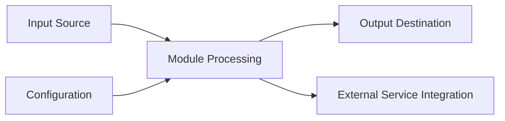

## Documentation Guidelines

## 1. Description

### 1.1 Purpose

_[Describe the primary purpose and scope of this software module. What business functionality does it provide? What problems does it solve?]_

**Example:** The [Module Name] Module provides [core functionality description] for the Aignostics Python SDK. It enables [key capabilities] and serves as [role in overall architecture].

### 1.2 Functional Requirements

_[List the specific functional capabilities this module must provide]_

The [Module Name] Module shall:

- **[FR-01]** [Functional requirement description]
- **[FR-02]** [Functional requirement description]
- **[FR-03]** [Functional requirement description]

### 1.3 Non-Functional Requirements

_[Specify performance, security, usability, and reliability requirements]_

- **Performance**: [Performance requirements and constraints]
- **Security**: [Security requirements, data protection, authentication]
- **Reliability**: [Availability, error handling, recovery requirements]
- **Usability**: [User interface requirements, accessibility]
- **Scalability**: [Volume, concurrency, resource requirements]

### 1.4 Constraints and Limitations

_[Document any technical or business constraints]_

- [Constraint 1: Description and impact]
- [Constraint 2: Description and impact]

---

## 2. Architecture and Design

### 2.1 Module Structure

_[Describe the internal organization of the module]_

```
[module_name]/
├── _service.py          # Core business logic and service implementation
├── _cli.py             # Command-line interface (if applicable)
├── _gui/               # Web-based GUI components (if applicable)
│   ├── __init__.py
│   └── [gui_files].py
├── _settings.py        # Module-specific configuration
├── _utils.py          # Helper functions and utilities
└── __init__.py        # Module exports and public API
```

### 2.2 Key Components

_[List and describe the main classes, functions, and interfaces, focusing on purpose not implementation]_

| Component      | Type           | Purpose               | Public Interface   | Dependencies |
| -------------- | -------------- | --------------------- | ------------------ | ------------ |
| `[Component1]` | Class/Function | [Purpose description] | [Key capabilities] | [Major deps] |
| `[Component2]` | Class/Function | [Purpose description] | [Key capabilities] | [Major deps] |
| `[Component3]` | Class/Function | [Purpose description] | [Key capabilities] | [Major deps] |

_Note: For detailed implementation, refer to the source code in the module directory._

### 2.3 Design Patterns

_[Identify architectural patterns used in this module]_

- **[Pattern Name]**: [How it's applied and why]
- **Dependency Injection**: [How DI is used for this module]
- **Service Layer Pattern**: [How business logic is encapsulated]

---

## 3. Inputs and Outputs

### 3.1 Inputs

_[Define what data/parameters the module accepts, focusing on contracts not implementation]_

| Input Type | Source        | Data Type/Format | Validation Rules         | Business Rules   |
| ---------- | ------------- | ---------------- | ------------------------ | ---------------- |
| [Input1]   | [CLI/GUI/API] | [Schema/Format]  | [Validation description] | [Business logic] |
| [Input2]   | [CLI/GUI/API] | [Schema/Format]  | [Validation description] | [Business logic] |
| [Input3]   | [CLI/GUI/API] | [Schema/Format]  | [Validation description] | [Business logic] |

### 3.2 Outputs

_[Define what data/responses the module produces, focusing on contracts not implementation]_

| Output Type | Destination     | Data Type/Format | Success Criteria     | Error Conditions |
| ----------- | --------------- | ---------------- | -------------------- | ---------------- |
| [Output1]   | [Target system] | [Schema/Format]  | [Success definition] | [Error cases]    |
| [Output2]   | [Target system] | [Schema/Format]  | [Success definition] | [Error cases]    |
| [Output3]   | [Target system] | [Schema/Format]  | [Success definition] | [Error cases]    |

### 3.3 Data Schemas

_[Define data structures using schemas rather than code snippets]_

**Input Data Schema:**

```yaml
# Example using YAML schema format
InputType1:
  type: object
  properties:
    field1:
      type: string
      description: [Field description]
      validation: [Validation rules]
    field2:
      type: integer
      minimum: 0
      description: [Field description]
  required: [field1]
```

**Output Data Schema:**

```yaml
# Example using YAML schema format
OutputType1:
  type: object
  properties:
    result:
      type: string
      description: [Result description]
    metadata:
      type: object
      description: [Metadata structure]
```

_Note: Actual schemas may be defined in OpenAPI specifications or JSON Schema files._

### 3.4 Data Flow

_[Describe the flow of data through the module]_



---

## 4. Interface Definitions

### 4.1 Public API

_[Document the main public interfaces that other modules or external systems use. Focus on contracts, not implementation.]_

#### Core Service Interface

**Service Class**: `[ModuleName]Service`

- **Purpose**: [Brief description of the service's responsibility]
- **Key Methods**:
  - `[method1](param1: Type1, param2: Type2) -> ReturnType`: [Method purpose and behavior]
  - `[method2](param: Type) -> ReturnType`: [Method purpose and behavior]

**Input/Output Contracts**:

- **Input Types**: [List expected input data types and validation rules]
- **Output Types**: [List return data types and success criteria]
- **Error Conditions**: [List exception types and when they occur]

_Note: For detailed method signatures, refer to the module's `__init__.py` and service class documentation._

### 4.2 CLI Interface (if applicable)

_[Document command-line interface specifications focusing on behavior, not implementation]_

**Command Structure:**

```bash
uvx aignostics [module-name] [subcommand] [options]
```

**Available Commands:**

| Command      | Purpose                       | Input Requirements            | Output Format        |
| ------------ | ----------------------------- | ----------------------------- | -------------------- |
| `[command1]` | [Description of what it does] | [Required parameters/options] | [Output description] |
| `[command2]` | [Description of what it does] | [Required parameters/options] | [Output description] |

**Common Options:**

- `--help`: Display command help
- `--verbose`: Enable detailed output
- `[other-options]`: [Description]

### 4.3 HTTP/Web Interface (if applicable)

_[Document web interface specifications]_

**Endpoint Structure:**

| Method | Endpoint       | Purpose       | Request Format      | Response Format |
| ------ | -------------- | ------------- | ------------------- | --------------- |
| `GET`  | `/[endpoint1]` | [Description] | [Query params/body] | [Response type] |
| `POST` | `/[endpoint2]` | [Description] | [Query params/body] | [Response type] |

**Authentication**: [Authentication requirements, if any]
**Error Responses**: [Standard error response format]

---

## 5. Dependencies and Integration

### 5.1 Internal Dependencies

_[List dependencies on other SDK modules, focusing on interfaces used not implementation details]_

| Dependency Module | Usage Purpose       | Interface/Contract Used      | Criticality         |
| ----------------- | ------------------- | ---------------------------- | ------------------- |
| Platform Service  | [Usage description] | [Interface name/description] | [Required/Optional] |
| Utils Module      | [Usage description] | [Interface name/description] | [Required/Optional] |
| [Other Module]    | [Usage description] | [Interface name/description] | [Required/Optional] |

### 5.2 External Dependencies

_[List third-party libraries and external services, focusing on purpose not versions]_

| Dependency         | Min Version | Purpose   | Optional/Required   | Fallback Behavior |
| ------------------ | ----------- | --------- | ------------------- | ----------------- |
| [Library1]         | [Min Ver]   | [Purpose] | [Required/Optional] | [If unavailable]  |
| [External Service] | [API Ver]   | [Purpose] | [Required/Optional] | [If unavailable]  |

_Note: For exact version requirements, refer to `pyproject.toml` and dependency lock files._

### 5.3 Integration Points

_[Describe how this module integrates with external systems]_

- **Aignostics Platform API**: [Integration details]
- **Cloud Storage Services**: [Integration details]
- **Third-party Tools**: [Integration details]

---

## 6. Configuration and Settings

### 6.1 Configuration Parameters

_[Document all configurable settings]_

| Parameter    | Type   | Default   | Description   | Required |
| ------------ | ------ | --------- | ------------- | -------- |
| `[setting1]` | [Type] | [Default] | [Description] | [Yes/No] |
| `[setting2]` | [Type] | [Default] | [Description] | [Yes/No] |

### 6.2 Environment Variables

_[List environment variables used by this module]_

| Variable     | Purpose   | Example Value     |
| ------------ | --------- | ----------------- |
| `[ENV_VAR1]` | [Purpose] | `[example_value]` |
| `[ENV_VAR2]` | [Purpose] | `[example_value]` |

---

## 7. Error Handling and Validation

### 7.1 Error Categories

_[Define types of errors this module can encounter and how they're handled]_

| Error Type     | Cause               | Handling Strategy  | User Impact       |
| -------------- | ------------------- | ------------------ | ----------------- |
| `[ErrorType1]` | [Cause description] | [How it's handled] | [User experience] |
| `[ErrorType2]` | [Cause description] | [How it's handled] | [User experience] |

### 7.2 Input Validation

_[Specify validation rules for all inputs]_

- **[Input Type]**: [Validation rules and error responses]
- **[Input Type]**: [Validation rules and error responses]

### 7.3 Graceful Degradation

_[Describe behavior when dependencies are unavailable]_

- **When [dependency] is unavailable**: [Fallback behavior]
- **When [external service] is unreachable**: [Fallback behavior]

---

## 8. Security Considerations

### 8.1 Data Protection

_[Describe how sensitive data is handled]_

- **Authentication**: [How authentication is managed]
- **Data Encryption**: [In-transit and at-rest encryption]
- **Access Control**: [Permission and authorization mechanisms]

### 8.2 Security Measures [Optional]

_[List specific security implementations]_

- **Input Sanitization**: [How inputs are validated and sanitized]
- **Secret Management**: [How API keys and secrets are handled]
- **Audit Logging**: [What security events are logged]

---

## 9. Implementation Details

### 9.1 Key Algorithms and Business Logic

_[Describe significant algorithms or processing logic at a conceptual level]_

- **[Algorithm1]**: [Purpose and high-level approach, not implementation details]
- **[Algorithm2]**: [Purpose and high-level approach, not implementation details]
- **[Business Rule]**: [Important business logic or processing rules]

### 9.2 State Management and Data Flow

_[Describe how the module manages state and data flow patterns]_

- **State Type**: [Stateless/Stateful and why]
- **Data Persistence**: [How data is stored and managed]
- **Session Management**: [How user sessions or context is handled]
- **Cache Strategy**: [Caching approach, if applicable]

### 9.3 Performance and Scalability Considerations

_[Describe performance characteristics and scalability approaches]_

- **Performance Characteristics**: [Expected performance behavior]
- **Scalability Patterns**: [How the module scales with load]
- **Resource Management**: [Memory, CPU, I/O considerations]
- **Concurrency Model**: [Thread safety, async patterns]

---

## Documentation Maintenance

### Verification and Updates

**Last Verified**: [Date when spec was verified against implementation]  
**Verification Method**: [How accuracy was confirmed - code review, testing, etc.]  
**Next Review Date**: [When this spec should be reviewed again]

### Change Management

**Interface Changes**: Changes to public APIs require spec updates and version bumps  
**Implementation Changes**: Internal changes don't require spec updates unless behavior changes  
**Dependency Changes**: Major dependency changes should be reflected in constraints section

### References

**Implementation**: See `src/aignostics/[module_name]/` for current implementation  
**Tests**: See `tests/aignostics/[module_name]/` for usage examples and verification  
**API Documentation**: [Link to auto-generated API docs if available]
