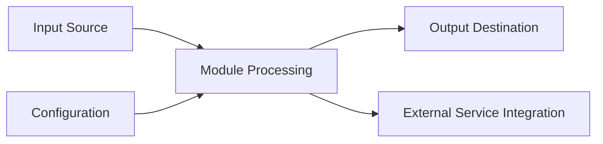

# Software Item Specification: [MODULE_NAME] Module

---

**Item ID:** SPEC-[MODULE_NAME_UPPER]-SERVICE  
**Item Type:** Software Item Spec  
**Item Fulfills:** [REQUIREMENT_ID] _(e.g., FE-6386)_  
**Module:** [Module Name] _(e.g., Bucket, Application, Dataset)_  
**Layer:** [Layer Type] _(Domain Service, Platform Service, Infrastructure Service, Presentation Interface)_  
**Version:** [VERSION] _(e.g., 0.2.105)_  
**Date:** [DATE]

---

## 1. Description

### 1.1 Purpose

_[Describe the primary purpose and scope of this software module. What business functionality does it provide? What problems does it solve?]_

**Example:** The [Module Name] Module provides [core functionality description] for the Aignostics Python SDK. It enables [key capabilities] and serves as [role in overall architecture].

### 1.2 Functional Requirements

_[List the specific functional capabilities this module must provide]_

The [Module Name] Module shall:

- **[FR-01]** [Functional requirement description]
- **[FR-02]** [Functional requirement description]
- **[FR-03]** [Functional requirement description]

### 1.3 Non-Functional Requirements

_[Specify performance, security, usability, and reliability requirements]_

- **Performance**: [Performance requirements and constraints]
- **Security**: [Security requirements, data protection, authentication]
- **Reliability**: [Availability, error handling, recovery requirements]
- **Usability**: [User interface requirements, accessibility]
- **Scalability**: [Volume, concurrency, resource requirements]

### 1.4 Constraints and Limitations

_[Document any technical or business constraints]_

- [Constraint 1: Description and impact]
- [Constraint 2: Description and impact]

---

## 2. Architecture and Design

### 2.1 Module Structure

_[Describe the internal organization of the module]_

```
[module_name]/
├── _service.py          # Core business logic and service implementation
├── _cli.py             # Command-line interface (if applicable)
├── _gui/               # Web-based GUI components (if applicable)
│   ├── __init__.py
│   └── [gui_files].py
├── _settings.py        # Module-specific configuration
├── _utils.py          # Helper functions and utilities
└── __init__.py        # Module exports and public API
```

### 2.2 Key Components

_[List and describe the main classes, functions, and interfaces]_

| Component      | Type           | Purpose               | Public API              |
| -------------- | -------------- | --------------------- | ----------------------- |
| `[Component1]` | Class/Function | [Purpose description] | [Key methods/functions] |
| `[Component2]` | Class/Function | [Purpose description] | [Key methods/functions] |
| `[Component3]` | Class/Function | [Purpose description] | [Key methods/functions] |

### 2.3 Design Patterns

_[Identify architectural patterns used in this module]_

- **[Pattern Name]**: [How it's applied and why]
- **Dependency Injection**: [How DI is used for this module]
- **Service Layer Pattern**: [How business logic is encapsulated]

---

## 3. Inputs and Outputs

### 3.1 Inputs

_[Define what data/parameters the module accepts]_

| Input Type | Source        | Format/Type | Validation Rules         | Code Location   |
| ---------- | ------------- | ----------- | ------------------------ | --------------- |
| [Input1]   | [CLI/GUI/API] | [Data type] | [Validation description] | [File/Function] |
| [Input2]   | [CLI/GUI/API] | [Data type] | [Validation description] | [File/Function] |
| [Input3]   | [CLI/GUI/API] | [Data type] | [Validation description] | [File/Function] |

### 3.2 Outputs

_[Define what data/responses the module produces]_

| Output Type | Destination     | Format/Type | Success Criteria     | Code Location   |
| ----------- | --------------- | ----------- | -------------------- | --------------- |
| [Output1]   | [Target system] | [Data type] | [Success definition] | [File/Function] |
| [Output2]   | [Target system] | [Data type] | [Success definition] | [File/Function] |
| [Output3]   | [Target system] | [Data type] | [Success definition] | [File/Function] |

### 3.3 Data Flow

_[Describe the flow of data through the module]_



---

## 4. Interface Definitions

### 4.1 Public API

_[Document the main public interfaces that other modules or external systems use]_

#### Core Service Interface

```python
class [ModuleName]Service:
    """[Service class description]"""

    def [method1](self, param1: Type1, param2: Type2) -> ReturnType:
        """[Method description]

        Args:
            param1: [Parameter description]
            param2: [Parameter description]

        Returns:
            [Return value description]

        Raises:
            [Exception]: [When this exception is raised]
        """
        pass

    def [method2](self, param: Type) -> ReturnType:
        """[Method description]"""
        pass
```

### 4.2 CLI Interface (if applicable)

_[Document command-line interface specifications]_

**Command Structure:**

```bash
uvx aignostics [module-name] [subcommand] [options]
```

**Available Commands:**

- `[command1]`: [Description of command]
- `[command2]`: [Description of command]

### 4.3 GUI Interface (if applicable)

_[Document graphical user interface specifications]_

- **Navigation**: [How users access this module in the GUI]
- **Key UI Components**: [Forms, tables, buttons, etc.]
- **User Workflows**: [Primary user interaction flows]

---

## 5. Dependencies and Integration

### 5.1 Internal Dependencies

_[List dependencies on other SDK modules]_

| Dependency Module | Usage Purpose       | Interface Used             |
| ----------------- | ------------------- | -------------------------- |
| Platform Service  | [Usage description] | [Specific methods/classes] |
| Utils Module      | [Usage description] | [Specific methods/classes] |
| [Other Module]    | [Usage description] | [Specific methods/classes] |

### 5.2 External Dependencies

_[List third-party libraries and external services]_

| Dependency         | Version       | Purpose   | Optional/Required   |
| ------------------ | ------------- | --------- | ------------------- |
| [Library1]         | [Version]     | [Purpose] | [Required/Optional] |
| [External Service] | [API Version] | [Purpose] | [Required/Optional] |

### 5.3 Integration Points

_[Describe how this module integrates with external systems]_

- **Aignostics Platform API**: [Integration details]
- **Cloud Storage Services**: [Integration details]
- **Third-party Tools**: [Integration details]

---

## 6. Configuration and Settings

### 6.1 Configuration Parameters

_[Document all configurable settings]_

| Parameter    | Type   | Default   | Description   | Required |
| ------------ | ------ | --------- | ------------- | -------- |
| `[setting1]` | [Type] | [Default] | [Description] | [Yes/No] |
| `[setting2]` | [Type] | [Default] | [Description] | [Yes/No] |

### 6.2 Environment Variables

_[List environment variables used by this module]_

| Variable     | Purpose   | Example Value     |
| ------------ | --------- | ----------------- |
| `[ENV_VAR1]` | [Purpose] | `[example_value]` |
| `[ENV_VAR2]` | [Purpose] | `[example_value]` |

---

## 7. Error Handling and Validation

### 7.1 Error Categories

_[Define types of errors this module can encounter and how they're handled]_

| Error Type     | Cause               | Handling Strategy  | User Impact       |
| -------------- | ------------------- | ------------------ | ----------------- |
| `[ErrorType1]` | [Cause description] | [How it's handled] | [User experience] |
| `[ErrorType2]` | [Cause description] | [How it's handled] | [User experience] |

### 7.2 Input Validation

_[Specify validation rules for all inputs]_

- **[Input Type]**: [Validation rules and error responses]
- **[Input Type]**: [Validation rules and error responses]

### 7.3 Graceful Degradation

_[Describe behavior when dependencies are unavailable]_

- **When [dependency] is unavailable**: [Fallback behavior]
- **When [external service] is unreachable**: [Fallback behavior]

---

## 8. Security Considerations

### 8.1 Data Protection

_[Describe how sensitive data is handled]_

- **Authentication**: [How authentication is managed]
- **Data Encryption**: [In-transit and at-rest encryption]
- **Access Control**: [Permission and authorization mechanisms]

### 8.2 Security Measures [Optional]

_[List specific security implementations]_

- **Input Sanitization**: [How inputs are validated and sanitized]
- **Secret Management**: [How API keys and secrets are handled]
- **Audit Logging**: [What security events are logged]

---

## 9. Implementation Details

### 9.1 Key Algorithms

_[Describe any significant algorithms or processing logic]_

- **[Algorithm1]**: [Purpose and high-level description]
- **[Algorithm2]**: [Purpose and high-level description]

### 9.2 State Management

_[Describe how the module manages state and data persistence]_

- **Configuration State**: [How settings are stored and managed]
- **Runtime State**: [How operational state is maintained]
- **Cache Management**: [Caching strategies used]

### 9.3 Concurrency and Threading

_[Describe concurrent processing approaches]_

- **Async Operations**: [How asynchronous operations are handled]
- **Thread Safety**: [Thread safety guarantees and mechanisms]
