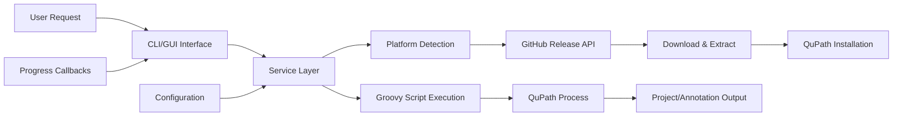

## 1. Description

### 1.1 Purpose

The QuPath Module provides comprehensive integration between the Aignostics Python SDK and QuPath, an open-source software platform for bioimage analysis. It enables seamless management of QuPath installations, automated project creation from Platform AI results, and batch processing of whole slide image annotations.

The module uses QuPath programmatically to process Model Run Results obtained from the Aignostics Platform API, transforming AI model outputs into complete QuPath projects with the correct images, annotations, GeoJSON files, and all artifacts generated by the AI models. This allows users to visualize and further analyze AI-generated results in QuPath's rich interactive environment.

This module serves as the primary bridge between Aignostics Platform analysis results and the QuPath ecosystem for visualization and further analysis.

### 1.2 Functional Requirements

The QuPath Module shall:

- **[FR-01]** Automatically download, verify, and install QuPath from GitHub releases with cross-platform support (Linux x64, macOS x64/ARM64, Windows x64)
- **[FR-02]** Maintain version-specific QuPath installations with health monitoring and compatibility validation
- **[FR-03]** Create QuPath projects automatically when adding images, with support for WSI files from various formats (DICOM, SVS, TIFF) and metadata synchronization
- **[FR-04]** Import and process large-scale annotation datasets with batch processing, progress tracking, and error recovery
- **[FR-05]** Convert between Aignostics Platform annotation formats and QuPath-compatible GeoJSON with coordinate system validation
- **[FR-06]** Provide CLI, GUI, and notebook interfaces for scripted workflows, management service, and exploratory analysis
- **[FR-07]** Execute Groovy scripts through QuPath's command-line interface for project automation and introspection
- **[FR-08]** Manage QuPath processes with secure execution, timeout limits, and resource monitoring including process termination capabilities

### 1.3 Non-Functional Requirements

- **Performance**: Support for whole slide images with efficient memory management through streaming processing, chunked downloads (10MB chunks), and concurrent operations with thread-safe implementations
- **Security**: Verify download integrity from GitHub releases using HTTPS with timeout enforcement, proper file system permissions, and process isolation with timeout limits (30s launch, 2h script execution)
- **Reliability**: Automatic error recovery for batch operations, resumable downloads, and graceful degradation when QuPath is unavailable
- **Usability**: Type-safe CLI commands with automatic help generation, progressive download indicators, and comprehensive error messages
- **Scalability**: Handle large annotation datasets (500K+ annotations per batch), parallel image processing, and concurrent QuPath instances

### 1.4 Constraints and Limitations

- QuPath ARM64 Linux support: QuPath is not officially supported on ARM64 Linux architecture
- Version dependency: Currently supports QuPath v0.6.0-rc5 with backward compatibility considerations
- Platform isolation: Uses managed installation approach to avoid conflicts with existing QuPath installations
- Resource constraints: Long-running operations limited by system memory and processing power for large WSI files

---

## 2. Architecture and Design

### 2.1 Module Structure

```
qupath/
├── _service.py          # Core business logic and QuPath management
├── _cli.py             # Command-line interface with Typer integration
├── _gui.py             # Web-based GUI components for interactive management
├── _settings.py        # Module-specific configuration and defaults
├── scripts/            # Groovy scripts for QuPath automation
│   ├── add.groovy      # Project creation and bulk image addition
│   ├── annotate.groovy # GeoJSON annotation import with batch processing
│   ├── inspect.groovy  # Project introspection and metadata extraction
│   └── test.groovy     # Installation verification and functionality testing
├── assets/             # GUI assets and animations
│   ├── download.lottie # Download progress animation
│   ├── microscope.lottie # Microscope icon animation
│   └── update.lottie   # Update progress animation
└── __init__.py        # Module exports and public API
```

### 2.2 Key Components

| Component          | Type   | Purpose                                                      | Public API                                                                                                      |
| ------------------ | ------ | ------------------------------------------------------------ | --------------------------------------------------------------------------------------------------------------- |
| `Service`          | Class  | Core QuPath management, installation, and project operations | `install_qupath()`, `uninstall_qupath()`, `health()`, `add()`, `annotate()`, `inspect()`                        |
| `QuPathVersion`    | Model  | Version information storage and validation                   | `version`, `build_time`, `commit_tag` properties                                                                |
| `QuPathProject`    | Model  | Project information and image metadata                       | `uri`, `version`, `images` properties                                                                           |
| `QuPathImage`      | Model  | Individual image information in projects                     | Image metadata, hierarchy, and file path information                                                            |
| `AddProgress`      | Model  | Progress tracking for image addition operations              | `status`, `image_count`, `image_index`, `progress_normalized` properties                                        |
| `AnnotateProgress` | Model  | Progress tracking for annotation import operations           | `status`, `annotation_count`, `annotation_index`, `progress_normalized` properties                              |
| `CLI`              | Module | Command-line interface with Typer commands                   | `install`, `launch`, `processes`, `terminate`, `uninstall`, `add`, `annotate`, `inspect`, `run-script` commands |
| `GUI`              | Module | Web-based interface using GUI framework                      | Interactive QuPath management dashboard                                                                         |

### 2.3 Design Patterns

- **Service Layer Pattern**: Business logic encapsulated in `Service` class with clear separation from CLI/GUI interfaces
- **Factory Pattern**: Platform-specific QuPath executable and download URL creation based on system detection
- **Command Pattern**: CLI commands implemented as discrete functions with type-safe parameter validation
- **Observer Pattern**: Progress callbacks for download and extraction operations with real-time updates

---

## 3. Inputs and Outputs

### 3.1 Inputs

| Input Type        | Source      | Format/Type     | Validation Rules                                                  |
| ----------------- | ----------- | --------------- | ----------------------------------------------------------------- |
| QuPath Version    | CLI/GUI/API | String (semver) | Must match available GitHub releases, defaults to 0.6.0-rc5       |
| Installation Path | CLI/GUI     | Path            | Must be writable directory, defaults to user data directory       |
| Platform Override | CLI         | String          | Must be valid platform identifier (Windows/Linux/Darwin)          |
| WSI File Paths    | CLI/API     | List[Path]      | Files must exist and be readable, supports DICOM/SVS/TIFF formats |
| Annotation Data   | CLI/API     | GeoJSON/JSON    | Must contain valid coordinate data and classification schemas     |
| Project Metadata  | API         | Dict            | Key-value pairs for QuPath project properties                     |

### 3.2 Outputs

| Output Type               | Destination  | Format/Type         | Success Criteria                                                 |
| ------------------------- | ------------ | ------------------- | ---------------------------------------------------------------- |
| QuPath Installation       | File System  | Binary Executable   | Executable responds to `--version` command successfully          |
| QuPath Project            | File System  | .qpproj File        | Project opens in QuPath with all images and annotations loaded   |
| Health Status             | CLI/GUI/API  | Health Model        | Contains installation status, version, and application health    |
| Progress Updates          | CLI/GUI      | Progress Callbacks  | Real-time download/extraction progress with percentage and speed |
| Error Messages            | CLI/GUI/Logs | Structured Messages | Clear error descriptions with actionable resolution steps        |
| Image Addition Results    | CLI/API      | Integer Count       | Number of images successfully added to project                   |
| Annotation Import Results | CLI/API      | Integer Count       | Number of annotations successfully imported to image             |
| Project Information       | CLI/API      | QuPathProject Model | Complete project metadata including images and hierarchy info    |

### 3.3 Data Schemas

**QuPath Version Schema:**

```yaml
QuPathVersion:
  type: object
  properties:
    version:
      type: string
      description: QuPath version string
      pattern: "^[0-9]+\.[0-9]+\.[0-9]+.*$"
    build_time:
      type: string
      description: Build timestamp
      format: date-time
    commit_tag:
      type: string
      description: Git commit tag
      pattern: "^[a-f0-9]+$"
```

**QuPath Project Schema:**

```yaml
QuPathProject:
  type: object
  properties:
    uri:
      type: string
      description: Project file URI
      format: uri
    version:
      type: string
      description: QuPath version used
    images:
      type: array
      items:
        $ref: "#/definitions/QuPathImage"
      description: List of images in project
```

### 3.4 Data Flow



---

## 4. Interface Definitions

### 4.1 Public API

#### Core Service Interface

```python
class Service(BaseService):
    """QuPath service for managing installations and projects."""

    @staticmethod
    def install_qupath(
        version: str = QUPATH_VERSION,
        path: Path | None = None,
        reinstall: bool = True,
        platform_system: str | None = None,
        platform_machine: str | None = None,
        download_progress: Callable | None = None,
        extract_progress: Callable | None = None,
        progress_queue: queue.Queue[InstallProgress] | None = None,
    ) -> Path: ...

    @staticmethod
    def uninstall_qupath(
        version: str | None = None,
        path: Path | None = None,
        platform_system: str | None = None,
        platform_machine: str | None = None,
    ) -> bool: ...

    def health(self) -> Health: ...

    @staticmethod
    def add(
        project: Path,
        paths: list[Path],
        progress_callable: Callable | None = None,
    ) -> int: ...

    @staticmethod
    def annotate(
        project: Path,
        image: Path,
        annotations: Path,
        progress_callable: Callable | None = None,
    ) -> int: ...

    @staticmethod
    def inspect(project: Path) -> QuPathProject: ...
```

### 4.2 CLI Interface

**Command Structure:**

```bash
uvx aignostics qupath [subcommand] [options]
```

**Available Commands:**

- `install`: Download and install QuPath with version and platform options
- `launch`: Launch QuPath application with optional project and script parameters
- `processes`: List running QuPath processes with detailed information
- `terminate`: Terminate all running QuPath processes
- `uninstall`: Remove QuPath installation with platform-specific cleanup
- `add`: Add images to QuPath project (creates project if needed)
- `annotate`: Import GeoJSON annotations to specific image in project
- `inspect`: Examine project structure and metadata
- `run-script`: Execute custom Groovy scripts with QuPath

**Example Usage:**

```bash
# Install QuPath (default version)
uvx aignostics qupath install

# Install specific version with custom path
uvx aignostics qupath install --version 0.6.0-rc5 --path /custom/path

# Launch QuPath with project
uvx aignostics qupath launch --project ./my_project.qpproj

# Add images to project (creates if needed)
uvx aignostics qupath add ./my_project.qpproj image1.svs image2.tiff

# Add annotations to specific image
uvx aignostics qupath annotate ./my_project.qpproj image1.svs annotations.json

# Inspect project structure
uvx aignostics qupath inspect ./my_project.qpproj

# List running processes
uvx aignostics qupath processes

# Terminate all QuPath processes
uvx aignostics qupath terminate
```

### 4.3 GUI Interface

- **Navigation**: Accessible via main SDK GUI under "QuPath" module section
- **Key UI Components**:
  - Installation status dashboard with version information
  - Progress bars for download/extraction operations with Lottie animations (download.lottie, microscope.lottie, update.lottie)
  - Project creation interface with file selection and metadata entry
  - Annotation import interface with batch processing configuration
- **User Workflows**:
  1. Check installation status and install/update QuPath
  2. Launch QuPath application with optional project loading
  3. Add images to projects by selecting WSI files
  4. Import annotations by uploading GeoJSON files with progress tracking
  5. Inspect project structure and image metadata
  6. Monitor and manage running QuPath processes

---

## 5. Dependencies and Integration

### 5.1 Internal Dependencies

| Dependency Module | Usage Purpose                                      | Interface Used                                |
| ----------------- | -------------------------------------------------- | --------------------------------------------- |
| Utils Module      | Logging, base service class, and common utilities  | `BaseService`, `get_logger()`, `console`      |
| CLI Module        | Command registration and CLI framework integration | CLI router registration and command discovery |
| GUI Module        | Web interface framework and component libraries    | NiceGUI components and page registration      |

### 5.2 External Dependencies

| Dependency  | Version | Purpose                                                            | Optional/Required |
| ----------- | ------- | ------------------------------------------------------------------ | ----------------- |
| `typer`     | Latest  | Type-safe CLI command framework with automatic help generation     | Required          |
| `requests`  | Latest  | HTTP client for GitHub API and file downloads with timeout support | Required          |
| `psutil`    | Latest  | Process management and system monitoring for QuPath instances      | Required          |
| `appdirs`   | Latest  | Platform-specific application data directory resolution            | Required          |
| `packaging` | Latest  | Version parsing and comparison for QuPath version management       | Required          |
| `ijson`     | Latest  | Streaming JSON parser for large annotation datasets                | Required          |
| `pydantic`  | Latest  | Data validation and serialization for configuration models         | Required          |

### 5.3 Integration Points

- **GitHub Releases API**: QuPath version discovery and download URL resolution (REST API)
- **QuPath GitHub Releases**: Binary distribution downloads for all supported platforms (HTTPS downloads with integrity verification)
- **QuPath CLI Interface**: Groovy script execution and project manipulation (Command-line subprocess execution with JSON parameter passing)

---

## 6. Configuration and Settings

### 6.1 Configuration Parameters

| Parameter                          | Type   | Default           | Description                                     | Required |
| ---------------------------------- | ------ | ----------------- | ----------------------------------------------- | -------- |
| `QUPATH_VERSION`                   | String | `"0.6.0-rc5"`     | Default QuPath version to install               | No       |
| `DOWNLOAD_CHUNK_SIZE`              | Int    | `10485760` (10MB) | Size of download chunks for QuPath archive      | No       |
| `QUPATH_LAUNCH_MAX_WAIT_TIME`      | Int    | `30`              | Maximum wait time for QuPath to start (seconds) | No       |
| `QUPATH_SCRIPT_MAX_EXECUTION_TIME` | Int    | `7200`            | Maximum script execution time (seconds)         | No       |
| `ANNOTATIONS_BATCH_SIZE`           | Int    | `500000`          | Batch size for annotation processing            | No       |

### 6.2 Environment Variables

| Variable              | Purpose                                | Example Value            |
| --------------------- | -------------------------------------- | ------------------------ |
| `AIGNOSTICS_QUPATH_*` | Module-specific configuration settings | Various based on setting |

---

## 7. Error Handling and Validation

### 7.1 Error Categories

| Error Type               | Cause                                 | Handling Strategy                           | User Impact                                 |
| ------------------------ | ------------------------------------- | ------------------------------------------- | ------------------------------------------- |
| `Installation Errors`    | Network failures, corrupted downloads | Retry with exponential backoff              | Clear error message with retry option       |
| `Platform Compatibility` | Unsupported architectures             | Graceful error with supported platform list | Installation blocked with explanation       |
| `QuPath Process Errors`  | Script execution failures, timeouts   | Process termination and error logging       | Operation fails with detailed error         |
| `File System Errors`     | Path permissions, disk space          | Permission checks and space validation      | User prompted to resolve file system issues |

### 7.2 Input Validation

- **QuPath Version**: Must match semver pattern and be available in GitHub releases
- **Installation Path**: Must be writable directory with sufficient disk space
- **WSI File Paths**: Files must exist, be readable, and match supported formats (DICOM, SVS, TIFF)
- **Annotation Data**: Must contain valid GeoJSON structure with coordinate data and classification schemas

### 7.3 Graceful Degradation

- **When QuPath installation is unavailable**: Module functions return appropriate error status with installation instructions
- **When GitHub API is unreachable**: Use cached version information or offline installation if available
- **When QuPath process fails**: Cleanup partial operations and provide recovery suggestions

---

## 8. Security Considerations

### 8.1 Data Protection

- **Authentication**: No authentication required as QuPath is a local application
- **Data Encryption**: Downloads verified using HTTPS from GitHub releases
- **Access Control**: File system permissions enforced for QuPath installation directory

### 8.2 Security Measures

- **Input Sanitization**: All file paths and command arguments are validated and sanitized before execution
- **Process Isolation**: QuPath processes run with timeout limits and resource monitoring
- **Download Verification**: Archive integrity verified through GitHub API checksums

---

## 9. Implementation Details

### 9.1 Key Algorithms and Business Logic

- **Platform Detection**: Automatic detection of OS and architecture for QuPath binary selection
- **Chunked Download**: Efficient download of large QuPath archives with progress tracking
- **Streaming JSON Processing**: Memory-efficient processing of large annotation datasets using ijson
- **Process Management**: Safe execution and monitoring of QuPath subprocess with timeout handling

### 9.2 State Management and Data Flow

- **Configuration State**: Module settings stored using Pydantic settings with environment variable override
- **Runtime State**: QuPath process information tracked in memory with psutil integration
- **Installation State**: QuPath installation status persisted in user data directory

### 9.3 Performance and Scalability Considerations

- **Async Operations**: Download and extraction operations run in background with progress callbacks
- **Thread Safety**: All service methods are thread-safe for concurrent access
- **Process Monitoring**: QuPath processes monitored asynchronously with timeout enforcement
