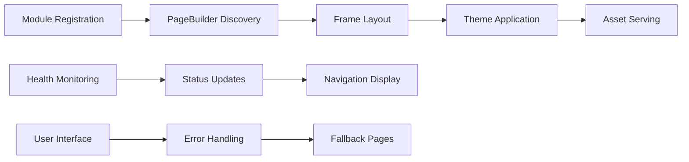

## 1. Description

### 1.1 Purpose

The GUI (Graphical User Interface) Module provides a web-based interface framework for the Aignostics Python SDK. The module enables other SDK modules to create consistent web interfaces using the BasePageBuilder pattern, with standardized theming, error handling, and layout components. It serves as the presentation layer that aggregates functionality from domain modules into a unified web application interface.

### 1.2 Functional Requirements

The GUI Module shall:

- **[FR-01]** Provide standardized page layout framework through `frame()` context manager with navigation and branding components
- **[FR-02]** Enable consistent theming through `theme()` function with Aignostics brand colors, fonts, and CSS styling
- **[FR-03]** Implement BasePageBuilder pattern to enable module-specific GUI component registration and discovery
- **[FR-04]** Support static asset management with centralized serving of fonts, logos, and styling resources
- **[FR-05]** Provide error page handling through ErrorPageBuilder with fallback mechanisms for failed operations
- **[FR-06]** Enable health monitoring integration with periodic system health updates in the navigation frame
- **[FR-07]** Support user authentication status display with profile integration and authentication state management

### 1.3 Non-Functional Requirements

- **Performance**: Health monitoring updates every 30 seconds, user info updates every 3600 seconds, lazy loading of optional dependencies
- **Security**: Secure handling of user authentication status, safe asset serving, input validation for navigation
- **Reliability**: Graceful degradation when NiceGUI is unavailable, fallback error pages, conditional feature loading
- **Usability**: Consistent navigation patterns, responsive design, accessible theming, cross-platform desktop support
- **Scalability**: Modular architecture supporting dynamic module registration, efficient asset management

### 1.4 Constraints and Limitations

- **NiceGUI Framework Dependency**: Full functionality requires NiceGUI installation, graceful degradation when unavailable
- **Platform Integration Dependencies**: Requires Platform and System modules for user authentication and health monitoring features
- **Container Environment**: Health monitoring and authentication features may have limited functionality in containerized environments
- **Browser Compatibility**: Requires modern web browser with JavaScript enabled for full functionality

---

## 2. Architecture and Design

### 2.1 Module Structure

```
gui/
├── __init__.py        # Module exports and conditional NiceGUI loading
├── _theme.py          # Brand theming, colors, fonts, CSS styling
├── _frame.py          # Page layout framework with navigation and health monitoring
├── _error.py          # Error page handling and fallback mechanisms
└── assets/            # Static assets for branding and styling
    ├── cabin-v27-latin-regular.woff2    # Custom font file
    ├── cat.lottie                       # Animation asset
    └── logo.png                         # Brand logo
```

### 2.2 Key Components

| Component          | Type     | Purpose                               | Public Interface                       | Dependencies     |
| ------------------ | -------- | ------------------------------------- | -------------------------------------- | ---------------- |
| `theme`            | Function | Apply Aignostics brand styling        | Configures UI colors, fonts, CSS       | NiceGUI          |
| `frame`            | Function | Page layout with navigation framework | Context manager for page structure     | Platform, System |
| `PageBuilder`      | Class    | Theme and static asset registration   | BasePageBuilder pattern implementation | Utils Module     |
| `ErrorPageBuilder` | Class    | Error page handling and fallbacks     | Error scenario page registration       | Utils Module     |

For detailed implementation, refer to the source code in the `src/aignostics/gui/` directory.

### 2.3 Design Patterns

- **BasePageBuilder Pattern**: Abstract base class pattern enabling module-specific GUI component registration through standardized interface
- **Context Manager Pattern**: `frame()` function provides consistent page layout structure with automatic resource management
- **Factory Pattern**: Theme application with configurable styling and brand asset loading
- **Observer Pattern**: Health monitoring integration with automatic UI updates and status propagation
- **Conditional Loading Pattern**: Optional dependency detection and graceful degradation when GUI frameworks unavailable
- **Auto-Discovery Pattern**: Automatic detection and registration of module GUI components using `locate_subclasses()`

---

## 3. Inputs and Outputs

### 3.1 Inputs

| Input Type           | Source     | Data Type/Format | Validation Rules                       | Business Rules                          |
| -------------------- | ---------- | ---------------- | -------------------------------------- | --------------------------------------- |
| Navigation Title     | Function   | `str`            | Required, non-empty string             | Must be descriptive page identifier     |
| Navigation Icon      | Function   | `str` or `None`  | Optional, valid icon identifier        | Must be valid NiceGUI icon name         |
| Layout Configuration | Function   | `bool`           | Boolean flags for sidebar display      | Controls page layout structure          |
| Static Asset Files   | Filesystem | Binary files     | Valid file paths, readable permissions | Font, image, and animation files        |
| Module PageBuilders  | Code       | Class instances  | Must inherit from BasePageBuilder      | Auto-discovered through service pattern |

### 3.2 Outputs

| Output Type      | Destination   | Data Type/Format | Success Criteria                      | Error Conditions                      |
| ---------------- | ------------- | ---------------- | ------------------------------------- | ------------------------------------- |
| HTML Page Layout | Web Browser   | HTML/CSS/JS      | Complete responsive page structure    | Rendering errors, missing components  |
| Theme Styles     | Web Browser   | CSS stylesheets  | Applied brand colors and typography   | Style conflicts, loading failures     |
| Static Assets    | Web Browser   | Binary responses | Correct MIME types, efficient serving | File not found, permission denied     |
| Error Pages      | Web Browser   | HTML content     | User-friendly error display           | Critical system failures              |
| Health Updates   | Web Interface | JSON data        | Real-time service status display      | Health monitoring service unavailable |

### 3.3 Data Schemas

**Frame Configuration Schema:**

```yaml
# Frame function parameters
frame_config:
  type: object
  required: [navigation_title]
  properties:
    navigation_title:
      type: string
      description: Title displayed in navigation bar
      validation: Non-empty string
    icon:
      type: string
      description: Icon identifier for navigation
      validation: Valid NiceGUI icon name or null
    left_sidebar:
      type: boolean
      description: Enable left sidebar display
      default: false
```

**Theme Configuration Schema:**

```yaml
# Theme styling configuration
theme_config:
  type: object
  properties:
    colors:
      type: object
      description: Aignostics brand color scheme
    fonts:
      type: object
      description: Custom font definitions
    css_overrides:
      type: string
      description: Additional CSS styling
```

Actual schemas may be defined in OpenAPI specifications or JSON Schema files.

### 3.4 Data Flow



---

## 4. Interface Definitions

### 4.1 Public API

#### Core Service Interface

**Frame Context Manager**: `frame()`

- **Purpose**: Provides standardized page layout with navigation, branding, and health monitoring integration
- **Key Methods**:
  - `frame(navigation_title: str, icon: str | None = None, left_sidebar: bool = False)`: Creates consistent page layout structure
- **Input/Output Contracts**:
  - **Input Types**: Navigation title (required string), optional icon and layout configuration
  - **Output Types**: HTML page structure with navigation, sidebar, and content areas
  - **Error Conditions**: Graceful fallback when NiceGUI dependencies unavailable

**Theme Application Function**: `theme()`

- **Purpose**: Applies consistent Aignostics branding and styling across all interfaces
- **Key Methods**:
  - `theme() -> None`: Applies CSS color scheme, custom fonts, and responsive design patterns

**PageBuilder Classes**: `PageBuilder`, `ErrorPageBuilder`

- **Purpose**: Standard interface for module-specific GUI component registration and static asset management
- **Key Methods**:
  - `register_pages() -> None`: Abstract method for route and asset registration

### 4.2 CLI Interface (if applicable)

**Command Structure:**

```bash
uvx aignostics launchpad
```

**Available Commands:**

| Command     | Purpose                               | Input Requirements | Output Format         |
| ----------- | ------------------------------------- | ------------------ | --------------------- |
| `launchpad` | Open graphical user interface desktop | None               | Native desktop window |

**Common Options:**

- `--help`: Display command help
- Conditional availability based on NiceGUI and WebView dependencies

### 4.3 HTTP/Web Interface (if applicable)

**Endpoint Structure:**

| Method | Endpoint                | Purpose               | Request Format | Response Format |
| ------ | ----------------------- | --------------------- | -------------- | --------------- |
| `GET`  | `/`                     | Main application page | None           | HTML page       |
| `GET`  | `/module_name_assets/*` | Static asset serving  | File path      | Binary content  |
| `GET`  | `/module_name/*`        | Module-specific pages | None           | HTML page       |

**Authentication**: User authentication status display integrated in navigation
**Error Responses**: Standardized error pages with fallback mechanisms

---

## 5. Dependencies and Integration

### 5.1 Internal Dependencies

| Dependency Module | Usage Purpose                          | Interface/Contract Used                  | Criticality |
| ----------------- | -------------------------------------- | ---------------------------------------- | ----------- |
| Utils Module      | BasePageBuilder pattern implementation | `BasePageBuilder`, service discovery     | Required    |
| Platform Module   | User authentication status integration | `UserInfo`, authentication services      | Optional    |
| System Module     | Health monitoring integration          | `SystemService`, health status reporting | Optional    |
| Constants Module  | Version and project metadata           | `__version__`, project configuration     | Required    |

### 5.2 External Dependencies

| Dependency | Min Version | Purpose                              | Optional/Required | Fallback Behavior                     |
| ---------- | ----------- | ------------------------------------ | ----------------- | ------------------------------------- |
| `nicegui`  | ^1.0        | Web framework and UI components      | Required          | GUI functionality completely disabled |
| `fastapi`  | ^0.100      | Static file serving and HTTP routing | Required          | Asset serving fails                   |
| `humanize` | ^4.0        | Human-readable time formatting       | Required          | Raw timestamp display                 |
| `webview`  | ^4.0        | Native desktop application support   | Optional          | Web browser launch only               |
| `uvicorn`  | ^0.23       | ASGI server for development          | Optional          | Development server unavailable        |

For exact version requirements, refer to `pyproject.toml` and dependency lock files.

### 5.3 Integration Points

- **All SDK Modules**: Provides theming and layout framework for module-specific GUI components through PageBuilder pattern
- **CLI Integration**: GUI application launcher integrated with main CLI through conditional command registration
- **Web Browser**: Primary interface through modern web browser with responsive design compatibility
- **Desktop Environment**: Optional native desktop application support through WebView integration

---

## 6. Configuration and Settings

### 6.1 Configuration Parameters

| Parameter                  | Type  | Default | Description                           | Required |
| -------------------------- | ----- | ------- | ------------------------------------- | -------- |
| `HEALTH_UPDATE_INTERVAL`   | `int` | `30`    | Health check frequency (seconds)      | No       |
| `USERINFO_UPDATE_INTERVAL` | `int` | `3600`  | User info refresh frequency (seconds) | No       |

### 6.2 Environment Variables

| Variable                      | Purpose                                | Example Value      |
| ----------------------------- | -------------------------------------- | ------------------ |
| `__is_running_in_container__` | Container detection for feature gating | `"true"`/`"false"` |

---

## 7. Error Handling and Validation

### 7.1 Error Categories

| Error Type            | Cause                         | Handling Strategy          | User Impact              |
| --------------------- | ----------------------------- | -------------------------- | ------------------------ |
| `ImportError`         | NiceGUI not available         | Graceful degradation       | GUI features unavailable |
| `ModuleNotFoundError` | WebView not available         | Disable desktop features   | Web-only interface       |
| `ValueError`          | Invalid navigation parameters | Log warning, use defaults  | Default navigation shown |
| `RuntimeError`        | Asset serving failure         | Fallback to default assets | Basic styling applied    |

### 7.2 Input Validation

- **Navigation Title**: Required non-empty string, sanitized for HTML display
- **Icon Parameters**: Optional string validation against known icon set
- **Asset Paths**: Path validation for security, restricted to module directories
- **Boolean Flags**: Type validation with default fallbacks

### 7.3 Graceful Degradation

- **When NiceGUI is unavailable**: All GUI functionality disabled, empty exports returned
- **When WebView is unavailable**: Desktop features disabled, web-only mode active
- **When assets are missing**: Fallback to default assets and basic styling

---

## 8. Security Considerations

### 8.1 Data Protection

- **Authentication**: Secure display of user authentication status without exposing sensitive data
- **Data Encryption**: In-transit encryption through HTTPS for web interface
- **Access Control**: Module-based permission system for GUI component access

### 8.2 Security Measures [Optional]

- **Input Sanitization**: Navigation titles and parameters sanitized for HTML output
- **Secret Management**: No secrets stored in GUI module, authentication handled by Platform module
- **Audit Logging**: Security events logged through standard logging framework

---

## 9. Implementation Details

### 9.1 Key Algorithms and Business Logic

- **Auto-Discovery Algorithm**: Uses `locate_subclasses()` to find all `BasePageBuilder` implementations across modules and automatically register their pages
- **Conditional Loading Algorithm**: Uses `find_spec()` to detect available dependencies and conditionally load features
- **Theme Application Algorithm**: CSS injection and font loading with fallback mechanisms for consistent styling

### 9.2 State Management and Data Flow

- **State Type**: Stateful GUI application with session-based configuration and persistent theme settings
- **Data Persistence**: No persistent state maintained; configuration loaded from constants and environment detection
- **Session Management**: Browser session tracking for theme application and health monitoring state synchronization
- **Cache Strategy**: Static asset caching through FastAPI, one-time theme application per session

### 9.3 Performance and Scalability Considerations

- **Performance Characteristics**: Fast theme application with cached asset serving, efficient health update cycles
- **Scalability Patterns**: Modular PageBuilder pattern supports dynamic module registration, asynchronous health monitoring
- **Resource Management**: Memory-efficient static asset serving, configurable update intervals for monitoring overhead
- **Concurrency Model**: Timer-based async operations for health updates, thread-safe GUI component operations

---

## Documentation Maintenance

### Verification and Updates

**Last Verified**: September 15, 2025  
**Verification Method**: Code review against implementation in `src/aignostics/gui/` and template compliance check  
**Next Review Date**: December 15, 2025

### Change Management

**Interface Changes**: Changes to BasePageBuilder APIs require spec updates and version bumps  
**Implementation Changes**: Theme and styling changes don't require spec updates unless affecting public contracts  
**Dependency Changes**: NiceGUI version changes should be reflected in constraints section

### References

**Implementation**: See `src/aignostics/gui/` for current implementation  
**Tests**: See `tests/aignostics/gui/` for usage examples and verification  
**API Documentation**: Auto-generated from frame and theme function docstrings
