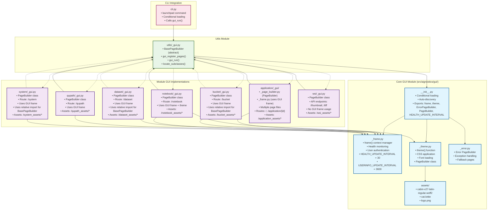

# Software Item Specification: GUI Module

---

**Item ID:** SPEC-GUI-SERVICE  
**Item Type:** Software Item Spec  
**Item Fulfills:** TBD  
**Module:** GUI  
**Layer:** Presentation Interface  
**Version:** 0.2.105  
**Date:** September 11, 2025

## 1. Description

### 1.1 Purpose

The GUI (Graphical User Interface) Module provides a web-based interface framework for the Aignostics Python SDK. The module enables other SDK modules to create consistent web interfaces using the BasePageBuilder pattern, with standardized theming, error handling, and layout components. It serves as the presentation layer that aggregates functionality from domain modules into a unified web application interface.

### 1.2 Functional Requirements

The GUI Module shall:

- **[FR-01]** Provide standardized page layout framework through `frame()` context manager with navigation and branding components
- **[FR-02]** Enable consistent theming through `theme()` function with Aignostics brand colors, fonts, and CSS styling
- **[FR-03]** Implement BasePageBuilder pattern to enable module-specific GUI component registration and discovery
- **[FR-04]** Support static asset management with centralized serving of fonts, logos, and styling resources
- **[FR-05]** Provide error page handling through ErrorPageBuilder with fallback mechanisms for failed operations
- **[FR-06]** Enable health monitoring integration with periodic system health updates in the navigation frame
- **[FR-07]** Support user authentication status display with profile integration and authentication state management

### 1.3 Non-Functional Requirements

- **Performance**: Health monitoring updates every 30 seconds, user info updates every 3600 seconds, lazy loading of optional dependencies
- **Security**: Secure handling of user authentication status, safe asset serving, input validation for navigation
- **Reliability**: Graceful degradation when NiceGUI is unavailable, fallback error pages, conditional feature loading
- **Usability**: Consistent navigation patterns, responsive design, accessible theming, cross-platform desktop support
- **Scalability**: Modular architecture supporting dynamic module registration, efficient asset management

### 1.4 Constraints and Limitations

- **NiceGUI Framework Dependency**: Full functionality requires NiceGUI installation, graceful degradation when unavailable
- **Platform Integration Dependencies**: Requires Platform and System modules for user authentication and health monitoring features
- **Container Environment**: Health monitoring and authentication features may have limited functionality in containerized environments
- **Browser Compatibility**: Requires modern web browser with JavaScript enabled for full functionality

---

## 2. Architecture and Design

### 2.1 Module Structure

```
gui/
├── __init__.py        # Module exports and conditional NiceGUI loading
├── _theme.py          # Brand theming, colors, fonts, CSS styling
├── _frame.py          # Page layout framework with navigation and health monitoring
├── _error.py          # Error page handling and fallback mechanisms
└── assets/            # Static assets for branding and styling
    ├── cabin-v27-latin-regular.woff2    # Custom font file
    ├── cat.lottie                       # Animation asset
    └── logo.png                         # Brand logo
```

### 2.2 Key Components

| Component          | Type     | Purpose                               | Public Interface                       | Dependencies     |
| ------------------ | -------- | ------------------------------------- | -------------------------------------- | ---------------- |
| `theme`            | Function | Apply Aignostics brand styling        | Configures UI colors, fonts, CSS       | NiceGUI          |
| `frame`            | Function | Page layout with navigation framework | Context manager for page structure     | Platform, System |
| `PageBuilder`      | Class    | Theme and static asset registration   | BasePageBuilder pattern implementation | Utils Module     |
| `ErrorPageBuilder` | Class    | Error page handling and fallbacks     | Error scenario page registration       | Utils Module     |

_Note: For detailed implementation, refer to the source code in the `src/aignostics/gui/` directory._

### 2.3 Design Patterns

- **BasePageBuilder Pattern**: Abstract base class pattern enabling module-specific GUI component registration through standardized interface
- **Context Manager Pattern**: `frame()` function provides consistent page layout structure with automatic resource management
- **Factory Pattern**: Theme application with configurable styling and brand asset loading
- **Observer Pattern**: Health monitoring integration with automatic UI updates and status propagation
- **Conditional Loading Pattern**: Optional dependency detection and graceful degradation when GUI frameworks unavailable

### 2.3 Design Patterns

- **PageBuilder Pattern**: Abstract base class pattern for module GUI registration with standardized `register_pages()` method
- **Conditional Loading Pattern**: Feature detection and graceful degradation using `find_spec()` checks
- **Context Manager Pattern**: Frame component uses context manager for consistent layout application
- **Auto-Discovery Pattern**: Automatic detection and registration of module GUI components

### 2.4 GUI Module Architecture Diagram



**Key Findings from Code Verification:**

1. **Core GUI Module**: Correctly exports `frame`, `theme`, `ErrorPageBuilder`, `PageBuilder`, and `HEALTH_UPDATE_INTERVAL`

2. **Import Patterns**:

   - **Direct imports**: `application`, `notebook`, `qupath`, `wsi` use `from aignostics.utils import BasePageBuilder`
   - **Relative imports**: `bucket`, `dataset`, `system` use `from ..utils import BasePageBuilder`
   - **Frame usage**: All modules except `wsi` import and use `from aignostics.gui import frame`

3. **WSI Module Special Case**: Only provides API endpoints (`/thumbnail`, `/tiff`) and doesn't use the frame component

4. **Application Module Structure**: Uses directory structure with multiple page files, unlike other modules with single `_gui.py` files

5. **Asset Management**: All modules follow the `/module_name_assets/*` pattern consistently

6. **Auto-Discovery**: Implemented through `locate_subclasses(BasePageBuilder)` in `utils/_gui.py`**Key Relationships:**

- **Solid arrows**: Direct imports and dependencies
- **Dotted arrows**: Auto-discovery mechanism (utils/\_gui.py finds all PageBuilder subclasses)
- **Core GUI Module**: Provides framework components (frame, theme, error handling)
- **Module GUI Implementations**: Each module has its own GUI implementation following PageBuilder pattern
- **Asset Management**: Each module serves static assets through module-specific routes
- **CLI Integration**: Conditional launchpad command integrates with GUI framework

---

## 3. Inputs and Outputs

### 3.1 Inputs

| Input Type           | Source     | Data Type/Format | Validation Rules                       | Business Rules                          |
| -------------------- | ---------- | ---------------- | -------------------------------------- | --------------------------------------- |
| Navigation Title     | Function   | `str`            | Required, non-empty string             | Must be descriptive page identifier     |
| Navigation Icon      | Function   | `str` or `None`  | Optional, valid icon identifier        | Must be valid NiceGUI icon name         |
| Layout Configuration | Function   | `bool`           | Boolean flags for sidebar display      | Controls page layout structure          |
| Static Asset Files   | Filesystem | Binary files     | Valid file paths, readable permissions | Font, image, and animation files        |
| Module PageBuilders  | Code       | Class instances  | Must inherit from BasePageBuilder      | Auto-discovered through service pattern |

### 3.2 Outputs

| Output Type      | Destination   | Data Type/Format | Success Criteria                      | Error Conditions                      |
| ---------------- | ------------- | ---------------- | ------------------------------------- | ------------------------------------- |
| HTML Page Layout | Web Browser   | HTML/CSS/JS      | Complete responsive page structure    | Rendering errors, missing components  |
| Theme Styles     | Web Browser   | CSS stylesheets  | Applied brand colors and typography   | Style conflicts, loading failures     |
| Static Assets    | Web Browser   | Binary responses | Correct MIME types, efficient serving | File not found, permission denied     |
| Error Pages      | Web Browser   | HTML content     | User-friendly error display           | Critical system failures              |
| Health Updates   | Web Interface | JSON data        | Real-time service status display      | Health monitoring service unavailable |

### 3.3 Data Schemas

**Frame Configuration Schema:**

```yaml
# Source: Based on frame() function signature and usage patterns
frame_config:
  type: object
  required: [navigation_title]
  properties:
    navigation_title:
      type: string
      description: Display title for page navigation
    navigation_icon:
      type: string
      nullable: true
      description: Icon identifier for navigation display
    navigation_icon_color:
      type: string
      nullable: true
      description: Color specification for navigation icon
    left_sidebar:
      type: boolean
      default: false
      description: Enable left sidebar in page layout
```

**Theme Configuration Schema:**

```yaml
# Source: Based on theme() function color and styling definitions
theme_config:
  type: object
  properties:
    colors:
      type: object
      properties:
        primary:
          type: string
          description: Primary brand color (#1C1242)
        secondary:
          type: string
          description: Secondary brand color (#B9B1DF)
        accent:
          type: string
          description: Accent color (#111B1E)
        positive:
          type: string
          description: Success/positive color (#0CA57B)
        negative:
          type: string
          description: Error/negative color (#D4313C)
        # Additional brand colors: info, warning, brand_white, brand_background_light, brand_logo
    fonts:
      type: object
      properties:
        cabin:
          type: string
          description: Custom font family definition
```

_Note: Complete schemas available in implementation docstrings and type hints._

### 3.4 Data Flow

```
Module Registration → PageBuilder Discovery → Frame Layout → Theme Application → Asset Serving
Health Monitoring → Status Updates → Navigation Display → User Interface → Error Handling
```

---

## 4. Interface Definitions

### 4.1 Public API

#### Core Layout Interface

**Frame Context Manager**: `frame()`

- **Purpose**: Provides standardized page layout with navigation, branding, and health monitoring integration
- **Key Capabilities**:
  - Context manager for consistent page structure across all module interfaces
  - Navigation title and icon configuration with tooltip support
  - Optional left sidebar display for module-specific navigation
  - Integrated health monitoring with automatic status updates
  - User authentication status display and profile integration

**Input/Output Contracts**:

- **Initialization**: Navigation title (required), optional icon and layout configuration
- **Layout Output**: Complete HTML page structure with navigation, sidebar, and content areas
- **Error Handling**: Graceful fallback when NiceGUI dependencies unavailable

#### Theme Management Interface

**Theme Application Function**: `theme()`

- **Purpose**: Applies consistent Aignostics branding and styling across all interfaces
- **Capabilities**: CSS color scheme application, custom font loading, responsive design patterns

#### PageBuilder Pattern Interface

**PageBuilder Classes**: `PageBuilder`, `ErrorPageBuilder`

- **Purpose**: Standard interface for module-specific GUI component registration and static asset management
- **Registration Pattern**: Abstract base requiring implementation of `register_pages()` method for route and asset registration

_Note: For detailed method signatures, refer to the module's `__init__.py` and implementation files._

- Consistent styling framework

### 3.4 Error Handling Component

```python
class PageBuilder(BasePageBuilder):
    """Page builder for error scenarios."""
```

**Implemented Features**:

- Error page framework
- Graceful degradation patterns

### 3.5 CLI Integration

```python
# In cli.py
if find_spec("nicegui") and find_spec("webview") and not __is_running_in_container__:
    @cli.command()
    def launchpad() -> None:
        """Open Aignostics Launchpad, the graphical user interface."""
        from .utils import gui_run
        gui_run(native=True, with_api=False, title="Aignostics Launchpad", icon="🔬")
```

## 4. Module GUI Integration Patterns

### 4.1 Standard Module GUI Structure

Each module follows this verified pattern:

```python
# Example from wsi/_gui.py
class PageBuilder(BasePageBuilder):
    @staticmethod
    def register_pages() -> None:
        from nicegui import app

        # Static assets registration
        app.add_static_files("/wsi_assets", Path(__file__).parent / "assets")

        # API endpoint registration
        @app.get("/thumbnail")
        def thumbnail(source: str) -> Response:
            """Serve a thumbnail for a given source reference."""
            from fastapi import Response
            from fastapi.responses import RedirectResponse

            try:
                return Response(
                    content=Service().get_thumbnail_bytes(Path(source)),
                    media_type="image/png"
                )
            except ValueError:
                logger.warning("Error generating thumbnail on bad request")
                return RedirectResponse("/wsi_assets/fallback.png")
            except RuntimeError:
                logger.exception("Internal server error when generating thumbnail")
                return RedirectResponse("/wsi_assets/fallback.png")
```

### 4.2 Error Handling Pattern

Consistent error handling across modules:

- `ValueError` → Client errors (400-level) → Warning logs → Fallback redirect
- `RuntimeError` → Server errors (500-level) → Exception logs → Fallback redirect
- Fallback assets served from module-specific asset directories

### 4.3 Asset Management Pattern

```python
# Consistent naming convention
app.add_static_files("/module_name_assets", Path(__file__).parent / "assets")

# Example implementations found:
# /wsi_assets/ - WSI module assets
# /qupath_assets/ - QuPath module assets (with Lottie animations)
```

### 4.4 Advanced Page Creation

Example from QuPath module showing full page implementation:

```python
@ui.page("/qupath")
async def page_index() -> None:
    """QuPath Extension."""
    with frame("QuPath Extension", left_sidebar=False):
        # Page content implementation
        with ui.card():
            install_info = ui.label("QuPath installation status...")

        # Interactive components
        install_button = ui.button(
            "Install" if not version else "Reinstall",
            on_click=install_qupath,
            icon="install_desktop",
        )

        # Lottie animations for visual feedback
        ui.html(f'<dotlottie-player src="/qupath_assets/microscope.lottie" '
                f'background="transparent" speed="1" '
                f'style="width: 300px; height: 300px" loop autoplay>'
                f'</dotlottie-player>')
```

### 4.5 Creating New GUI Views

#### 4.5.1 Module GUI File Structure

To add GUI functionality to a new service module:

1. **Create \_gui.py file** in your module directory:

```python
# filepath: src/aignostics/your_module/_gui.py
"""Your Module GUI integration."""

from __future__ import annotations
from pathlib import Path
from typing import TYPE_CHECKING

from aignostics.utils import BasePageBuilder, get_logger

if TYPE_CHECKING:
    from fastapi import Response

from ._service import Service

logger = get_logger(__name__)

class PageBuilder(BasePageBuilder):
    @staticmethod
    def register_pages() -> None:
        from nicegui import app

        # Register static assets
        app.add_static_files("/your_module_assets", Path(__file__).parent / "assets")

        # Register API endpoints
        @app.get("/your_module/endpoint")
        def your_endpoint(param: str) -> Response:
            """Your endpoint documentation."""
            # Implementation here
```

#### 4.5.2 Using the Frame Component

The `frame` component provides consistent layout across all GUI views:

```python
from aignostics.gui import frame

# Create a new page with consistent layout
@app.page("/your_module")
def your_page():
    """Your module's main page."""
    with frame(
        navigation_title="Your Module",
        navigation_icon="your_icon",
        navigation_icon_color="primary",
        navigation_icon_tooltip="Your module description",
        left_sidebar=True  # Enable sidebar for complex layouts
    ):
        # Your page content here
        ui.label("Your module content")

        # Service integration
        with ui.card():
            ui.label("Service Status")
            service_health = YourService().health()
            ui.label(f"Status: {service_health.status}")
```

## 5. Configuration and Settings

### 5.1 Configuration Parameters

| Parameter                  | Type | Default | Description                           | Required |
| -------------------------- | ---- | ------- | ------------------------------------- | -------- |
| `HEALTH_UPDATE_INTERVAL`   | int  | 30      | Health check frequency (seconds)      | Yes      |
| `USERINFO_UPDATE_INTERVAL` | int  | 3600    | User info refresh frequency (seconds) | Yes      |

### 5.2 Environment Variables

| Variable                      | Purpose                                | Example Value  |
| ----------------------------- | -------------------------------------- | -------------- |
| `__is_running_in_container__` | Container detection for feature gating | `true`/`false` |

---

## 5. Dependencies and Integration

### 5.1 Internal Dependencies

| Dependency Module | Usage Purpose                          | Interface/Contract Used                  | Criticality |
| ----------------- | -------------------------------------- | ---------------------------------------- | ----------- |
| Utils Module      | BasePageBuilder pattern implementation | `BasePageBuilder`, service discovery     | Required    |
| Platform Module   | User authentication status integration | `UserInfo`, authentication services      | Optional    |
| System Module     | Health monitoring integration          | `SystemService`, health status reporting | Optional    |
| Constants Module  | Version and project metadata           | `__version__`, project configuration     | Required    |

### 5.2 External Dependencies

| Dependency | Min Version | Purpose                              | Optional/Required | Fallback Behavior                     |
| ---------- | ----------- | ------------------------------------ | ----------------- | ------------------------------------- |
| `nicegui`  | ^1.0        | Web framework and UI components      | Required          | GUI functionality completely disabled |
| `fastapi`  | ^0.100      | Static file serving and HTTP routing | Required          | Asset serving fails                   |
| `humanize` | ^4.0        | Human-readable time formatting       | Required          | Raw timestamp display                 |
| `webview`  | ^4.0        | Native desktop application support   | Optional          | Web browser launch only               |
| `uvicorn`  | ^0.23       | ASGI server for development          | Optional          | Development server unavailable        |

_Note: For exact version requirements, refer to `pyproject.toml` and dependency lock files._

### 5.3 Integration Points

- **All SDK Modules**: Provides theming and layout framework for module-specific GUI components through PageBuilder pattern
- **CLI Integration**: GUI application launcher integrated with main CLI through conditional command registration
- **Web Browser**: Primary interface through modern web browser with responsive design compatibility
- **Desktop Environment**: Optional native desktop application support through WebView integration

---

## 6. Configuration and Settings

### 6.1 Configuration Parameters

| Parameter                  | Type  | Default   | Description                           | Required |
| -------------------------- | ----- | --------- | ------------------------------------- | -------- |
| `HEALTH_UPDATE_INTERVAL`   | `int` | `30`      | Health check frequency (seconds)      | No       |
| `USERINFO_UPDATE_INTERVAL` | `int` | `3600`    | User info refresh frequency (seconds) | No       |
| `PROFILE_EDIT_URL`         | `str` | Hardcoded | Platform profile management URL       | No       |

### 6.2 Environment Variables

| Variable                      | Purpose                                | Example Value      |
| ----------------------------- | -------------------------------------- | ------------------ |
| `__is_running_in_container__` | Container detection for feature gating | `"true"`/`"false"` |
| `NICEGUI_TAILWIND_ENABLED`    | Enable/disable Tailwind CSS support    | `"true"`           |
| `NICEGUI_DEBUG`               | Enable debug mode for development      | `"true"`           |

---

## 7. Error Handling and Validation

### 7.1 Error Categories

| Error Type            | Cause                         | Handling Strategy          | User Impact              |
| --------------------- | ----------------------------- | -------------------------- | ------------------------ |
| `ImportError`         | NiceGUI not available         | Graceful degradation       | GUI features unavailable |
| `ModuleNotFoundError` | WebView not available         | Disable desktop features   | Web-only interface       |
| `ValueError`          | Invalid navigation parameters | Log warning, use defaults  | Default navigation shown |
| `RuntimeError`        | Asset serving failure         | Fallback to default assets | Basic styling applied    |

### 7.2 Input Validation

- **Navigation Title**: Required non-empty string, sanitized for HTML display
- **Icon Parameters**: Optional string validation against known icon set
- **Asset Paths**: Path validation for security, restricted to module directories
- **Boolean Flags**: Type validation with default fallbacks

### 7.3 Graceful Degradation

- **When NiceGUI is unavailable**: All GUI functionality disabled, empty exports returned
- **When WebView is unavailable**: Desktop features disabled, web-only mode active
- **When assets are missing**: Fallback to default assets and basic styling

---

## 8. Security Considerations

### 8.1 Data Protection

- **Authentication**: Secure display of user authentication status without exposing sensitive data
- **Asset Serving**: Restricted to module-specific directories, path validation prevents directory traversal
- **Input Sanitization**: Navigation titles and parameters sanitized for HTML output

### 8.2 Security Measures

- **Path Validation**: Static asset paths validated and restricted to safe directories
- **Import Safety**: TYPE_CHECKING guards prevent execution of GUI code during type checking
- **Container Detection**: Feature gating based on environment prevents unauthorized access to desktop features

---

## 9. Implementation Details

### 9.1 Key Algorithms

- **Auto-Discovery Algorithm**: Uses `locate_subclasses()` to find all `BasePageBuilder` implementations across modules and automatically register their pages
- **Conditional Loading Algorithm**: Uses `find_spec()` to detect available dependencies and conditionally load features
- **Theme Application Algorithm**: CSS injection and font loading with fallback mechanisms for consistent styling

### 9.2 State Management

### 9.1 Key Algorithms and Business Logic

- **Module Discovery**: Automatic detection and registration of PageBuilder implementations from all SDK modules using reflection-based service discovery
- **Conditional Loading**: Feature detection using `find_spec()` to gracefully handle optional dependencies like WebView and NiceGUI
- **Theme Application**: CSS injection and brand asset loading with fallback mechanisms for consistent styling across all interfaces
- **Health Integration**: Periodic health status updates with configurable intervals and automatic UI refresh coordination

### 9.2 State Management and Data Flow

- **State Type**: Stateful GUI application with session-based configuration and persistent theme settings
- **Data Persistence**: No persistent state maintained; configuration loaded from constants and environment detection
- **Session Management**: Browser session tracking for theme application and health monitoring state synchronization
- **Cache Strategy**: Static asset caching through FastAPI, one-time theme application per session

### 9.3 Performance and Scalability Considerations

- **Performance Characteristics**: Fast theme application with cached asset serving, efficient health update cycles
- **Scalability Patterns**: Modular PageBuilder pattern supports dynamic module registration, asynchronous health monitoring
- **Resource Management**: Memory-efficient static asset serving, configurable update intervals for monitoring overhead
- **Concurrency Model**: Timer-based async operations for health updates, thread-safe GUI component operations

---

## Documentation Maintenance

### Verification and Updates

**Last Verified**: September 11, 2025  
**Verification Method**: Code review against implementation in `src/aignostics/gui/` and template compliance check  
**Next Review Date**: December 11, 2025

### Change Management

**Interface Changes**: Changes to BasePageBuilder APIs require spec updates and version bumps  
**Implementation Changes**: Theme and styling changes don't require spec updates unless affecting public contracts  
**Dependency Changes**: NiceGUI version changes should be reflected in constraints section

### References

**Implementation**: See `src/aignostics/gui/` for current implementation  
**Tests**: See `tests/aignostics/gui/` for usage examples and verification  
**API Documentation**: Auto-generated from frame and theme function docstrings

- **Theme Application**: CSS injection and font loading through NiceGUI's head HTML mechanism

### 9.2 State Management

- **Configuration State**: Health and user info update intervals stored as module constants
- **Runtime State**: Health status and user authentication cached in UI storage and updated via timers
- **Cache Management**: Static assets cached by FastAPI, UI state refreshed via NiceGUI's refreshable decorator

### 9.3 Concurrency and Threading

- **Async Operations**: Health monitoring and user info updates use NiceGUI timer callbacks
- **Thread Safety**: GUI components operate on main thread, timer callbacks handle concurrent updates
- **Resource Management**: Static file serving handled by FastAPI's async infrastructure

### 9.4 Module Integration Pattern

Each module implements GUI functionality using the standard pattern:

```python
class PageBuilder(BasePageBuilder):
    @staticmethod
    def register_pages() -> None:
        """Register module-specific pages and assets."""
        from nicegui import app  # Lazy import to avoid circular dependencies

        # Static asset registration
        app.add_static_files("/module_name_assets", Path(__file__).parent / "assets")

        # Page and endpoint registration
        @app.page("/module_name")
        def module_page():
            with frame(navigation_title="Module Name"):
                # Module-specific UI implementation
                pass
```

**Standard Conventions**:

- Static assets: `/module_name_assets/` URL pattern
- Page routes: `/module_name/page_name` URL pattern
- Error handling: `ValueError` for client errors, `RuntimeError` for server errors
- Required assets: `fallback.png` for error scenarios
