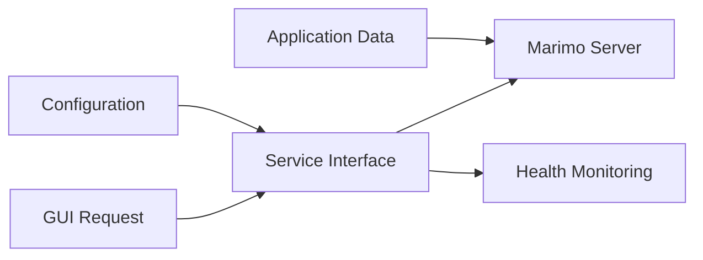

## 1. Description

### 1.1 Purpose

The Notebook Module provides interactive data analysis capabilities through Marimo notebook integration for the Aignostics Python SDK. It enables users to perform exploratory data analysis, visualization, and computation within the Aignostics platform ecosystem and serves as the presentation interface for data analysis workflows.

### 1.2 Functional Requirements

The Notebook Module shall:

- **[FR-01]** Manage Marimo server lifecycle with start/stop/health monitoring capabilities
- **[FR-02]** Provide web-based notebook interface through iframe integration
- **[FR-03]** Support application run data integration for analysis workflows
- **[FR-04]** Register GUI pages and maintain navigation controls
- **[FR-05]** Handle asset management for notebook interface resources
- **[FR-06]** Implement comprehensive error handling and recovery mechanisms

### 1.3 Non-Functional Requirements

- **Performance**: Server startup within 60 seconds, responsive GUI page loading, minimal impact from output monitoring
- **Security**: User-level process permissions, URL parameter validation, iframe same-origin policy compliance
- **Reliability**: Graceful server startup failure recovery, safe concurrent start/stop requests, stable iframe integration
- **Usability**: Clear feedback for server operations, actionable error messages, consistent navigation controls
- **Scalability**: Singleton pattern for resource management, configurable timeout handling

### 1.4 Constraints and Limitations

- Marimo and NiceGUI dependencies required for full functionality - module unavailable without these
- No support for Jupyter notebook compatibility or custom notebook runtime engines
- Limited to subprocess-based Marimo server management - no advanced configuration customization

---

## 2. Architecture and Design

### 2.1 Module Structure

```
notebook/
├── _service.py          # Core business logic and Marimo server management
├── _gui.py             # Web-based GUI components and page registration
├── _notebook.py        # Default notebook template and configuration
├── assets/             # Static assets for notebook interface
│   └── python.lottie   # Animation resources
└── __init__.py         # Module exports and conditional loading
```

### 2.2 Key Components

| Component     | Type             | Purpose                              | Public Interface          | Dependencies          |
| ------------- | ---------------- | ------------------------------------ | ------------------------- | --------------------- |
| `Service`     | Class            | Marimo server lifecycle management   | start(), stop(), health() | marimo, subprocess    |
| `PageBuilder` | Class            | GUI page registration and navigation | register_pages()          | nicegui, Service      |
| `_Runner`     | Class (Internal) | Subprocess execution and monitoring  | N/A - Internal            | threading, subprocess |

_Note: For detailed implementation, refer to the source code in the `src/aignostics/notebook/` directory._

### 2.3 Design Patterns

- **Singleton Pattern**: Applied to \_Runner class for single server instance management
- **Facade Pattern**: Service class provides simplified interface to complex \_Runner operations
- **Page Builder Pattern**: Modular GUI page registration and asset management

---

## 3. Inputs and Outputs

### 3.1 Inputs

| Input Type         | Source        | Data Type/Format | Validation Rules             | Business Rules                 |
| ------------------ | ------------- | ---------------- | ---------------------------- | ------------------------------ |
| Application Run ID | GUI/URL       | String           | Non-empty, 'all' or valid ID | Determines notebook data scope |
| Results Folder     | GUI/URL       | File Path        | Valid directory path         | Provides data access location  |
| Server Timeout     | Configuration | Integer          | 1-300 seconds                | Controls startup wait time     |

### 3.2 Outputs

| Output Type   | Destination | Data Type/Format | Success Criteria               | Error Conditions          |
| ------------- | ----------- | ---------------- | ------------------------------ | ------------------------- |
| Server URL    | Client/GUI  | HTTP URL String  | Valid URL returned             | RuntimeError on failure   |
| Health Status | Monitoring  | Health Object    | Server/thread status available | Component failure states  |
| GUI Pages     | Web Browser | HTML/NiceGUI     | Pages load successfully        | Missing dependency errors |

### 3.3 Data Schemas

**Server Configuration Schema:**

```yaml
ServerConfig:
  type: object
  properties:
    startup_timeout:
      type: integer
      default: 60
      description: "Maximum seconds to wait for server startup"
      source: "MARIMO_SERVER_STARTUP_TIMEOUT constant in _service.py"
  required: []
  note: "Default notebook path is hardcoded in constants.py, not configurable"
```

**Navigation Parameters Schema:**

```yaml
NavigationParams:
  type: object
  properties:
    application_run_id:
      type: string
      description: "Application run identifier or 'all' for general access"
      source: "URL path parameter in GUI routing"
    results_folder:
      type: string
      format: path
      description: "Path to results directory for data access"
      source: "URL query parameter in GUI routing"
  required: [application_run_id, results_folder]
```

_Note: Actual schemas are implemented through method signatures and configuration constants._

### 3.4 Data Flow



---

## 4. Interface Definitions

### 4.1 Public API

#### Core Service Interface

**Service Class**: `Service`

- **Purpose**: Manages Marimo server lifecycle and provides health monitoring
- **Key Methods**:
  - `start() -> str`: Start Marimo server and return URL
  - `stop() -> None`: Stop running Marimo server
  - `health() -> Health`: Get server and thread status information

**Input/Output Contracts**:

- **Input Types**: Timeout configuration (integer), optional parameters
- **Output Types**: Server URLs (string), Health objects, None for cleanup operations
- **Error Conditions**: RuntimeError for startup failures, graceful handling for missing dependencies

_Note: For detailed method signatures, refer to the module's `__init__.py` and service class documentation._

### 4.2 GUI Interface

**Page Registration Interface:**

The module registers web interface pages through the PageBuilder pattern:

- `/notebook` - Main notebook management interface
- `/notebook/{application_run_id}` - Application-specific notebook view with data integration

**Navigation Behavior:**

- Iframe integration for seamless notebook embedding
- Back navigation controls with context-aware routing
- Error handling with retry mechanisms for server failures

### 4.3 HTTP/Web Interface

**Endpoint Structure:**

| Method | Endpoint         | Purpose                   | Request Format            | Response Format  |
| ------ | ---------------- | ------------------------- | ------------------------- | ---------------- |
| `GET`  | `/notebook`      | Main notebook interface   | Query parameters optional | HTML page        |
| `GET`  | `/notebook/{id}` | Application-specific view | Path + query parameters   | HTML with iframe |

**Error Responses**: Standard NiceGUI error handling with user-friendly messages and retry options

---

## 5. Dependencies and Integration

### 5.1 Internal Dependencies

| Dependency Module | Usage Purpose             | Interface/Contract Used      | Criticality |
| ----------------- | ------------------------- | ---------------------------- | ----------- |
| GUI Module        | Frame and theme support   | frame(), theme() functions   | Required    |
| Utils Module      | Base services and logging | BaseService, BasePageBuilder | Required    |
| Constants Module  | Default notebook path     | NOTEBOOK_DEFAULT constant    | Required    |

### 5.2 External Dependencies

| Dependency | Min Version | Purpose                 | Optional/Required | Fallback Behavior  |
| ---------- | ----------- | ----------------------- | ----------------- | ------------------ |
| marimo     | Latest      | Notebook server runtime | Required          | Module unavailable |
| nicegui    | Latest      | Web UI framework        | Required          | Module unavailable |

_Note: For exact version requirements, refer to `pyproject.toml` and dependency lock files._

### 5.3 Integration Points

- **Aignostics Platform**: Application run data integration through URL parameters
- **File System**: Results folder access for data analysis workflows
- **Web Browser**: Iframe integration for notebook interface embedding

---

## 6. Configuration and Settings

### 6.1 Configuration Parameters

| Parameter          | Type    | Default       | Description                                | Required |
| ------------------ | ------- | ------------- | ------------------------------------------ | -------- |
| `startup_timeout`  | Integer | 60            | Maximum seconds to wait for server startup | No       |
| `default_notebook` | Path    | \_notebook.py | Path to default notebook template          | No       |

### 6.2 Environment Variables

| Variable | Purpose                                 | Example Value |
| -------- | --------------------------------------- | ------------- |
| N/A      | No environment variables currently used | N/A           |

---

## 7. Error Handling and Validation

### 7.1 Error Categories

| Error Type     | Cause                  | Handling Strategy                        | User Impact                                  |
| -------------- | ---------------------- | ---------------------------------------- | -------------------------------------------- |
| `RuntimeError` | Server startup failure | Clear error messages with retry options  | User sees actionable error with retry button |
| `ImportError`  | Missing dependencies   | Graceful degradation, module unavailable | Module not loaded, no functionality          |
| `TimeoutError` | Server startup timeout | Process cleanup and error reporting      | User notified of timeout with retry option   |

### 7.2 Input Validation

- **Application Run ID**: Validated as non-empty string, supports 'all' for general access
- **Results Folder Path**: URL encoded, validated for path traversal prevention
- **Timeout Values**: Integer validation with reasonable bounds (1-300 seconds)

### 7.3 Graceful Degradation

- **When marimo is unavailable**: Module not loaded, conditional import prevents errors
- **When nicegui is unavailable**: Module not loaded, no GUI functionality available
- **When server startup fails**: Clear error display with retry mechanisms

---

## 8. Security Considerations

### 8.1 Data Protection

- **Authentication**: Relies on platform-level authentication mechanisms
- **Data Encryption**: No sensitive data stored, relies on HTTPS for transport security
- **Access Control**: Results folder access controlled through application permissions

### 8.2 Security Measures

- **Input Sanitization**: URL parameter validation prevents path traversal attacks
- **Process Management**: Server processes run with user-level permissions only
- **Iframe Security**: Follows same-origin policy where applicable for browser security

---

## 9. Implementation Details

### 9.1 Key Algorithms and Business Logic

- **Server Lifecycle Management**: Singleton pattern ensures single server instance with proper cleanup
- **URL Detection**: Character-by-character output monitoring with regex pattern matching
- **Health Monitoring**: Thread-based status checking for server and monitoring components

### 9.2 State Management and Data Flow

- **State Type**: Stateful with singleton server instance management
- **Data Persistence**: Temporary server state only, no persistent data storage
- **Session Management**: Browser session-based through iframe integration
- **Cache Strategy**: No caching implemented, direct server communication

### 9.3 Performance and Scalability Considerations

- **Performance Characteristics**: 60-second server startup, character-level output monitoring
- **Scalability Patterns**: Single server instance per process, thread-safe operations
- **Resource Management**: Automatic process cleanup, memory-efficient output capture
- **Concurrency Model**: Thread-safe singleton with proper synchronization

---

## Documentation Maintenance

### Verification and Updates

**Last Verified**: 2025-09-11  
**Verification Method**: Source code analysis and senior engineer review  
**Next Review Date**: 2025-12-11

### Change Management

**Interface Changes**: Changes to Service API require spec updates and version bumps  
**Implementation Changes**: Internal \_Runner changes don't require spec updates unless contracts change  
**Dependency Changes**: marimo/nicegui version changes should be reflected in requirements section

### References

**Implementation**: See `src/aignostics/notebook/` for current implementation  
**Tests**: See `tests/aignostics/notebook/` for usage examples and verification  
**Feature Tests**: See `tests/aignostics/notebook/TC-NOTEBOOK-GUI-01.feature` for behavior verification

```

```
