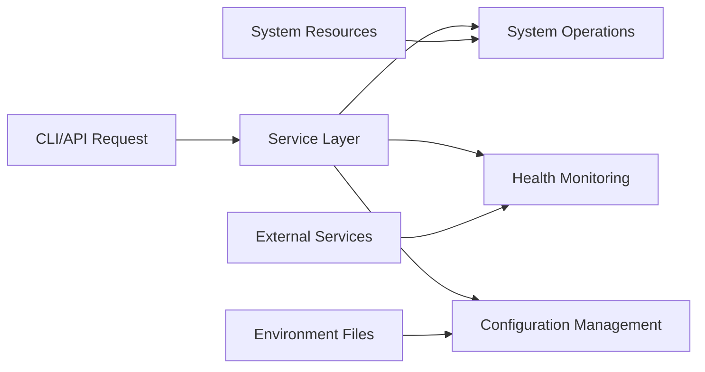

## 1. Description

### 1.1 Purpose

The System Module provides core platform services and system management capabilities for the Aignostics Python SDK. It enables system health monitoring, configuration management, diagnostics, proxy configuration, and serves as the foundational service layer for other modules in the platform ecosystem.

### 1.2 Functional Requirements

The System Module shall:

- **[FR-01]** Provide comprehensive system health monitoring with network connectivity checks
- **[FR-02]** Aggregate and report system information including runtime, hardware, and process details
- **[FR-03]** Manage environment variable configuration through .env file operations
- **[FR-04]** Support remote diagnostics control via Sentry and Logfire integration
- **[FR-05]** Enable HTTP proxy configuration with SSL certificate and verification options
- **[FR-06]** Provide token-based authentication validation for sensitive operations
- **[FR-07]** Offer CLI commands for system management and configuration
- **[FR-08]** Support web-based GUI interface for system administration
- **[FR-09]** Generate and serve OpenAPI schema for API documentation

### 1.3 Non-Functional Requirements

- **Performance**: Network health checks timeout at 5 seconds, system info gathering uses 2-second intervals for CPU measurements, minimal CPU overhead during monitoring
- **Security**: Secret detection and masking in environment variables, token-based authentication, secure proxy configuration
- **Reliability**: Graceful degradation when network unavailable, robust error handling, consistent state management
- **Usability**: Clear CLI output formats (JSON/YAML), intuitive web interface, comprehensive help documentation
- **Scalability**: Efficient service discovery, minimal memory footprint, thread-safe operations

### 1.4 Constraints and Limitations

- Network health checks depend on external connectivity to api.ipify.org
- Remote diagnostics require valid Sentry and Logfire configuration
- OpenAPI schema loading requires accessible schema file in codegen directory
- GUI functionality requires nicegui dependency availability

---

## 2. Architecture and Design

### 2.1 Module Structure

```
system/
├── _service.py          # Core business logic and system operations
├── _cli.py             # Command-line interface commands
├── _gui.py             # Web-based GUI components and pages
├── _settings.py        # Module-specific configuration settings
├── _exceptions.py      # Custom exception definitions
├── assets/             # Static assets for GUI interface
│   └── system.lottie   # Animation resources
└── __init__.py         # Module exports and conditional loading
```

### 2.2 Key Components

| Component     | Type  | Purpose                                  | Public Interface                     | Dependencies      |
| ------------- | ----- | ---------------------------------------- | ------------------------------------ | ----------------- |
| `Service`     | Class | Core system operations and health checks | health(), info(), token validation   | requests, psutil  |
| `Settings`    | Class | Configuration management                 | Token storage and validation         | pydantic_settings |
| `PageBuilder` | Class | GUI page registration and interface      | register_pages()                     | nicegui, Service  |
| `cli`         | Typer | Command-line interface                   | health, info, config, serve commands | typer, yaml       |

_Note: For detailed implementation, refer to the source code in the `src/aignostics/system/` directory._

### 2.3 Design Patterns

- **Service Layer Pattern**: Service class encapsulates all business logic and system operations
- **Facade Pattern**: Simplified interface to complex system information gathering and configuration
- **Strategy Pattern**: Multiple output formats (JSON/YAML) for CLI commands
- **Template Method Pattern**: BaseService inheritance for consistent service behavior

---

## 3. Inputs and Outputs

### 3.1 Inputs

| Input Type           | Source      | Data Type/Format | Validation Rules                    | Business Rules                    |
| -------------------- | ----------- | ---------------- | ----------------------------------- | --------------------------------- |
| Authentication Token | CLI/API/GUI | String           | Non-empty, matches configured token | Required for sensitive operations |
| Configuration Key    | CLI         | String           | Valid environment variable name     | Converted to uppercase            |
| Configuration Value  | CLI         | String           | Any string value                    | Stored in primary .env file       |
| Proxy Settings       | CLI         | Host/Port/Scheme | Valid URL components                | SSL options mutually exclusive    |
| Output Format        | CLI         | Enum             | 'json' or 'yaml'                    | Default to JSON                   |

### 3.2 Outputs

| Output Type    | Destination | Data Type/Format | Success Criteria             | Error Conditions          |
| -------------- | ----------- | ---------------- | ---------------------------- | ------------------------- |
| Health Status  | CLI/API/GUI | Health Object    | Status and component details | Network/service failures  |
| System Info    | CLI/API/GUI | JSON/Dict        | Complete system information  | Permission/access errors  |
| Configuration  | Environment | .env File        | Key-value pairs written      | File access errors        |
| OpenAPI Schema | CLI/API     | JSON Schema      | Valid OpenAPI specification  | Schema file not found     |
| GUI Pages      | Web Browser | HTML/NiceGUI     | Pages render successfully    | Missing dependency errors |

### 3.3 Data Schemas

**Health Status Schema:**

```yaml
Health:
  type: object
  properties:
    status:
      type: string
      enum: [UP, DOWN]
      description: "Overall system health status"
    components:
      type: object
      description: "Health status of individual components"
      additionalProperties:
        $ref: "#/definitions/Health"
    reason:
      type: string
      description: "Reason for DOWN status, null for UP"
  required: [status]
```

**System Info Schema:**

```yaml
SystemInfo:
  type: object
  properties:
    package:
      type: object
      description: "Package metadata (version, name, repository)"
    runtime:
      type: object
      description: "Runtime environment information"
      properties:
        environment:
          type: string
        username:
          type: string
        process:
          type: object
        host:
          type: object
        python:
          type: object
        environ:
          type: object
          description: "Environment variables (optional, masked by default)"
    settings:
      type: object
      description: "Aggregated settings from all modules"
  required: [package, runtime, settings]
```

**Configuration Schema:**

```yaml
Configuration:
  type: object
  properties:
    key:
      type: string
      description: "Environment variable key (uppercase)"
    value:
      type: string
      description: "Environment variable value"
  required: [key, value]
```

### 3.4 Data Flow



---

## 4. Interface Definitions

### 4.1 Public API

#### Core Service Interface

**Service Class**: `Service`

- **Purpose**: Provides core system management, health monitoring, and configuration services
- **Key Methods**:
  - `health() -> Health`: Get aggregate system health including component status (instance method)
  - `health_static() -> Health`: Static method to get system health without instance
  - `info(include_environ: bool = False, mask_secrets: bool = True) -> dict[str, Any]`: Static method to get comprehensive system information
  - `is_token_valid(token: str) -> bool`: Validate authentication token (instance method)
  - `dotenv_set(key: str, value: str) -> None`: Static method to set environment variable in .env files
  - `dotenv_get(key: str) -> str | None`: Static method to get environment variable value
  - `dotenv_unset(key: str) -> int`: Static method to remove environment variable from .env files
  - `remote_diagnostics_enable() -> None`: Static method to enable remote diagnostics
  - `remote_diagnostics_disable() -> None`: Static method to disable remote diagnostics
  - `http_proxy_enable(host: str, port: int, scheme: str, ssl_cert_file: str | None = None, no_ssl_verify: bool = False) -> None`: Static method to configure HTTP proxy
  - `http_proxy_disable() -> None`: Static method to disable HTTP proxy
  - `openapi_schema() -> JsonType`: Static method to get OpenAPI specification

**Input/Output Contracts**:

- **Input Types**: Strings for tokens/keys/values, booleans for flags, timeout integers, optional SSL certificate paths
- **Output Types**: Health objects, dictionaries for info, strings for configuration values, JSON for OpenAPI schema
- **Error Conditions**: RuntimeError for network failures, ValueError for configuration errors, OpenAPISchemaError for schema issues

### 4.2 CLI Interface

**Command Structure:**

```bash
uvx aignostics system [subcommand] [options]
```

**Available Commands:**

| Command   | Purpose                        | Input Requirements             | Output Format   |
| --------- | ------------------------------ | ------------------------------ | --------------- |
| `health`  | Display system health status   | Optional output format         | JSON/YAML       |
| `info`    | Show comprehensive system info | Optional environ/masking flags | JSON/YAML       |
| `serve`   | Start web GUI server           | Host, port, browser options    | Server startup  |
| `openapi` | Display OpenAPI schema         | API version, output format     | JSON/YAML       |
| `install` | Complete installation          | None                           | Success message |

**Configuration Subcommands:**

| Command                             | Purpose                    | Input Requirements      | Output          |
| ----------------------------------- | -------------------------- | ----------------------- | --------------- |
| `config get <key>`                  | Get configuration value    | Configuration key name  | Key value       |
| `config set <key> <value>`          | Set configuration value    | Key name and value      | Success message |
| `config unset <key>`                | Remove configuration value | Configuration key name  | Success message |
| `config remote-diagnostics-enable`  | Enable remote diagnostics  | None                    | Success message |
| `config remote-diagnostics-disable` | Disable remote diagnostics | None                    | Success message |
| `config http-proxy-enable`          | Configure HTTP proxy       | Host, port, SSL options | Success message |
| `config http-proxy-disable`         | Disable HTTP proxy         | None                    | Success message |

### 4.3 HTTP/Web Interface

**GUI Pages:**

| Route     | Purpose                  | Request Format   | Response Format |
| --------- | ------------------------ | ---------------- | --------------- |
| `/system` | System administration UI | Query parameters | HTML interface  |

**GUI Features:**

- Health monitoring with JSON tree display
- System info with secret masking controls
- Configuration management interface
- Remote diagnostics toggle

---

## 5. Dependencies and Integration

### 5.1 Internal Dependencies

| Dependency Module | Usage Purpose             | Interface/Contract Used      | Criticality |
| ----------------- | ------------------------- | ---------------------------- | ----------- |
| Utils Module      | Base services and logging | BaseService, Health, logging | Required    |
| Constants Module  | API version information   | API_VERSIONS constant        | Required    |
| GUI Module        | Frame and theme support   | frame() function             | Optional    |

### 5.2 External Dependencies

| Dependency        | Min Version | Purpose                    | Optional/Required | Fallback Behavior    |
| ----------------- | ----------- | -------------------------- | ----------------- | -------------------- |
| requests          | Latest      | HTTP requests for health   | Required          | Network health fails |
| psutil            | Latest      | System resource monitoring | Required          | Info gathering fails |
| typer             | Latest      | CLI framework              | Required          | No CLI functionality |
| pydantic-settings | Latest      | Configuration management   | Required          | No settings support  |
| nicegui           | Latest      | Web GUI framework          | Optional          | No GUI functionality |
| python-dotenv     | Latest      | .env file management       | Required          | No config management |

_Note: For exact version requirements, refer to `pyproject.toml` and dependency lock files._

### 5.3 Integration Points

- **External Health Check**: api.ipify.org for network connectivity validation
- **File System**: .env files for configuration persistence
- **Process System**: System resource monitoring and process information
- **Other SDK Modules**: Service discovery and health aggregation

---

## 6. Configuration and Settings

### 6.1 Configuration Parameters

| Parameter | Type      | Default | Description                                   | Required |
| --------- | --------- | ------- | --------------------------------------------- | -------- |
| `token`   | SecretStr | None    | Authentication token for sensitive operations | No       |

### 6.2 Environment Variables

| Variable                     | Purpose                    | Example Value                   |
| ---------------------------- | -------------------------- | ------------------------------- |
| `AIGNOSTICS_SYSTEM_TOKEN`    | Authentication token       | `secret-token-value`            |
| `AIGNOSTICS_SENTRY_ENABLED`  | Enable Sentry diagnostics  | `1`                             |
| `AIGNOSTICS_LOGFIRE_ENABLED` | Enable Logfire diagnostics | `1`                             |
| `HTTP_PROXY`                 | HTTP proxy URL             | `http://proxy.example.com:8080` |
| `HTTPS_PROXY`                | HTTPS proxy URL            | `http://proxy.example.com:8080` |
| `SSL_CERT_FILE`              | SSL certificate file path  | `/path/to/certificate.pem`      |
| `SSL_NO_VERIFY`              | Disable SSL verification   | `1`                             |

---

## 7. Error Handling and Validation

### 7.1 Error Categories

| Error Type           | Cause                   | Handling Strategy               | User Impact                   |
| -------------------- | ----------------------- | ------------------------------- | ----------------------------- |
| `OpenAPISchemaError` | Schema file issues      | Clear error message with path   | Schema operations fail        |
| `ValueError`         | Configuration conflicts | Validation with helpful message | Configuration rejected        |
| `RuntimeError`       | Network/system failures | Graceful degradation            | Reduced functionality         |
| `FileNotFoundError`  | Missing .env files      | Clear error with file path      | Configuration operations fail |

### 7.2 Input Validation

- **Authentication Tokens**: Non-empty string validation, secure comparison
- **Configuration Keys**: Converted to uppercase, validated as environment variable names
- **Proxy Settings**: URL format validation, SSL option mutual exclusion
- **File Paths**: Existence verification for SSL certificates

### 7.3 Graceful Degradation

- **When network is unavailable**: Health status shows DOWN but system continues
- **When .env files missing**: Clear error messages with file paths
- **When dependencies unavailable**: Conditional loading prevents import errors
- **When external services fail**: Local operations continue, remote features disabled

---

## 8. Security Considerations

### 8.1 Data Protection

- **Authentication**: Token-based validation for sensitive operations
- **Data Encryption**: No sensitive data persistence, secure token handling
- **Access Control**: Environment variable access controlled through service layer

### 8.2 Security Measures

- **Secret Detection**: Advanced pattern matching for environment variable masking
- **Input Sanitization**: Configuration key validation and path traversal prevention
- **Token Security**: SecretStr usage for secure token storage and comparison
- **Audit Logging**: Comprehensive logging of configuration changes and access

- **Token Security**: Automatic expiration, secure storage, validation on each use

---

## 9. Implementation Details

### 9.1 Key Algorithms and Business Logic

- **Health Aggregation**: Automatic discovery and aggregation of BaseService implementations
- **System Information Gathering**: Comprehensive runtime, hardware, and process data collection with configurable intervals
- **Secret Detection**: Dual-strategy pattern matching for environment variable classification using sophisticated algorithms:
  - Word Boundary Matching: Terms like "id" use regex word boundaries to avoid false positives
  - String Matching: Unambiguous terms like "token", "key", "secret", "password" use substring matching
  - Case Insensitive: All detection is case-insensitive for robustness
  - Real-world Patterns: Handles common environment variable naming conventions
- **Configuration Management**: Atomic .env file operations with rollback capability

**Key Constants:**

- `NETWORK_TIMEOUT = 5`: Network health check timeout in seconds
- `MEASURE_INTERVAL_SECONDS = 2`: CPU measurement interval for system info gathering
- `IPIFY_URL`: External service URL for network connectivity validation

### 9.2 State Management and Data Flow

- **State Type**: Mostly stateless with singleton service instances
- **Data Persistence**: Configuration persisted to .env files, runtime state in memory
- **Session Management**: Token-based authentication for web operations
- **Cache Strategy**: No caching for real-time system information

### 9.3 Performance and Scalability Considerations

- **Performance Characteristics**: Sub-second health checks, 2-second info gathering
- **Scalability Patterns**: Service discovery pattern for module integration
- **Resource Management**: Efficient system monitoring with configurable intervals
- **Concurrency Model**: Thread-safe operations, no shared mutable state

---

## Documentation Maintenance

### Verification and Updates

**Last Verified**: 2025-09-11  
**Verification Method**: Source code analysis, test examination, and implementation review  
**Next Review Date**: 2025-12-11

### Change Management

**Interface Changes**: Changes to Service API require spec updates and version bumps  
**Implementation Changes**: Internal algorithm changes don't require spec updates unless behavior changes  
**Dependency Changes**: Major dependency changes should be reflected in requirements section

### References

**Implementation**: See `src/aignostics/system/` for current implementation  
**Tests**: See `tests/aignostics/system/` for usage examples and verification  
**API Documentation**: Auto-generated from service class docstrings
