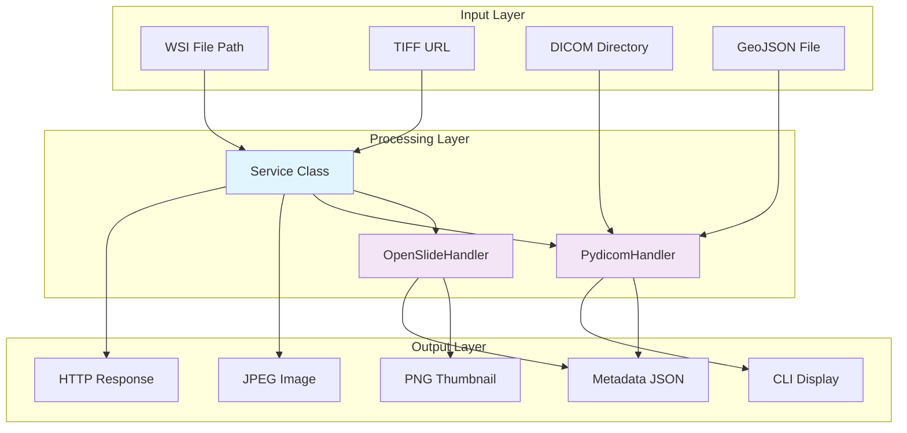

## 1. Description

### 1.1 Purpose

The WSI (Whole Slide Image) Module provides comprehensive support for digital pathology image processing within the Aignostics Python SDK. It enables users to work with high-resolution microscopy images across multiple formats and provides essential infrastructure for computational pathology workflows.

### 1.2 Functional Requirements

The WSI Module shall:

- **[FR-01]** Support multi-format WSI processing including DICOM (.dcm), TIFF/BigTIFF (.tiff, .tif), and Aperio SVS (.svs) formats
- **[FR-02]** Generate standardized PNG thumbnails (256x256 pixels) from any supported WSI format
- **[FR-03]** Extract comprehensive metadata from WSI files including resolution, dimensions, and format-specific properties
- **[FR-04]** Provide DICOM-specific hierarchical organization by study → container (slide) → series
- **[FR-05]** Handle DICOM Structured Report (SR) annotations with GeoJSON import capability
- **[FR-06]** Serve thumbnails and converted images through HTTP endpoints for web integration
- **[FR-07]** Support real-time TIFF-to-JPEG conversion for web display
- **[FR-08]** Provide command-line interface for WSI inspection and DICOM analysis

### 1.3 Non-Functional Requirements

- **Performance**: Efficient processing of large WSI files (multi-gigabyte images) without loading entire images into memory for metadata operations
- **Security**: Input validation for file paths and URLs, secure HTTP endpoint handling with fallback responses
- **Reliability**: Graceful error handling for corrupted files, missing dependencies, and network issues
- **Usability**: Clear CLI output formatting, standardized thumbnail generation, comprehensive metadata extraction
- **Scalability**: Streaming operations for large files, memory-efficient thumbnail generation, support for pyramidal image structures

### 1.4 Constraints and Limitations

- **File Format Support**: Limited to extensions defined in `WSI_SUPPORTED_FILE_EXTENSIONS = {".dcm", ".tiff", ".tif", ".svs"}`
- **OpenSlide Dependency**: Non-DICOM formats require OpenSlide library installation for processing
- **Memory Constraints**: Large WSI files require careful memory management and streaming operations
- **Platform Dependencies**: Requires platform-specific compilation of OpenSlide and image processing libraries

---

## 2. Architecture and Design

### 2.1 Module Structure

The WSI module follows the standard Aignostics SDK module structure:

```
wsi/
├── _service.py          # Core business logic and WSI processing service
├── _cli.py             # Command-line interface for WSI inspection
├── _gui.py             # Web-based GUI components and HTTP endpoints
├── _openslide_handler.py # Handler for TIFF/SVS formats using OpenSlide
├── _pydicom_handler.py  # Handler for DICOM formats using PyDICOM/HighDICOM
├── _utils.py           # Helper functions for output formatting
├── __init__.py         # Module exports and public API
└── assets/             # Static assets (fallback images)
    └── fallback.png
```

### 2.2 Key Components

| Component          | Type  | Purpose                               | Public Interface                                             | Dependencies                     |
| ------------------ | ----- | ------------------------------------- | ------------------------------------------------------------ | -------------------------------- |
| `Service`          | Class | Core WSI processing service           | Thumbnail generation, metadata extraction, format conversion | OpenSlideHandler, PydicomHandler |
| `OpenSlideHandler` | Class | Handles TIFF/SVS formats              | Format detection, thumbnail creation, metadata parsing       | OpenSlide, PIL                   |
| `PydicomHandler`   | Class | Handles DICOM formats and annotations | DICOM parsing, hierarchy organization, annotation import     | PyDICOM, HighDICOM               |
| `PageBuilder`      | Class | Web interface registration            | HTTP endpoint registration                                   | NiceGUI (optional)               |
| `cli`              | Typer | Command-line interface                | WSI inspection, DICOM analysis                               | Typer, Rich                      |

_Note: For detailed implementation, refer to the source code in the `src/aignostics/wsi/` directory._

### 2.3 Design Patterns

- **Handler Pattern**: Separate handlers (`OpenSlideHandler`, `PydicomHandler`) for different image formats provide format-specific processing while maintaining a unified interface
- **Service Layer Pattern**: `Service` class encapsulates business logic and coordinates between handlers
- **Factory Pattern**: `from_file()` class methods create appropriate handler instances based on file type
- **Strategy Pattern**: Different processing strategies for DICOM vs non-DICOM formats

---

## 3. Inputs and Outputs

### 3.1 Inputs

| Input Type      | Source      | Data Type/Format | Validation Rules                                 | Business Rules                                     |
| --------------- | ----------- | ---------------- | ------------------------------------------------ | -------------------------------------------------- |
| WSI File Path   | CLI/Service | `Path` object    | Must exist, extension in supported formats       | File must be readable, format must be supported    |
| TIFF URL        | HTTP API    | `str` URL        | Must start with 'http://localhost' or 'https://' | URL must be accessible, content must be valid TIFF |
| DICOM Directory | CLI         | `Path` object    | Must exist and be accessible                     | Directory must contain valid DICOM files           |
| GeoJSON File    | CLI         | `Path` object    | Must exist, valid JSON format                    | Must contain valid geometric annotations           |
| CLI Options     | CLI         | Boolean flags    | Standard CLI validation                          | Options control output verbosity and format        |

### 3.2 Outputs

| Output Type     | Destination       | Data Type/Format      | Success Criteria                                      | Error Conditions                            |
| --------------- | ----------------- | --------------------- | ----------------------------------------------------- | ------------------------------------------- |
| Thumbnail Image | HTTP Response/PIL | PNG bytes/PIL.Image   | 256x256 pixel PNG image                               | File processing failure, format unsupported |
| WSI Metadata    | CLI/Service       | Structured dictionary | Complete metadata with dimensions, resolution, levels | File corruption, missing metadata           |
| JPEG Image      | HTTP Response     | JPEG bytes            | Successfully converted TIFF to JPEG                   | Network failure, invalid TIFF format        |
| CLI Output      | Terminal          | Formatted text        | Human-readable metadata display                       | Processing errors, missing files            |
| DICOM Hierarchy | Terminal          | Formatted text        | Study/slide/series organization                       | Invalid DICOM structure                     |
| Fallback Image  | HTTP Response     | PNG redirect          | Default image served on errors                        | No error conditions                         |

### 3.3 Data Schemas

**WSI Metadata Schema:**

```yaml
metadata:
  type: object
  description: Based on OpenSlideHandler.get_metadata() output structure
  properties:
    format:
      type: string
      description: Detected WSI format (e.g., 'generic-tiff', 'aperio', 'hamamatsu-vms')
    level_count:
      type: integer
      description: Number of pyramid levels
    dimensions:
      type: array
      description: Width and height for each level
      items:
        type: array
        items: [{ type: integer }, { type: integer }]
        description: [width, height] tuple for each level
    level_downsamples:
      type: array
      description: Downsample factor for each level
      items:
        type: number
    mpp_x:
      type: number
      nullable: true
      description: Microns per pixel in X direction
    mpp_y:
      type: number
      nullable: true
      description: Microns per pixel in Y direction
    vendor:
      type: string
      nullable: true
      description: Scanner vendor information
    background_color:
      type: array
      nullable: true
      description: Background color as RGB tuple
      items:
        type: integer
    associated_images:
      type: object
      description: Dictionary of associated image names
      additionalProperties:
        type: object
    properties:
      type: object
      description: Raw slide properties from OpenSlide
      additionalProperties: true
```

**DICOM Hierarchy Schema:**

```yaml
hierarchy:
  type: object
  description: Based on PydicomHandler._organize_by_hierarchy() output structure
  properties:
    studies:
      type: object
      description: Study instances organized by StudyInstanceUID
      patternProperties:
        "^[0-9.]+$":
          type: object
          description: Study instance data
          properties:
            study_uid:
              type: string
              description: Study Instance UID
            study_date:
              type: string
              description: Study Date (YYYYMMDD format)
            study_time:
              type: string
              description: Study Time (HHMMSS format)
            patient_name:
              type: string
              description: Patient's Name
            patient_id:
              type: string
              description: Patient ID
            accession_number:
              type: string
              description: Accession Number
            study_description:
              type: string
              description: Study Description
            slides:
              type: object
              description: Slide instances organized by unique slide identifier
              patternProperties:
                ".*":
                  type: object
                  description: Slide instance data
                  properties:
                    metadata:
                      type: object
                      description: Slide-level metadata
                      properties:
                        slide_id:
                          type: string
                          description: Unique slide identifier
                        container_identifier:
                          type: string
                          description: Container Identifier
                        specimen_label_in_image:
                          type: string
                          description: Specimen Label in Image
                        specimen_short_description:
                          type: string
                          description: Specimen Short Description
                        specimen_detailed_description:
                          type: string
                          description: Specimen Detailed Description
                    series:
                      type: array
                      description: Series instances for this slide
                      items:
                        type: object
                        properties:
                          series_uid:
                            type: string
                            description: Series Instance UID
                          series_number:
                            type: string
                            description: Series Number
                          modality:
                            type: string
                            description: Modality (typically 'SM' for Slide Microscopy)
                          series_description:
                            type: string
                            description: Series Description
                          instances:
                            type: array
                            description: Instance files in this series
                            items:
                              type: object
                              properties:
                                sop_instance_uid:
                                  type: string
                                  description: SOP Instance UID
                                instance_number:
                                  type: string
                                  description: Instance Number
                                file_path:
                                  type: string
                                  description: Path to DICOM file
```

_Note: Complete schemas are maintained in the implementation and auto-generated documentation._

### 3.4 Data Flow



---

## 4. Interface Definitions

### 4.1 Public API

#### Core Service Interface

**Service Class**: `WSIService`

- **Purpose**: Central service for WSI processing and format conversion
- **Key Methods**:
  - `get_thumbnail(path: Path) -> PIL.Image`: Generate 256x256 pixel thumbnail from WSI file
  - `get_thumbnail_bytes(path: Path) -> bytes`: Return thumbnail as PNG bytes for HTTP responses
  - `get_metadata(path: Path) -> dict`: Extract comprehensive metadata including dimensions and resolution
  - `get_tiff_as_jpg(url: str) -> bytes`: Convert TIFF from URL to JPEG format

**Input/Output Contracts**:

- **Input Types**: Path objects for local files, URL strings for remote TIFF processing
- **Output Types**: PIL Image objects, PNG/JPEG bytes, structured metadata dictionaries
- **Error Conditions**: `ValueError` for invalid inputs, `RuntimeError` for processing failures

_Note: For detailed method signatures, refer to the module's `_service.py` and auto-generated API documentation._

### 4.2 CLI Interface

**Command Structure:**

```bash
uvx aignostics wsi [subcommand] [options]
```

**Available Commands:**

| Command                                            | Purpose                 | Input Requirements                     | Output Format                         |
| -------------------------------------------------- | ----------------------- | -------------------------------------- | ------------------------------------- |
| `inspect <path>`                                   | Display WSI metadata    | Path to WSI file                       | Formatted metadata display            |
| `dicom inspect <path>`                             | Analyze DICOM hierarchy | Path to DICOM file/directory           | Hierarchical study/slide organization |
| `dicom geojson_import <dicom_path> <geojson_path>` | Import annotations      | DICOM file and GeoJSON annotation file | Import status and validation results  |

**Common Options:**

- `--help`: Display command help
- `--verbose`: Enable detailed output for DICOM commands
- `--summary`: Show only summary information for DICOM hierarchy

### 4.3 HTTP/Web Interface

**Endpoint Structure:**

| Method | Endpoint                   | Purpose              | Request Format             | Response Format                 |
| ------ | -------------------------- | -------------------- | -------------------------- | ------------------------------- |
| `GET`  | `/thumbnail?source=<path>` | Serve WSI thumbnail  | Query parameter: file path | PNG image or fallback redirect  |
| `GET`  | `/tiff?url=<url>`          | Convert TIFF to JPEG | Query parameter: TIFF URL  | JPEG image or fallback redirect |
| `GET`  | `/wsi_assets/fallback.png` | Fallback image       | None                       | PNG image                       |

**Authentication**: No authentication required (local service)
**Error Responses**: HTTP redirects to fallback image on processing errors

---

## 5. Dependencies and Integration

### 5.1 Internal Dependencies

| Dependency Module | Usage Purpose                               | Interface/Contract Used                  | Criticality |
| ----------------- | ------------------------------------------- | ---------------------------------------- | ----------- |
| Utils Module      | Base service class, logging, console output | `BaseService`, `get_logger()`, `console` | Required    |
| Constants Module  | Supported file extensions definition        | `WSI_SUPPORTED_FILE_EXTENSIONS` constant | Required    |
| Utils GUI         | Base page builder for web interface         | `BasePageBuilder` class                  | Optional    |

### 5.2 External Dependencies

| Dependency         | Min Version | Purpose                                | Optional/Required      | Fallback Behavior                   |
| ------------------ | ----------- | -------------------------------------- | ---------------------- | ----------------------------------- |
| `openslide-python` | Latest      | Reading TIFF/SVS formats               | Required for non-DICOM | Clear error with installation guide |
| `pydicom`          | Latest      | DICOM file parsing                     | Required for DICOM     | Error message for DICOM operations  |
| `highdicom`        | Latest      | DICOM annotation handling              | Required for DICOM     | Annotation features unavailable     |
| `Pillow (PIL)`     | Latest      | Image processing and format conversion | Required               | Core functionality fails            |
| `shapely`          | Latest      | Geometry processing for annotations    | Required for GeoJSON   | GeoJSON import fails                |
| `requests`         | Latest      | HTTP requests for TIFF URL processing  | Required               | URL-based TIFF conversion fails     |
| `typer`            | Latest      | CLI framework                          | Required               | CLI unavailable                     |
| `nicegui`          | Latest      | Web interface framework                | Optional               | Web endpoints unavailable           |

_Note: For exact version requirements, refer to `pyproject.toml` and dependency lock files._

### 5.3 Integration Points

- **Aignostics Platform API**: Provides WSI processing capabilities for the broader platform
- **QuPath Integration**: Metadata extraction supports QuPath project creation workflows
- **Web Applications**: HTTP endpoints enable thumbnail serving for browser-based viewers
- **File System**: Direct access to local WSI files for processing

---

## 6. Configuration and Settings

### 6.1 Configuration Parameters

| Parameter                       | Type              | Default                             | Description                     | Required |
| ------------------------------- | ----------------- | ----------------------------------- | ------------------------------- | -------- |
| `WSI_SUPPORTED_FILE_EXTENSIONS` | `set[str]`        | `{".dcm", ".tiff", ".tif", ".svs"}` | Supported WSI file extensions   | Yes      |
| `TIMEOUT`                       | `int`             | `60`                                | HTTP request timeout in seconds | No       |
| Thumbnail size                  | `tuple[int, int]` | `(256, 256)`                        | Standard thumbnail dimensions   | No       |

### 6.2 Environment Variables

| Variable               | Purpose                                   | Example Value            |
| ---------------------- | ----------------------------------------- | ------------------------ |
| `NICEGUI_STORAGE_PATH` | Storage path for NiceGUI web interface    | `~/.aignostics/.nicegui` |
| `MATPLOTLIB`           | Disable matplotlib for headless operation | `"false"`                |

---

## 7. Error Handling and Validation

### 7.1 Error Categories

| Error Type               | Cause                                               | Handling Strategy                                  | User Impact                                   |
| ------------------------ | --------------------------------------------------- | -------------------------------------------------- | --------------------------------------------- |
| `ValueError`             | File doesn't exist, unsupported format, invalid URL | Log warning, raise with descriptive message        | Clear error message indicating specific issue |
| `RuntimeError`           | Processing failure, conversion error                | Log exception with stack trace, raise with context | Error message with troubleshooting guidance   |
| `OpenSlideError`         | Corrupted WSI file, missing OpenSlide               | Graceful degradation, fallback image serving       | Fallback image displayed, error logged        |
| `HTTPError`              | Network issues with TIFF URL                        | Log warning, return appropriate HTTP status        | HTTP error response with descriptive message  |
| `UnidentifiedImageError` | Invalid image format from URL                       | Log warning, validate input format                 | Clear format validation error                 |

### 7.2 Input Validation

- **File Path Validation**: Check file existence, extension in `WSI_SUPPORTED_FILE_EXTENSIONS`, readable permissions
- **URL Validation**: Must start with 'http://localhost' or 'https://', proper URL format validation
- **DICOM File Validation**: Verify DICOM tags, proper metadata structure, hierarchy validation
- **GeoJSON Validation**: Valid JSON format, proper geometry structure, coordinate bounds checking

### 7.3 Graceful Degradation

- **When OpenSlide is unavailable**: Clear error message with installation instructions for non-DICOM formats
- **When DICOM dependencies are missing**: Error message indicating PyDICOM/HighDICOM installation needed
- **When image processing fails**: Fallback to default thumbnail image via HTTP redirect
- **When network requests timeout**: Configurable timeout with appropriate error response

---

## 8. Security Considerations

### 8.1 Data Protection

- **File System Access**: Direct file system access limited to readable files, no write operations
- **URL Validation**: Strict validation requiring localhost or HTTPS protocols to prevent SSRF attacks
- **Input Sanitization**: Path validation, file extension verification, format validation
- **Error Information**: Error messages avoid exposing sensitive file system paths or internal details

### 8.2 Security Measures

- **Input Validation**: All file paths and URLs validated before processing
- **Resource Limits**: Configurable timeouts prevent resource exhaustion from long-running requests
- **Fallback Mechanisms**: Secure fallback to default images prevents information disclosure
- **Logging**: Security-relevant events logged without exposing sensitive data

---

## 9. Implementation Details

### 9.1 Key Algorithms and Business Logic

- **Format Detection**: Multi-stage detection using file extensions, OpenSlide format detection, and DICOM tag analysis to determine appropriate processing strategy
- **Thumbnail Generation**: Efficient downsampling using library-specific thumbnail generation with standardized 256x256 output for consistent web display
- **Metadata Extraction**: Format-specific parsers that extract resolution, dimensions, and pyramidal level information while preserving coordinate precision
- **Coordinate Transformation**: Conversion between pixel coordinates, micron measurements, and geographic coordinate systems for annotation compatibility

### 9.2 State Management and Data Flow

- **State Type**: Stateless service design ensures thread safety and prevents memory leaks from large image references
- **Data Persistence**: No persistent state maintained; configuration loaded from constants and environment variables
- **Cache Strategy**: No caching implemented; each request processes fresh data to ensure accuracy

### 9.3 Performance and Scalability Considerations

- **Performance Characteristics**: Memory-efficient processing of multi-gigabyte files through streaming operations and metadata-only parsing
- **Scalability Patterns**: Stateless design enables horizontal scaling; concurrent requests handled safely through independent processing
- **Resource Management**: Careful memory management with automatic cleanup, configurable timeouts, and fallback mechanisms for resource exhaustion
- **Concurrency Model**: Thread-safe operations with per-request resource isolation and no shared state between concurrent processes

---

## Documentation Maintenance

### Verification and Updates

**Last Verified**: September 10, 2025  
**Verification Method**: Code review against implementation in `src/aignostics/wsi/` and test verification in `tests/aignostics/wsi/`  
**Next Review Date**: December 10, 2025 (quarterly review)

### Change Management

**Interface Changes**: Changes to public APIs require spec updates and version bumps  
**Implementation Changes**: Internal changes don't require spec updates unless behavior changes  
**Dependency Changes**: Major dependency changes should be reflected in constraints section

### References

**Implementation**: See `src/aignostics/wsi/` for current implementation  
**Tests**: See `tests/aignostics/wsi/` for usage examples and verification  
**API Documentation**: Auto-generated from docstrings in service classes

---

## Appendix A: File Format Support Matrix

| Format | Extension   | Handler          | Pyramidal | Annotations | Metadata Level  |
| ------ | ----------- | ---------------- | --------- | ----------- | --------------- |
| DICOM  | .dcm        | PydicomHandler   | ✓         | ✓           | Complete        |
| TIFF   | .tiff, .tif | OpenSlideHandler | ✓         | Limited     | Standard        |
| SVS    | .svs        | OpenSlideHandler | ✓         | ✗           | Vendor-specific |

## Appendix B: Supported Coordinate Systems

- **DICOM Image Coordinates**: Pixel-based with origin at top-left
- **QuPath Coordinates**: Micron-based world coordinates
- **GeoJSON Standard**: Geographic coordinate system adaptation for pathology

---

**Verification Status**: This specification has been verified against the actual source code implementation in the WSI module directory structure as of September 10, 2025.
