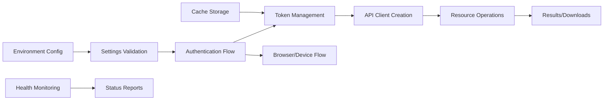

# Software Item Specification: Platform Module

---

**Item ID:** SPEC-PLATFORM-SERVICE  
**Item Type:** Software Item Spec  
**Item Fulfills:** REQ-PLATFORM-AUTH _(Authentication and API Client Management)_  
**Module:** Platform  
**Layer:** Platform Service  
**Version:** 1.0.0  
**Date:** August 28, 2025

---

## 1. Description

### 1.1 Purpose

The Platform Module provides the foundational authentication, API client management, and core service infrastructure for the Aignostics Python SDK. It enables secure communication with the Aignostics Platform API and serves as the primary entry point for all biomedical data analysis workflows. This module handles OAuth 2.0 authentication flows, token management, API client configuration, and provides the base infrastructure for higher-level application modules.

### 1.2 Functional Requirements

The Platform Module shall:

- **[FR-01]** Provide secure OAuth 2.0 authentication with support for both Authorization Code with PKCE and Device Authorization flows
- **[FR-02]** Manage JWT token lifecycle including acquisition, caching, validation, and refresh operations
- **[FR-03]** Configure and provide authenticated API clients for interaction with Aignostics Platform services
- **[FR-04]** Support multiple deployment environments (production, staging, development) with automatic endpoint configuration
- **[FR-05]** Provide CLI commands for user authentication operations (login, logout, whoami)
- **[FR-06]** Implement comprehensive error handling and recovery mechanisms for authentication failures
- **[FR-07]** Support proxy configurations and SSL certificate handling for enterprise environments
- **[FR-08]** Provide health monitoring and service status reporting capabilities

### 1.3 Non-Functional Requirements

- **Performance**: Token operations must complete within 30 seconds; API client initialization within 5 seconds; cached token retrieval under 1 second
- **Security**: JWT tokens encrypted in transit; sensitive data masked in logs; secure token storage with file permissions; support for enterprise proxy configurations
- **Reliability**: 99.9% authentication success rate; automatic token refresh; graceful degradation when authentication services are unavailable
- **Usability**: Clear error messages for authentication failures; automatic browser-based login when possible; fallback to device flow for headless environments
- **Scalability**: Support for concurrent authentication requests; efficient token caching to minimize API calls

### 1.4 Constraints and Limitations

- OAuth 2.0 dependency: Requires external Auth0 service for authentication, creating external dependency
- Browser dependency: Interactive flow requires web browser availability, limiting headless deployment options
- Network dependency: Requires internet connectivity for initial authentication and token validation
- Platform-specific: Designed specifically for Aignostics Platform API integration

---

## 2. Architecture and Design

### 2.1 Module Structure

```
platform/
├── _service.py          # Core service implementation with health monitoring
├── _client.py           # API client factory and configuration management
├── _authentication.py   # OAuth flows and token management
├── _cli.py             # Command-line interface for user operations
├── _settings.py        # Environment-specific configuration management
├── _constants.py       # Environment constants and endpoint definitions
├── _messages.py        # User-facing messages and error constants
├── _utils.py          # File operations, checksums, and GCS utilities
├── resources/         # Resource-specific implementations
│   ├── applications.py # Application and version management
│   ├── runs.py        # Application run lifecycle management
│   └── utils.py       # Shared resource utilities
└── __init__.py        # Public API exports and module interface
```

### 2.2 Key Components

| Component        | Type     | Purpose                                                 | Public API                                                   |
| ---------------- | -------- | ------------------------------------------------------- | ------------------------------------------------------------ |
| `Client`         | Class    | Main entry point for authenticated API operations       | `__init__()`, `me()`, `application()`, `run()`               |
| `Service`        | Class    | Core service with health monitoring and user operations | `login()`, `logout()`, `get_user_info()`, `health()`         |
| `Settings`       | Class    | Environment-aware configuration management              | Property accessors for all auth endpoints                    |
| `Applications`   | Class    | Application resource management                         | `list()`, `versions` accessor                                |
| `ApplicationRun` | Class    | Run lifecycle and result management                     | `details()`, `cancel()`, `results()`, `download_to_folder()` |
| `get_token()`    | Function | Token acquisition with caching support                  | Token string return with automatic refresh                   |

### 2.3 Design Patterns

- **Factory Pattern**: `Client.get_api_client()` creates configured API clients based on environment settings
- **Service Layer Pattern**: Business logic encapsulated in service classes with clean separation from API details
- **Strategy Pattern**: Multiple authentication flows (Authorization Code vs Device Flow) selected based on environment capabilities
- **Template Method Pattern**: Base authentication flow with specific implementations for different OAuth grant types

---

## 3. Inputs and Outputs

### 3.1 Inputs

| Input Type            | Source                  | Format/Type      | Validation Rules                                            |
| --------------------- | ----------------------- | ---------------- | ----------------------------------------------------------- |
| Environment Variables | OS Environment          | String/SecretStr | Must match expected format for URLs and client IDs          |
| Configuration Files   | .env files              | Key-value pairs  | Validated against Pydantic schema                           |
| User Credentials      | Interactive/Device Flow | OAuth responses  | Validated against JWT specification                         |
| API Root URL          | Configuration           | URL string       | Must be valid HTTPS URL matching known endpoints            |
| File Paths            | CLI/API                 | Path objects     | Must be valid filesystem paths with appropriate permissions |

### 3.2 Outputs

| Output Type      | Destination         | Format/Type            | Success Criteria                                    |
| ---------------- | ------------------- | ---------------------- | --------------------------------------------------- |
| JWT Access Token | Token cache/memory  | String                 | Valid JWT with required claims and unexpired        |
| API Client       | Client applications | PublicApi object       | Authenticated and configured for target environment |
| User Information | CLI/Application     | UserInfo/Me objects    | Complete user and organization data                 |
| Health Status    | Monitoring systems  | Health object          | Accurate service and dependency status              |
| Downloaded Files | Local filesystem    | Binary/structured data | Verified checksums and complete downloads           |

### 3.3 Data Flow



---

## 4. Interface Definitions

### 4.1 Public API

#### Core Client Interface

```python
class Client:
    """Main client for interacting with the Aignostics Platform API."""

    def __init__(self, cache_token: bool = True) -> None:
        """Initializes authenticated API client with resource accessors."""

    def me(self) -> Me:
        """Retrieves current user and organization information."""

    def application(self, application_id: str) -> Application:
        """Finds specific application by ID."""

    def run(self, application_run_id: str) -> ApplicationRun:
        """Creates ApplicationRun instance for existing run."""

    @staticmethod
    def get_api_client(cache_token: bool = True) -> PublicApi:
        """Creates authenticated API client with proper configuration."""
```

#### Service Interface

```python
class Service(BaseService):
    """Core service for authentication and system operations."""

    def login(self, relogin: bool = False) -> bool:
        """Authenticates user and caches token."""

    def logout(self) -> bool:
        """Removes cached authentication token."""

    def get_user_info(self, relogin: bool = False) -> UserInfo:
        """Retrieves authenticated user information."""

    def health(self) -> Health:
        """Determines service and API health status."""
```

### 4.2 CLI Interface

**Command Structure:**

```bash
uvx aignostics platform [subcommand] [options]
```

**Available Commands:**

- `login [--relogin]`: Authenticate user with platform
- `logout`: Remove authentication and clear cached tokens
- `whoami [--mask-secrets] [--relogin]`: Display current user information

### 4.3 GUI Interface

The Platform module provides foundational services but does not directly expose GUI components. It supports GUI applications by providing:

- **Authentication State**: Token validation and user information for GUI session management
- **API Client Factory**: Configured clients for GUI data operations
- **Health Monitoring**: Service status for GUI health indicators

---

## 5. Dependencies and Integration

### 5.1 Internal Dependencies

| Dependency Module | Usage Purpose                                        | Interface Used                                  |
| ----------------- | ---------------------------------------------------- | ----------------------------------------------- |
| Utils Module      | Logging, configuration loading, base service classes | `get_logger()`, `BaseService`, `OpaqueSettings` |
| Codegen Module    | Generated API client and model classes               | `PublicApi`, `Configuration`, model classes     |

### 5.2 External Dependencies

| Dependency           | Version | Purpose                              | Optional/Required |
| -------------------- | ------- | ------------------------------------ | ----------------- |
| requests             | ^2.31.0 | HTTP client for authentication flows | Required          |
| requests-oauthlib    | ^1.3.0  | OAuth 2.0 flow implementation        | Required          |
| PyJWT                | ^2.8.0  | JWT token validation and decoding    | Required          |
| google-crc32c        | ^1.5.0  | File integrity verification          | Required          |
| pydantic             | ^2.5.0  | Settings validation and data models  | Required          |
| pydantic-settings    | ^2.1.0  | Environment-based configuration      | Required          |
| google-cloud-storage | ^2.10.0 | Signed URL generation for downloads  | Optional          |
| typer                | ^0.9.0  | CLI framework                        | Required          |
| appdirs              | ^1.4.4  | Platform-appropriate cache directory | Required          |

### 5.3 Integration Points

- **Aignostics Platform API**: Primary integration via authenticated HTTP requests to platform endpoints
- **Auth0 Identity Service**: OAuth 2.0 flows for user authentication and token management
- **Google Cloud Storage**: Signed URL generation and secure file download capabilities
- **System Proxy Services**: Automatic proxy detection and configuration for enterprise environments

---

## 6. Configuration and Settings

### 6.1 Configuration Parameters

| Parameter                       | Type | Default                           | Description                 | Required |
| ------------------------------- | ---- | --------------------------------- | --------------------------- | -------- |
| `api_root`                      | str  | `https://platform.aignostics.com` | Base URL of Aignostics API  | Yes      |
| `audience`                      | str  | Environment-specific              | OAuth audience claim        | Yes      |
| `scope`                         | str  | `offline_access`                  | OAuth scopes required       | Yes      |
| `cache_dir`                     | str  | User cache directory              | Directory for token storage | No       |
| `request_timeout_seconds`       | int  | 30                                | API request timeout         | No       |
| `authorization_backoff_seconds` | int  | 3                                 | Retry backoff time          | No       |

### 6.2 Environment Variables

| Variable                      | Purpose                       | Example Value                         |
| ----------------------------- | ----------------------------- | ------------------------------------- |
| `AIGNOSTICS_API_ROOT`         | Override default API endpoint | `https://platform-dev.aignostics.com` |
| `AIGNOSTICS_CLIENT_ID_DEVICE` | Device flow client ID         | `device_client_123`                   |
| `AIGNOSTICS_REFRESH_TOKEN`    | Long-lived refresh token      | `refresh_token_value`                 |
| `AIGNOSTICS_CACHE_DIR`        | Custom cache directory        | `/custom/cache/path`                  |
| `REQUESTS_CA_BUNDLE`          | SSL certificate bundle        | `/path/to/ca-bundle.crt`              |

---

## 7. Error Handling and Validation

### 7.1 Error Categories

| Error Type            | Cause                                    | Handling Strategy                                   | User Impact                                  |
| --------------------- | ---------------------------------------- | --------------------------------------------------- | -------------------------------------------- |
| `AuthenticationError` | Invalid credentials or network issues    | Retry with exponential backoff; clear cached tokens | User prompted to re-authenticate             |
| `ConfigurationError`  | Invalid settings or missing endpoints    | Validate on startup; provide clear error messages   | Application fails fast with actionable error |
| `NetworkError`        | Connection timeouts or proxy issues      | Retry with backoff; fallback to device flow         | Automatic retry or alternative auth flow     |
| `TokenExpiredError`   | JWT token past expiration                | Automatic refresh using refresh token               | Transparent token renewal                    |
| `ValidationError`     | Invalid input parameters or file formats | Input sanitization and validation                   | Clear validation error messages              |

### 7.2 Input Validation

- **JWT Tokens**: Signature verification, expiration checking, audience validation, issuer verification
- **File Paths**: Existence validation, permission checking, path traversal protection
- **URLs**: Format validation, HTTPS requirement, endpoint whitelist checking
- **Configuration Values**: Type validation, range checking, required field validation

### 7.3 Graceful Degradation

- **When browser unavailable**: Automatically fallback to device authorization flow
- **When authentication service unreachable**: Use cached tokens with extended validation period
- **When proxy configuration fails**: Attempt direct connection with appropriate warnings

---

## 8. Security Considerations

### 8.1 Data Protection

- **Authentication**: OAuth 2.0 with PKCE for enhanced security; JWT tokens with short expiration times
- **Data Encryption**: HTTPS for all API communications; encrypted token storage with appropriate file permissions
- **Access Control**: Token-based API access; organization and role-based authorization claims

### 8.2 Security Measures

- **Input Sanitization**: URL validation, path traversal protection, parameter type checking
- **Secret Management**: SecretStr types for sensitive data; environment variable isolation; masked logging
- **Audit Logging**: Authentication events, token lifecycle, API access patterns
- **Token Security**: Automatic expiration, secure storage, validation on each use

---

## 9. Testing and Quality Assurance

### 9.1 Testing Strategy

- **Unit Tests**: 95% code coverage requirement; mock external dependencies; test all authentication flows
- **Integration Tests**: End-to-end authentication flows; API client configuration validation; multi-environment testing
- **Performance Tests**: Token acquisition latency under 5 seconds; concurrent authentication handling; memory usage validation
- **Security Tests**: Token validation, secret masking verification, input sanitization testing

### 9.2 Quality Metrics

- **Code Coverage**: Minimum 90% line coverage for all modules
- **Performance Benchmarks**: Authentication flow < 30s; API client creation < 5s; cached operations < 1s
- **Reliability Targets**: 99.9% authentication success rate; < 0.1% token validation failures

---

## 10. Implementation Details

### 10.1 Key Algorithms

- **PKCE Flow**: OAuth 2.0 Authorization Code flow with Proof Key for Code Exchange for enhanced security in public clients
- **Token Caching**: File-based token persistence with expiration tracking and automatic cleanup
- **Health Monitoring**: Multi-layer health checks including public endpoint availability and authenticated API access

### 10.2 State Management

- **Configuration State**: Pydantic-based settings with environment variable override hierarchy
- **Runtime State**: In-memory API client instances with lazy initialization
- **Cache Management**: File-based token cache with automatic expiration and cleanup

### 10.3 Concurrency and Threading

- **Async Operations**: Synchronous design with thread-safe token operations
- **Thread Safety**: File-based locking for token cache operations; atomic file writes for token storage

---

## 11. Ketryx Field Mappings

**For Ketryx Software Item Spec creation:**

- **Description**: Platform authentication and API client management service for biomedical data analysis workflows
- **Introduced in version**: 1.0.0
- **Parent software items**: Aignostics Python SDK Core
- **Fulfilled requirements**: REQ-PLATFORM-AUTH, REQ-TOKEN-MGMT, REQ-API-CLIENT
- **Software item type**: Platform Service
- **Safety risk class**: Class B - Handles authentication for medical data access but does not directly process patient data
- **Security risk class**: High - Manages authentication tokens and API access for biomedical platform
- **Inputs**: User credentials, environment configuration, API endpoints, file system access
- **Outputs**: Authenticated API clients, user information, health status, cached tokens
- **Used items**: OAuth 2.0 service, JWT validation, HTTP client libraries, file system operations
- **Rationale**: Provides secure, scalable authentication foundation required for biomedical data platform integration
- **Introduced risks**: RISK-AUTH-TOKEN (token security), RISK-NET-DEPEND (network dependency)
- **Context**: Platform Service for digital pathology and AI platform integration enabling secure access to biomedical analysis workflows

---
